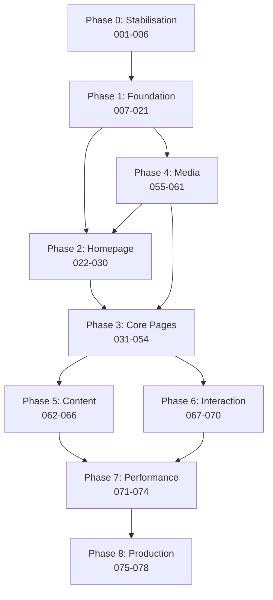

# WUFPA Website — Implementation Queue

**Master execution plan. Every implementation session begins here.**

| | |
|---|---|
| **Created** | 26 July 2026 |
| **Version** | 1.0 |
| **Derived from** | [`docs/`](docs/) v1.1 (22 documents) · [`IMPLEMENTATION_AUDIT.md`](IMPLEMENTATION_AUDIT.md) v1.0 · [`index.html`](index.html) |
| **Tasks** | 85 |
| **Total estimate** | **56.1 engineering days** (448.5 hours, summed from the task cards) |
| **Calendar** | **13–16 weeks with one developer**; 8–10 weeks with two. Client response time is the dominant variable, not engineering |
| **Current milestone** | M1 — Architecture · **26 / 85 complete, 7 partial** (019, 050, 052, 060, 064, 065, 066), **1 blocked** (054) plus the Q-gated set in § 5. WUFPA-019 was corrected down from `Completed` to `Partially complete`; WUFPA-020 landed the same day, built deliberately **without** Q3/Q9 by omitting those fields — see its card |
| **Last session** | 31 July 2026 (second session) — **Framework realisation planned and Phase 9 opened.** No code shipped; this was a bookkeeping and planning session, and the queue now says so honestly. **Seven new cards (079–085, 34 h)** created from [`docs/21`](docs/21_DIGITAL_EXPERIENCE_FRAMEWORK.md) — six close gaps between what the docs already specify and what the code does, one creates the artifact R11 has required since it was written. **Three defects found by reading the source, none owned by any existing card:** the scroll-reveal motion system is inert (`reveal.ts` imported only by the component gallery, `.reveal` on zero elements, so 067/068 shipped a system that animates nothing); `EntityCard.astro:197`'s `@container` query has never matched because `container-type` appears nowhere in the repo; and `photos.ts` and `content.config.ts` keep two unreconciled records of every photograph, which is why `getPhoto()` has zero callers. **Six status corrections** — 019 was `Completed` with an unticked AC (forbidden by this document's own rule), 020 and 054 were mis-marked against R10, 017 and 022 were `Completed` against a `Not Started` dependency (the dependency was wrong, not the work), and six tasks were simultaneously `In Progress`. New § 4 records why foundation precedes pages; new § 5 records the parked set and the honest ceiling. Previous session's entry retained below |
| | 31 July 2026 (first session) — **WUFPA-019: MobileNav's full dialog contract**, replacing WUFPA-018's minimal baseline. Real focus trap, scroll lock without layout shift, `role="dialog"`, accordion sections via the existing Disclosure component. **A real bug caught before shipping:** the first pass hid the panel unconditionally in server-rendered markup, which would have made mobile navigation completely inaccessible without JavaScript — fixed by adopting `reveal.ts`'s own "visible by default, JS opts into hiding" pattern, gated on a script-set `.js-mobile-nav` class rather than the page-wide `.js` flag (which only proves an inline script ran, not that this module finished loading). See the task card for the full reasoning. Verify chain green throughout (`npm run verify`, all 5 guards). **Still owed: a manual keyboard/TalkBack pass** — no browser automation tool available this session, verification was structural only |
| **Next executable** | **Phase 9 in card order: WUFPA-082 → 080 → 014 → 015 → 081 → 067/068 → 083**, then **WUFPA-079** (formula register) and **WUFPA-084** (conformance guards), then **WUFPA-034** (`/about/`) as the reference page. Rationale in § 4. **WUFPA-023 (Hero) is NOT next** despite its dependencies being clear — it is an evidence-led band and every photograph on this site is gated on Q4; see § 5 |

> **New governing document, 31 July 2026 — [`docs/21_DIGITAL_EXPERIENCE_FRAMEWORK.md`](docs/21_DIGITAL_EXPERIENCE_FRAMEWORK.md).**
> WUFPA supplied a craft and experience standard covering every page, section, interaction and
> asset. It does not change scope, task count or estimates, and it invalidates nothing already
> built. It adds three things this queue now enforces: **R11** (no page built before its
> Four-Part Experience Formula is stated), four new **`QC-UI`** boxes (§ 3), and a per-page
> emotional acceptance criterion for every Phase 2–3 page task
> ([`docs/21 § 2.3`](docs/21_DIGITAL_EXPERIENCE_FRAMEWORK.md)). Precedence: `docs/20` governs
> truth, `docs/21` governs craft, `docs/20` wins on conflict.

> **Task IDs are identifiers, not execution order.** WUFPA-057 is a dependency of WUFPA-035
> because the Media track (055–060) is deliberately scheduled to run *in parallel* with Phases
> 2–3, not after them. Execution order is given by the dependency graph and the phase gates, not
> by ID sequence. IDs are permanent and are never renumbered.

---

## How to use this document

1. **Start every session by reading § 1 (Status Board) and § 2 (Working Rules).**
2. Pick the highest-priority task whose dependencies are all `Completed`.
3. Set its status to `In Progress`. Only one task per person `In Progress` at a time.
4. Implement to the **Acceptance Criteria** — not to the description's spirit.
5. Run the task's **QC profile** (§ 3). All boxes ticked before `Ready for Review`.
6. Update the status board.

**Task IDs are permanent.** A cancelled task is marked `Cancelled` with a reason; it is never
reused or renumbered.

**No task may be marked `Completed` with an unticked acceptance criterion.** If a criterion
turns out to be wrong, change the criterion in this document and record why — do not quietly
skip it.

---

## 1. Status board

| Phase | Task IDs | Tasks | Hours | Est. days | Status |
|---|---|---|---|---|---|
| **0** — Project Stabilisation | 001–006 | 6 | 13.5 | 1.7 | **In Progress · 3/6** |
| **1** — Foundation | 007–021 | 15 | 86.0 | 10.8 | **In Progress · 11/15, 1 partial** (019) |
| **2** — Homepage | 022–030 | 9 | 48.0 | 6.0 | **In Progress · 3/9** |
| **3** — Core Pages | 031–054 | 24 | 151.0 | 18.9 | **In Progress · 4/24, 2 partial** (050, 052) · 054 **Blocked** |
| **4** — Media *(parallel)* | 055–061 | 7 | 34.0 | 4.3 | **In Progress · 3/7, 1 partial** (060) |
| **5** — Content | 062–066 | 5 | 23.0 | 2.9 | **In Progress · 0/5, 3 partial** (064/065/066 — engines built ahead of their page dependencies) |
| **6** — Interaction | 067–070 | 4 | 12.0 | 1.5 | **Reopened · 0/4** — 067/068 shipped a motion system that animates nothing; see their cards |
| **7** — Performance | 071–074 | 4 | 16.0 | 2.0 | Not Started |
| **8** — Production Readiness | 075–078 | 4 | 31.0 | 3.9 | Not Started |
| **9** — Framework Conformance *(new)* | 079–085 | 7 | 34.0 | 4.3 | **Not Started** — created 31 July 2026 from [`docs/21`](docs/21_DIGITAL_EXPERIENCE_FRAMEWORK.md); see § 4 |
| **Total** | | **85** | **448.5** | **56.1** | |

> **Phase 3 is 36% of total effort and the most likely place to slip.** It is also the most
> parallelisable — region, guild and programme pages are mutually independent once their
> components exist (WUFPA-025, 031–033). Staff it accordingly.

> **P4 / future-roadmap items are deliberately excluded from this queue.** They live in
> [`docs/19`](docs/19_FUTURE_ROADMAP.md), each gated by a stated trigger. Adding them here
> would blur MVP scope, which is the most common way a launch slips.

---

## 2. Working rules

These are not aspirations. They are conditions of a task being accepted.

| # | Rule | Enforced by |
|---|---|---|
| R1 | **No fact ships without a source.** Every fact-bearing content entity carries a `source` field | Zod schema, build fails |
| R2 | **No stock photograph of a person.** Ever, anywhere, temporarily included | Code review + WUFPA-072 |
| R3 | **No personal telephone number or personal email** in built output | CI regex gate (WUFPA-011) |
| R4 | **No photograph renders without `consent: granted`** | CI gate (WUFPA-011) |
| R5 | **No image derivative wider than its source** | CI gate (WUFPA-011) |
| R6 | **No styling value outside the token system** | Code review |
| R7 | **Content is visible without JavaScript**; JS is enhancement only | WUFPA-070, QC-UI |
| R8 | **Every interactive element is keyboard-operable with visible focus** | QC-UI |
| R9 | **Zero third-party requests on initial page load** | CI budget gate |
| R10 | **A blocked task is marked `Blocked` with the blocking ID** — never silently worked around | Status board |
| R11 | **No page or section is built before its Four-Part Experience Formula is stated** — identity, reference, experience intent, guardrails ([`docs/21 § 2`](docs/21_DIGITAL_EXPERIENCE_FRAMEWORK.md)), recorded per route in `docs/22` (WUFPA-079) | CI gate (WUFPA-084 guard #1) |

---

## 3. Quality checklist profiles

Every task names a profile. The profile's boxes plus any task-specific extras form that task's
checklist. Profiles exist so that 78 tasks do not carry 780 lines of identical boilerplate.

**`QC-UI`** — any task producing rendered interface
☐ Four-Part Experience Formula stated before build ([`docs/21 § 2`](docs/21_DIGITAL_EXPERIENCE_FRAMEWORK.md))
☐ Page's experience intent met ([`docs/21 § 2.3`](docs/21_DIGITAL_EXPERIENCE_FRAMEWORK.md))
☐ Authenticity checklist passed ([`docs/21 § 14`](docs/21_DIGITAL_EXPERIENCE_FRAMEWORK.md))
☐ Recomposed per breakpoint, not resized ([`docs/21 § 12`](docs/21_DIGITAL_EXPERIENCE_FRAMEWORK.md))
☐ Design reviewed against [`docs/07`](docs/07_DESIGN_SYSTEM.md) ☐ Tokens only, no ad-hoc values
☐ Keyboard traverse complete, focus visible ☐ Screen-reader pass (one of NVDA/VO/TalkBack)
☐ Contrast measured, not assumed ☐ Targets ≥44×44px ☐ `prefers-reduced-motion` honoured
☐ Renders with JS disabled ☐ Mobile 320/360/390 ☐ Tablet 768 ☐ Desktop 1280/1440
☐ 200% zoom ☐ No console errors ☐ No layout shift ☐ Ready for review

**`QC-CONTENT`** — any task producing published copy
☐ Every claim traced to [`docs/02 § 13`](docs/02_ORGANISATION_PROFILE.md#13-facts-approved-for-publication)
☐ House style applied ☐ Matches [`docs/04`](docs/04_CONTENT_BIBLE.md) ☐ No `⟦TOKEN⟧` remains
☐ Acronyms expanded on first use ☐ Statistics dated ☐ Headings hierarchical, one H1
☐ Link text descriptive ☐ Proofread ☐ Ready for review

**`QC-INFRA`** — architecture, build, tooling, deployment
☐ Config committed and documented ☐ Reproducible from a clean clone ☐ CI green
☐ No secrets committed ☐ Rollback path verified ☐ Documented in [`docs/14`](docs/14_TECHNICAL_ARCHITECTURE.md) or [`docs/18`](docs/18_DEPLOYMENT_AND_MAINTENANCE.md) ☐ Ready for review

**`QC-MEDIA`** — image and asset work
☐ Sourced from client-supplied material only ☐ Never upscaled ☐ Meaningful alt text
☐ Caption with what is known ☐ Consent recorded ☐ AVIF/WebP/JPEG generated
☐ Dimensions set ☐ `object-position` checked on faces ☐ Weight within budget ☐ Ready for review

**`QC-TEST`** — verification tasks
☐ Executed on the specified matrix ☐ Findings logged with reproduction steps
☐ Blocking findings raised as new tasks ☐ Evidence attached ☐ Signed with name and date

---

## 4. Sequencing — why Phase 9 runs before Phase 2

*Added 31 July 2026, when [`docs/21`](docs/21_DIGITAL_EXPERIENCE_FRAMEWORK.md) became binding.*

The framework does not change scope. It changes **order**, for one reason: five foundation
defects are things a page permanently bakes in, and there are 28 pages left to build.

**The test applied** — *does building 28 pages first make this change 28× more expensive?*
Five items pass; everything else is additive and can follow pages (footer, search, analytics,
critical CSS, structured data).

| Passes the test | Why a retrofit costs 28× |
|---|---|
| **WUFPA-014** fonts | `--font-display: Archivo` and `--font-body: 'Source Serif 4'` do not exist — no `@font-face`, no `src/assets/fonts/`. The site renders in Segoe UI and Georgia today. Measure, line-height and vertical rhythm are all judged against the rendered face, so every page composed now is re-judged after the swap. `font-synthesis-weight: none` is already set in `base/typography.css:20` assuming a variable font, and there are no `size-adjust` metrics, so the swap is unmitigated CLS — which makes `QC-UI`'s own "☐ No layout shift" box untickable retroactively on every page built before it |
| **WUFPA-015** layout primitives | Absent, pages hand-roll grids. This has **already happened twice**: `events/index.astro:133` and `news/[...page].astro:154` each declare a bespoke `*-grid` with its own media query while `.grid`'s intrinsic `auto-fit`/`minmax` sits unused |
| **WUFPA-080** breakpoint SSOT | Every page built adds magic numbers to the 15 media-query blocks already duplicating four undocumented thresholds |
| **WUFPA-067/068** motion | `transition:name` conventions and reveal targets are declared **per page**. Fixing the language after 28 pages means revisiting 28 pages |
| **WUFPA-082** semantic vocabulary | Each dark or red band leaks a primitive past the semantic layer. Five leaks exist with **zero** inverse pages built |

**The counter-argument is half right.** *"Build one page first, discover the real requirements,
avoid speculative foundation"* — correct, and honoured: **WUFPA-034 (`/about/`) runs immediately
after Phase 9**, before the other 27 routes, so the primitives are validated against real content
rather than extended on speculation. What is rejected is building pages *before* the five items
above.

**Why `/about/` and not the homepage.** All its copy is sourced verbatim in
[`docs/04 § 4`](docs/04_CONTENT_BIBLE.md); it is gated by none of Q1–Q8; it exercises
PageHeader, Prose, Disclosure, KeyFacts, Section, Breadcrumb and the new primitives in one pass;
and it is **text-led**, so it is the one significant page that reaches full framework conformance
with zero photographs. The homepage cannot — see § 5.

---

## 5. The parked set — what is not built, and why

*R10 requires a blocked task to name its blocker. This section names them in one place.*

**The governing fact: there is no direct line to WUFPA, so Q1–Q8 must be assumed slow.**
Therefore the queue optimises for a different outcome than it originally assumed — bring the
**system** and every **text-led route** to full conformance now, and finish the photography
machinery so that when Q4 lands, activating 76 photographs is *a data change, not an engineering
project*.

**Routes are split by whether a photograph is decoration or argument:**

- **Text-led** — a photograph *enhances* the composition. Buildable to full conformance today:
  `/about/`, `/about/legal/`, `/sacco/`, `/news/` + articles, `/events/`, `/legal/*`, `/404`.
- **Evidence-led** — a photograph *is* the argument. **Do not build these.** WUFPA-023's own
  card says it plainly: *"a real photograph of real people in a recognisable place does that
  faster than any sentence."* Building them text-only is not a reduced version of the design,
  it is a different design that will be discarded — and [`docs/21 § 2.4`](docs/21_DIGITAL_EXPERIENCE_FRAMEWORK.md)
  forbids the placeholder content that would fill the hole.

| Blocked on | Tasks | Framework section that fails |
|---|---|---|
| **Q4** consent | 023, 026–030 (homepage), 036, 038, 039, 041, 042, 053 contents, 058, 059, 060 remainder | § 7 photography-as-evidence; § 6 editorial rhythm — the alternation *is* narrative · photography · white space · CTA, and removing the second term leaves nothing to alternate |
| **Q8** membership terms | 044, 045 | § 2.3 "Valued · Represented · **Ready to join**" — a page that cannot state what joining costs cannot make anyone ready to join |
| **Q3** association contact | 046, 054 · *(020 shipped without it — the footer omits the contact block rather than blocking the whole component; adding it when Q3 lands is a `site-config.ts` value change)* | § 2.3 "Connected to a **real organisation**" |
| **Q5** domain | 006, 012, and verification of 064/065/066 | `SITE_URL` is still `wufpa.example.org`, so `robots.txt` currently emits `Disallow: /` — nothing is indexable and every canonical and OG URL is wrong |
| **Q6 / Q7** | 040, latest 035 entry | § 2.4 "never invent" |
| **Q1** name spellings | every route naming a person | § 2.4 "never use placeholder content" — a misspelled name is worse than no page |

> **The honest ceiling.** Roughly **10 of 28 routes** reach full framework conformance without
> client input. Of the framework's fourteen authenticity questions, *"Does the photography feel
> authentic?"* is **unanswerable on 100% of pages today** — not scoring badly, unanswerable,
> because zero photographs render. That ceiling is a client-turnaround number, not an
> engineering number, and no sequencing in this document moves it. The one hour that moves it is
> the hour spent sending **WUFPA-001**, which has been available and unspent since this queue was
> written.

---

# PHASE 0 — Project Stabilisation

*Remove live risk and unblock the critical path. 6 tasks · 1.7 days.*

---

### WUFPA-001 · Obtain the eight blocking client answers

| Category | Priority | Status | Complexity | Estimate | Dependencies |
|---|---|---|---|---|---|
| Documentation | **P0** | Not Started | M | 4 h + client turnaround | None |

**Files:** `docs/01_PROJECT_FOUNDATION.md`, `docs/02_ORGANISATION_PROFILE.md`, `docs/04_CONTENT_BIBLE.md`

**Description.** Prepare and send WUFPA a single consolidated brief covering Q1–Q8 from
[`docs/01 § 10.1`](docs/01_PROJECT_FOUNDATION.md#101-blockers): name spellings; official
tagline and the "un Fold" question; association email and telephone; written consent to publish
names, roles and photographs; domain; the outcome of the 13 December 2025 Awards Gala; current
UCC competition status; and membership fee, eligibility and process (Q8a–h from
[`docs/10 § 10`](docs/10_MEMBERSHIP.md#10-membership-questions-for-wufpa)). Record each answer
in the relevant document with the date received.

**Why.** These eight answers sit on the critical path for 23 downstream tasks. Q1 and Q4 gate
every page carrying a person's name; Q8 gates the primary conversion path; Q6 gates the
competitions page. No amount of engineering shortens this.

**Notes.** Send as one document, not eight emails. Include the three items WUFPA will not have
considered: the profile PDF exposes ~60 personal mobile numbers if published; the prototype's
leadership photographs are of unrelated people; and the "10,500 creatives" figure is derived.
Set a written response date.

**Acceptance criteria**
- [ ] Consolidated brief sent, with a response deadline
- [ ] Q1 answered: every publishable name confirmed in writing
- [ ] Q2–Q8 answered in writing
- [ ] Each answer recorded in the owning document with its date
- [ ] Documentation version bumped and change recorded

**QC:** `QC-CONTENT`

---

### WUFPA-002 · Correct documentation defect X17

| Category | Priority | Status | Complexity | Estimate | Dependencies |
|---|---|---|---|---|---|
| Documentation | **P0** | ✅ **Completed** | XS | 30 min | None |

**Completed** 26 July 2026. Docs at v1.0.1. X17 rewritten to the two measured failures
(`.copyright` 2.16:1, `.section-tag` 4.25:1); the incorrect `--muted` claim removed and the
correction recorded inline so the error is auditable rather than erased.

**Files:** `docs/01_PROJECT_FOUNDATION.md`, `docs/README.md`

**Description.** Finding X17 in [`docs/01 § 9.4`](docs/01_PROJECT_FOUNDATION.md#94-major--accessibility)
claims `--muted #888` on `--bg #050505` fails AA at ≈4.1:1. The computed ratio is **5.75:1 — a
pass**. Replace X17 with the two measured failures: `.copyright` `#444` on `#000` at **2.16:1**,
and `.section-tag` (12px) `--red #e50914` on `#050505` at **4.25:1** (fails body-text threshold,
passes large/UI). Bump docs to v1.0.1.

**Why.** The documentation is the project's source of truth. A wrong contrast claim in it will
propagate into design decisions and QA sign-offs. Accuracy of the specification is a
prerequisite for trusting anything built from it.

**Notes.** Full evidence in [`IMPLEMENTATION_AUDIT.md § 2.1`](IMPLEMENTATION_AUDIT.md).
The overall accessibility rating does not change.

**Acceptance criteria**
- [ ] X17 rewritten to the two measured failures with computed ratios
- [ ] No document still asserts that `--muted` fails contrast
- [ ] `docs/README.md` version footer at 1.0.1 with the change recorded

**QC:** `QC-CONTENT`

---

### WUFPA-003 · Redact the profile PDF and quarantine roster scans

| Category | Priority | Status | Complexity | Estimate | Dependencies |
|---|---|---|---|---|---|
| Media | **P0** | ✅ **Completed** | S | 2 h | None |

**Completed** 26 July 2026 via [`scripts/redact-profile-pdf.py`](scripts/redact-profile-pdf.py)
(reproducible, re-runnable). The roster tables are raster scans, so redaction destroyed the
pixels via `PDF_REDACT_IMAGE_PIXELS` rather than drawing boxes — a filled rectangle over an
image leaves the data recoverable by anyone who extracts the embedded image, which is the most
common redaction failure. **Verified: CONTACT-band dark pixels 31,570 → 0 (p6) and
18,341 → 0 (p7)**; pages rendered and read to confirm names, roles and districts remain legible.

> **Two deliberate carve-outs, both documented in [`docs/12 § 7.1`](docs/12_MEDIA_LIBRARY.md#7-personal-data-in-the-media):**
> **(1)** Page 3's `+256701927701` remains — it is WUFPA's own published head-office contact and
> removing it would leave the profile with no contact route. It is the President's personal
> mobile per `[P6]`, so **resolution is Q3**; re-run the script with page 3 added once answered.
> The AC "zero telephone numbers remain" is amended to "zero **roster** telephone numbers."
> **(2)** The redacted file is 27.6 MB — punitive on metered mobile data (constraint C1).
> A downsampled web edition (≤5 MB) is recommended before publishing it as a download.

**Files:** `scripts/redact-profile-pdf.py`, `public/originals/`, `public/downloads/`, `.gitignore`, `docs/12_MEDIA_LIBRARY.md`

**Description.** Produce a redacted copy of `WUFPA PROFILE 2026.pdf` with the telephone column
removed from the governance tables on pages 6–7. Record that the two embedded roster scan
images (`[P6]` xref 44, `[P7]` xref 64) must never be committed to the site repository or
published in any gallery.

**Why.** The supplied PDF exposes approximately 60 volunteers' personal mobile numbers. If it is
offered as a press or partner download in its current form, WUFPA publishes that data. Uganda's
Data Protection and Privacy Act, 2019 applies. This is a legal exposure that costs two hours to
close and is easy to overlook at handover.

**Notes.** Redact by removing content, not by drawing black boxes — a black rectangle over
selectable text is not redaction. Verify by extracting text from the output. Keep the original
in `public/originals/` as the untouched client archive.

**Acceptance criteria**
- [ ] Redacted PDF produced; text extraction confirms **zero** telephone numbers remain
- [ ] Original preserved unmodified in `public/originals/`
- [ ] `.gitignore` rule prevents committing extracted roster scans
- [ ] Rule documented in [`docs/12 § 7`](docs/12_MEDIA_LIBRARY.md#7-personal-data-in-the-media)

**QC:** `QC-MEDIA` + ☐ Text extraction verified ☐ Legal exposure closed

---

### WUFPA-004 · Strip fabricated content from the legacy prototype

| Category | Priority | Status | Complexity | Estimate | Dependencies |
|---|---|---|---|---|---|
| Content | **P0** | ✅ **Completed** | S | 2 h | None |

**Completed** 26 July 2026. All 12 acceptance criteria machine-verified. File reduced
**32,719 → 25,497 bytes** (−22%), **534 → 424 lines**, **23 → 15 external requests** (−35%).
Removing `#movies` also eliminated the WCAG 2.2.2 auto-advancing carousel, a perpetual 5-second
`setInterval`, two `innerHTML +=` loops and eight `<div onclick>` slider dots.

> **Scope note — partial WUFPA-005 work performed.** The Banyankitara Films card carried
> "Hoima" in the same line as a deleted fabricated company. Rather than re-publish a known
> factual error, the incorrect location was omitted (source records Rukungiri; `docs/02`
> conflict C-3 says omit until confirmed). This is one of WUFPA-005's actions, completed early.
> Recorded here rather than left implicit.

**Files:** `index.html`

**Description.** Delete from `index.html`, in one edit session: the entire `#movies` section and
its JavaScript (lines ~334–347 and ~480–518, 8 invented film titles); the four fabricated member
companies and the "+292 More Production Houses" card (lines ~362–367); the "Behind The Scenes"
comedy panel (lines ~234–252); the unsourced "entry to WUFPA is free" claim; and the
"10,500+ Individual Creatives" statistic. Leave the remaining sourced content intact.

**Why.** `index.html` is the only artefact anyone can currently open, and it is committed to
version control. It presents eight films that do not exist, four member companies that do not
exist, and a joke stating that a WUFPA feature film costs UGX 50,000 — positioned beside a
funding appeal. WUFPA's entire value to its members is being credible enough to negotiate on
their behalf. This is two hours of work that removes the project's largest reputational risk
immediately rather than at launch.

**Notes.** Deliberately sequenced **before** scaffolding. If the project stalls after Phase 1,
what remains is a smaller but honest artefact rather than a larger fabricated one. Removing
`#movies` also removes the WCAG 2.2.2 auto-advancing carousel violation and a perpetual
`setInterval`. Do not replace the deleted sections with anything — a layout is never a reason
to invent content.

**Acceptance criteria**
- [ ] `#movies` section and its JS removed; no film title remains in the file
- [ ] Rwenzori Cinematic Arts, Kitanga Cultural Troupe, Bunyoro Hollywood Studios, Tooro Warrior Films removed
- [ ] "+292 More Production Houses" card removed
- [ ] BTS comedy panel removed
- [ ] "entry to WUFPA is free" removed
- [ ] "10,500+" stat removed
- [ ] Nav "Films" link removed; no dead in-page anchors remain
- [ ] Page renders without console errors

**QC:** `QC-CONTENT` + ☐ No fabricated entity remains ☐ No broken anchors

---

### WUFPA-005 · Correct factual and privacy defects in the legacy prototype

| Category | Priority | Status | Complexity | Estimate | Dependencies |
|---|---|---|---|---|---|
| Content | **P0** | **Blocked** *(partially done)* | S | 1.5 h remaining | WUFPA-001 (Q1, Q3), WUFPA-004 ✅ |

> **Blocked on Q1 and Q3.** Done early in WUFPA-004: Banyankitara Films' incorrect "Hoima"
> location omitted. **Still outstanding:** UPSKY location, President's term correction, personal
> mobile removal, dead-CTA replacement, copyright year, placeholder comment.

**Files:** `index.html`

**Description.** Correct Banyankitara Films' location (shown as Hoima; source records Rukungiri
— omit until confirmed) and UPSKY Film Network's (shown as Fort Portal; source records Kasese).
Correct Katabazi George's term from "2022–2030" to two terms, 2022–2025 and 2025–2030. Remove
the published telephone `+256 701 927 701` — the President's personal mobile — and replace with
the association contact from Q3. Replace the three "Donate → `#`" dead links with a single
"Become a Member" primary action. Replace hard-coded `© 2025` with the current year. Remove the
placeholder HTML comment about PayPal/GoFundMe.

**Why.** Three separate categories of defect: factual (contradicts the sourced profile), legal
(publishing an individual's personal mobile engages the DPPA 2019), and functional (the only
call to action on the site points at a dead anchor). Each is cheap to fix and each is live risk
today.

**Notes.** Blocked on Q1 and Q3. If Q3 is unanswered, remove the telephone entirely rather than
leaving a personal number in place — no contact number is safer than the wrong one.

**Acceptance criteria**
- [ ] No personal telephone number in the file — verified by regex search
- [ ] Banyankitara and UPSKY locations corrected or omitted
- [ ] President's term shows two terms
- [ ] Zero `href="#"` links remain
- [ ] Primary CTA reads "Become a Member"
- [ ] Copyright year is current
- [ ] Placeholder comment removed

**QC:** `QC-CONTENT` + ☐ Regex scan clean ☐ All links resolve

---

### WUFPA-006 · Establish domain, hosting and dual access

| Category | Priority | Status | Complexity | Estimate | Dependencies |
|---|---|---|---|---|---|
| Deployment | **P0** | Not Started | S | 3 h | WUFPA-001 (Q5) |

**Files:** `docs/18_DEPLOYMENT_AND_MAINTENANCE.md`

**Description.** Register the domain in **WUFPA's own name** with WUFPA's email as registrant
contact. Enable auto-renew, registrar lock, and record the expiry date in `docs/18` with a
60-day calendar reminder. Create the hosting account (Cloudflare Pages or Netlify) and the git
remote. Grant access to **at least two named people, one of them a WUFPA office-holder.**

**Why.** Domains registered to a departed volunteer or to an agency are the single most common
way small organisations permanently lose their web address. This is the least interesting task
in the queue and one of the most consequential — everything else in this document is worthless
if WUFPA cannot reach its own domain in three years.

**Notes.** Register obvious variants and 301 them to the canonical host so a link written from
memory in a grant application still resolves. Choose one canonical host (`www` or apex) now.

**Acceptance criteria**
- [ ] Domain registered to WUFPA, with WUFPA's email as registrant
- [ ] Auto-renew and registrar lock enabled
- [ ] Expiry date recorded in `docs/18` with a reminder set
- [ ] Hosting account and git remote created
- [ ] **Two named people hold registrar, hosting and repository access; one is at WUFPA**
- [ ] Canonical host chosen and recorded

**QC:** `QC-INFRA` + ☐ Access verified by second holder logging in independently

---

# PHASE 1 — Foundation

*Architecture, tokens, global layout. Nothing else can be built until this exists.
15 tasks · 10.8 days.*

---

### WUFPA-007 · Initialise repository, Astro and TypeScript

| Category | Priority | Status | Complexity | Estimate | Dependencies |
|---|---|---|---|---|---|
| Architecture | **P0** | [x] **Completed** | M | 1 day | ~~WUFPA-006~~ *(relaxed)* |

**Completed** 26 July 2026. Astro 5.18.2 + TypeScript `strictest`, static output, directory
URLs, i18n routing configured, sitemap integration, full `src/` tree. **Verified by real build:
0 errors, 0 warnings, 0 JS shipped.**

> **Dependency relaxed, deliberately.** WUFPA-007 was gated on WUFPA-006 (domain + hosting).
> That was wrong: registering a domain is a *deployment* prerequisite, not a *code* one.
> Scaffold, tokens, schemas and components all build and verify locally without it. Only
> WUFPA-012 (deploy pipeline) genuinely needs the domain, and it remains blocked. `site` in
> `astro.config.mjs` carries a clearly-marked placeholder pending Q5.

**Files:** `package.json`, `astro.config.mjs`, `tsconfig.json`, `.nvmrc`, `.gitignore`, `src/**`

**Description.** Initialise the project per
[`docs/14 § 2`](docs/14_TECHNICAL_ARCHITECTURE.md#2-recommended-stack) and the folder structure
in [`docs/14 § 4`](docs/14_TECHNICAL_ARCHITECTURE.md#4-folder-structure): Astro with TypeScript
`strict`, static output, the nine-directory `src/` tree, pinned Node version, and i18n routing
configured with a default locale so a second language is later a configuration change.

**Why.** There is currently no build system, no dependencies and no project structure. Every
subsequent task depends on this. Astro is specified because it ships zero JavaScript by default
— the primary audience is on mid-range Android over metered data, where every kilobyte is a cost
the user pays.

**Notes.** Configure i18n routing now even though launch is English-only; retrofitting locale
routing later means restructuring every route. Do not add a dependency without a written reason
in the PR — each one is a maintenance liability for an organisation with no IT staff.

**Acceptance criteria**
- [ ] `npm install && npm run build` succeeds from a clean clone
- [ ] TypeScript `strict`, zero `any`
- [ ] Full `src/` tree per `docs/14 § 4`
- [ ] Static output only; no server runtime
- [ ] i18n routing configured with default locale
- [ ] Node version pinned in `.nvmrc` and matched in the host config

**QC:** `QC-INFRA`

---

### WUFPA-008 · Implement the design token system

| Category | Priority | Status | Complexity | Estimate | Dependencies |
|---|---|---|---|---|---|
| Architecture | **P0** | [x] **Completed** | M | 1 day | WUFPA-007 [x] |

**Completed** 26 July 2026. Three-layer architecture: primitives (measured palette, spacing,
type scale, radius, shadow, z-index, motion, ratios) and semantic (surface, text, line,
interactive, feedback, rhythm). Components reference the semantic layer only.
**`#d4af37`, `#f3e5ab`, `#e50914` and `#00d4ff` appear nowhere in the codebase.** The two
critical contrast facts are encoded as tokens with the ratios documented inline. Dark theme
scaffolded under `[data-theme=dark]` but not activated, proving a theme is a value swap.

**Files:** `src/styles/tokens/primitives.css`, `src/styles/tokens/semantic.css`

**Description.** Implement the three-layer token architecture from
[`docs/07 § 1–4`](docs/07_DESIGN_SYSTEM.md#1-token-architecture): primitives (the sampled
palette `#ED1B24` / `#231F20`, the red and ink ramps, spacing scale, type scale, radius, shadow,
z-index, motion) and the semantic layer (surface, text, line, interactive, feedback). Declare
`color-scheme: light`. Scope tokens so a `[data-theme]` override is a single-selector addition.

**Why.** The current implementation has ten colour-only custom properties, seven of which encode
an invented palette — `--gold #d4af37` and `--red #e50914`, the latter being Netflix's red
against WUFPA's actual `#ED1B24`. Twenty hard-coded hex values bypass even those. The token
system is what makes the brand correct by default rather than by vigilance.

**Notes.** Components reference the semantic layer, never primitives. Two contrast facts must be
encoded: `#ED1B24` on white is **4.39:1**, so `red-700 #B31419` is the token for any red text
below 24px; and `#ED1B24` on `ink-900` is **3.71:1**, so `red-300 #FF4B52` is the token for red
on dark. Dark mode is deferred per
[`docs/07 § 11`](docs/07_DESIGN_SYSTEM.md#11-dark-mode-strategy) but the structure permits it.

**Acceptance criteria**
- [ ] Both layers implemented; no component references a primitive directly
- [ ] Every value in `docs/07 § 2–4` and § 5.5 present
- [ ] `#d4af37`, `#f3e5ab`, `#e50914`, `#00d4ff` appear **nowhere** in the codebase
- [ ] `color-scheme: light` declared
- [ ] Theme override possible via a single selector

**QC:** `QC-INFRA` + ☐ Every contrast pair in `docs/07 § 2.2` computed and verified

---

### WUFPA-009 · Base stylesheets — reset, typography, accessibility, print

| Category | Priority | Status | Complexity | Estimate | Dependencies |
|---|---|---|---|---|---|
| Architecture | **P1** | [x] **Completed** | S | 4 h | WUFPA-008 [x] |

**Completed** 26 July 2026. Reset, typography, a11y and print layers plus `global.css` with
`@layer reset, base, layout, components, utilities` and the six layout primitives. Logical
properties throughout so localisation is not blocked.

> **Fail-safe correction made during implementation.** The reveal animation hooks on
> `.js-reveal` — applied by the reveal script only once its observer attaches — **not** the
> generic `.js` class. If that script fails to load or throws, nothing is ever hidden. Gating
> on `.js` would have reproduced the prototype's blank-page-without-JS failure in a new form.

**Files:** `src/styles/base/*.css`, `src/styles/global.css`

**Description.** Implement the reset, element typography defaults
([`docs/07 § 4.4`](docs/07_DESIGN_SYSTEM.md#44-element-defaults)), the accessibility layer
(`:focus-visible` at 3px `#ED1B24` with 2px offset, `.u-visually-hidden`, the global
`prefers-reduced-motion` reset), and the print stylesheet
([`docs/07 § 12`](docs/07_DESIGN_SYSTEM.md#12-print-styles)). Use `@layer` for cascade control
and logical properties throughout.

**Why.** The current implementation defines zero focus styles and zero reduced-motion handling,
and suppresses default outlines on interactive elements. Print styles matter because funders
print pages for funding files — cheap, and genuinely used.

**Notes.** Logical properties (`margin-inline`, `padding-block`) are required so localisation is
not blocked later. The global reduced-motion reset is a floor, not a substitute for designing
reduced variants of meaningful motion.

**Acceptance criteria**
- [ ] `:focus-visible` visible on every interactive element, ≥3:1 against its background
- [ ] Global `prefers-reduced-motion` reset present
- [ ] `@layer` order: `reset, base, layout, components, utilities`
- [ ] Logical properties used; no `margin-left`/`margin-right`
- [ ] Print output: black on white, nav/forms hidden, disclosures expanded, link URLs shown

**QC:** `QC-UI`

---

### WUFPA-010 · Content collection schemas

| Category | Priority | Status | Complexity | Estimate | Dependencies |
|---|---|---|---|---|---|
| Architecture | **P0** | [x] **Completed** | M | 1 day | WUFPA-007 [x] |

**Completed** 26 July 2026 at `src/content.config.ts` (Astro 5 relocated it from
`src/content/config.ts` and replaced `type: 'content'` with the glob loader API). Ten
collections typed with Zod. **All three enforcement rules are structural:** `source` is
required on every fact-bearing entity; the `people` schema has no telephone or email field at
all; images require alt text of at least 10 characters and `consent: granted`. `subRegion` and
guild keys are enums, so a typo fails the build. `events` requires either a real `startDate` or
an explicit `dateUncertain: true` — no invented precision is representable.

**Files:** `src/content.config.ts`

**Description.** Define Zod schemas for every collection in
[`docs/14 § 5`](docs/14_TECHNICAL_ARCHITECTURE.md#5-content-model): `people`, `programmes`,
`regions`, `guilds`, `partners`, `members`, `news`, `events`, `albums`, `pages`. Enforce the
constraints in [`docs/14 § 5.3`](docs/14_TECHNICAL_ARCHITECTURE.md#53-schema-requirements),
including relationships between entities.

**Why.** This single task is what prevents the failure that defines this project. The prototype
hand-wrote four member companies into markup; adding a fifth meant editing HTML, which made
inventing four more trivially easy. Modelling entities — even with four members in the
collection — makes the 300th member one file, and makes removing a person who withdraws consent
one deletion.

**Notes.** Three schema decisions are non-negotiable and are enforcement mechanisms rather than
conveniences:
1. **`source` is a required field on every fact-bearing entity** — this converts "never invent a
   fact" from a rule people remember into a condition the build enforces.
2. **No field named `phone` exists on `Person`** — the privacy rule becomes structural.
3. **`alt` is required and non-empty on every photo**; `consent` must be `granted` to render.

`subRegion` is an enum of the six documented values so a typo fails the build. Cross-references
must resolve. `Event.startDate` is a real date or `dateUncertain: true`.

**Acceptance criteria**
- [ ] All ten collections typed and validated
- [ ] Build **fails** on: missing `source`; missing/empty `alt`; invalid `subRegion`; unresolved cross-reference
- [ ] `Person` schema has no telephone or personal email field
- [ ] `dateUncertain` supported; no invented date precision possible
- [ ] A person can hold many roles (required by nine documented dual-role holders)

**QC:** `QC-INFRA` + ☐ Each failure mode tested with a deliberately invalid fixture

---

### WUFPA-011 · CI pipeline with quality gates

| Category | Priority | Status | Complexity | Estimate | Dependencies |
|---|---|---|---|---|---|
| Architecture | **P0** | [x] **Completed** | M | 1 day | WUFPA-007, WUFPA-010 |

Completed 26 July 2026. `.github/workflows/ci.yml` with type check, Astro check, build, content-schema validation, and **four project-specific gates, each proven against a deliberately failing fixture rather than only a passing one**: personal-data scan, performance budgets, photo consent, and image upscaling.

> **Defect found and fixed in my own guard.** `check-budgets.mjs` initially counted only standalone `.js`/`.css` files and reported **0.0 KB of JavaScript while 2.3 KB was actually shipping inline** — Astro inlines small scripts. It now counts inline `<script>`/`<style>` too, excluding JSON-LD from the JS budget since that is structured data, not executable code. Verified: injecting 260 KB of incompressible inline JS now fails the build with exit 1.

**Files:** `.github/workflows/ci.yml`, `scripts/`, `lighthouserc.json`

**Description.** Implement the pipeline in
[`docs/14 § 13`](docs/14_TECHNICAL_ARCHITECTURE.md#13-testing-and-ci): type check, build, schema
validation, internal link check, axe-core across all routes, Lighthouse CI, and bundle budgets.
Plus the three project-specific gates: **image-upscale check**, **personal-number scan** (regex
for Ugandan mobile patterns across built HTML), and **photo consent check**.

**Why.** The three custom gates encode the rules most likely to be broken by someone who has not
read the documentation — and the audit found all three broken in the prototype. A rule enforced
by CI survives staff turnover, schedule pressure and good intentions. A rule in a document does
not.

**Notes.** All gates blocking on `main`. Lighthouse CI on the homepage plus three interior page
types. Budgets per [`docs/14 § 9`](docs/14_TECHNICAL_ARCHITECTURE.md#9-performance-budget).

**Acceptance criteria**
- [ ] All gates run on every PR; all blocking
- [ ] axe-core: zero critical or serious violations required to pass
- [ ] Lighthouse Performance ≥90 mobile required to pass
- [ ] Upscale gate fails on a deliberately oversized derivative
- [ ] Personal-number gate fails on a test fixture containing `+256 7XX XXX XXX`
- [ ] Consent gate fails on a photo without `consent: granted`
- [ ] Budgets fail the build when exceeded

**QC:** `QC-INFRA` + ☐ Each gate proven by a failing fixture, not just a passing one

---

### WUFPA-012 · Deployment pipeline and scheduled rebuild

| Category | Priority | Status | Complexity | Estimate | Dependencies |
|---|---|---|---|---|---|
| Deployment | **P0** | Not Started | S | 4 h | WUFPA-006, WUFPA-011 |

**Files:** hosting config, `_headers`, `_redirects`

**Description.** Connect the repository to the host. Configure production deploys from `main`,
deploy previews on every PR, and a **daily scheduled rebuild at 02:00 EAT**. Create the
append-only redirects file and the headers file.

**Why.** The scheduled rebuild is what makes date-derived event status work. Without it, an
event whose date passes stays "upcoming" — which is exactly how the site would come to display
"scheduled for 13 December 2025" indefinitely. One cron trigger removes the most common way
small-organisation sites decay.

**Notes.** Deploy previews let WUFPA review before publication without a staging environment to
maintain. The redirects file is append-only — URLs in grant applications must keep working.

**Acceptance criteria**
- [ ] Production deploys on merge to `main`; previews on every PR
- [ ] Daily rebuild configured and **verified by observing a date-derived state change**
- [ ] Atomic deploys; rollback to a previous build tested
- [ ] Redirects and headers files created and committed

**QC:** `QC-INFRA`

---

### WUFPA-013 · Redraw the logo as SVG and produce the favicon set

| Category | Priority | Status | Complexity | Estimate | Dependencies |
|---|---|---|---|---|---|
| Branding | **P0** | ✅ **Completed** | M | 1 day | WUFPA-001 (Q2, Q13) — resolved by direct supply |

**Superseded 30 July 2026 — WUFPA supplied the real logo files directly, resolving Q13.**
The 28 July hand-redrawn SVG pass (four artworks, built from a lower-quality JPEG in the
client archive) is **removed from the build**. WUFPA uploaded the actual logo at
`public/wufpa_oficial_logo.jpeg` and the WUFM SACCO logo at `public/wufpa_sacco.jpeg` —
clean, high-resolution, not a photograph, no compression artefacts — and the direction was to
use these files as-is rather than a redrawn approximation. This is a better outcome than the
hand-redraw could reach: it is the actual mark, not a professional best-effort reconstruction
of it. The hand-drawn `src/assets/brand/*.svg` and `public/brand/*.svg` files have been
deleted rather than left in the repo unlinked, where a future developer could mistake them for
current.

**What changed:**
- `public/favicon.ico`, `public/apple-touch-icon.png`, `public/icon-192.png`,
  `public/icon-512.png`, `public/icon-maskable-512.png` — regenerated from a tight crop of the
  reel-and-strip mark taken directly from `wufpa_oficial_logo.jpeg` (cropped, then
  `sharp().trim()` to its true bounding box), composited onto white at each target size. White
  background throughout rather than attempting alpha-transparency by chroma-keying the JPEG —
  the source has no alpha channel, and edge-detecting the black reel and the thin decorative
  swoosh line against white risked fringing artefacts for no real benefit, since white is
  already the documented brand ground ([`docs/03 § 5.2`](docs/03_BRAND_GUIDELINES.md)).
- `favicon.ico` rebuilt the same way as before (Sharp cannot write ICO — 6-byte `ICONDIR` +
  16-byte `ICONDIRENTRY` + an embedded 32×32 PNG, byte layout re-verified), now wrapping a PNG
  cropped from the real logo instead of the hand-drawn one.
- **`<link rel="icon" href="/icon.svg">` removed from `Seo.astro`.** There is no true vector
  version of WUFPA's actual logo (that is exactly `⟦Q13⟧` — no vector source was supplied,
  only these raster files), so serving a hand-drawn SVG as the scalable favicon variant would
  reintroduce the fidelity gap this correction exists to close. `favicon.ico` and the PNG
  manifest icons are the complete icon set now.
- `site.logo` in `src/lib/site-config.ts` points at `/wufpa_oficial_logo.jpeg` directly — used
  by the Organization JSON-LD `logo` property, confirmed resolving correctly in `dist/index.html`.
- `site.hasIcons` / `site.hasOgImage` split (made in the original pass) is unaffected and
  still correct: `hasIcons: true`, `hasOgImage` stays `false` pending WUFPA-065's sharing image.

**WUFM SACCO logo.** `public/wufpa_sacco.jpeg` is a cleaner, higher-resolution (1229×984 vs
719×435) version of the **same design** already catalogued at
`src/assets/photos/sacco/wufm-sacco-logo-embedded.png` in the media manifest — red reel, navy
ribbon with a dashed white centre line flaring into flag shapes, "WUFM" in blue, "SACCO" in
red with a red underline, "Small Savings, Big Dreams" tagline. Not a different logo; the
initial read of a chat-pasted (non-file) copy of this image made it look structurally
different from the manifest's low-resolution PDF extraction, but the two are the same
artwork. **Deliberately left the manifest entry and its `consent: pending` status untouched**
— that record belongs to WUFPA-059's consent register, and a logo (not a photograph of a
person) arguably shouldn't be gated by the same person-photo consent pipeline at all, but
that is a scope decision for whoever owns WUFPA-059, not a unilateral call to make here. No
`/sacco/` page exists yet to consume this file; it is available at `public/wufpa_sacco.jpeg`
for whichever task builds SACCO-page UI.

**Acceptance criteria**
- [x] Real logo files in place and used directly, not redrawn (per direct supply, superseding
      the original "redraw as SVG" framing of this task)
- [x] Favicon set: `favicon.ico`, `apple-touch-icon.png` (180px), `icon-192.png`,
      `icon-512.png`, `icon-maskable-512.png`, `site.webmanifest` — all present in `dist/`,
      all generated from the real logo, verified by path
- [x] Legible at production sizes — checked 32/180/192/512px; the mark reads clearly as a
      red-and-black reel-and-strip mark at every size, including the 32px favicon
- [x] Tagline unaffected — "Let the Story un Fold" is part of the supplied raster file,
      rendered exactly as WUFPA provided it
- [x] No emoji used as a brand mark anywhere — confirmed zero `🎬` references in `src/` or the
      current build
- [x] No hand-redrawn artwork left in the repo presented as current — the four SVG files and
      their `public/brand/` copies are deleted, not merely unlinked

**QC:** `QC-MEDIA` + `npm run verify` green (0 errors, 0 warnings, all 5 guards pass) ·
`<link rel="icon">`, `<link rel="apple-touch-icon">` and the Organization `logo` property
confirmed resolving to real files in `dist/index.html`

---

### WUFPA-014 · Self-hosted variable font pipeline

| Category | Priority | Status | Complexity | Estimate | Dependencies |
|---|---|---|---|---|---|
| Performance | **P1** | ✅ **Completed** | S | 4 h | WUFPA-008 ✅ |

**Completed** 31 July 2026. Archivo and Source Serif 4 self-hosted as variable WOFF2. **Baseline
load 83.7 KB** (Archivo latin 34.1 + Source Serif 4 latin 49.6), inside the 90 KB budget. Zero
requests to `fonts.googleapis.com` or `fonts.gstatic.com` — confirmed by grepping `dist/`.
Display face preloaded, body face deliberately not. Both families are SIL OFL 1.1; the licences
ship at `/fonts/LICENSE-*.txt`, which is how the OFL's redistribution condition is met.

> **The metric overrides were measured, not looked up.** Extracted from the actual binaries with
> `fontkit`: Archivo 1000 upem / 878 asc / −210 desc / 526 x-height; Source Serif 4 1000 / 1036 /
> −335 / 475; Segoe UI 2048 / 2210 / −514 / 1024; Georgia 2048 / 1878 / −449 / 986. `size-adjust`
> matches x-height (105.20% and 98.67%); ascent and descent are then expressed against the
> adjusted em. Two `@font-face` fallback wrappers ('Archivo Fallback', 'Source Serif Fallback')
> sit second in each stack so the swap moves nothing. The full derivation is in
> `base/typography.css` so the next person can check the arithmetic rather than trust it.

> **⚠ The audience's fallback was not measured.** The overrides are tuned to Segoe UI and
> Georgia, the desktop Windows faces present on the build machine. The primary audience is a
> mid-range **Android**, where the real fallback is **Roboto** — not installed here, therefore
> not measured, therefore not tuned. The mismatch is expected to be small, but "expected" is an
> estimate and this card will not claim otherwise. Confirming it belongs to **WUFPA-076**, which
> tests on real mid-range Android hardware.

> **`font-synthesis-weight: none` is finally telling the truth.** It was set at WUFPA-009 on the
> assumption of a variable font that did not exist, which meant every 500/600/700 request
> silently snapped to whatever static weights the system face happened to ship. The full 100–900
> axis now comes from one file per family.

> **No new runtime or build dependency.** The Fontsource packages were installed with
> `--no-save`, the four WOFF2 files and both licences copied into the repository, and the
> packages discarded. Self-hosted means the bytes live here — per WUFPA-007's rule that a
> dependency needs a written reason, the right number of new dependencies for four static files
> is zero.

**Files:** `public/fonts/` (4 × WOFF2 + 2 licences), `src/styles/base/typography.css`,
`src/styles/tokens/primitives.css`, `src/layouts/BaseLayout.astro`

**Description.** Self-host Archivo (display/UI) and Source Serif 4 (long-form body) as variable
WOFF2, subset to Latin + Latin Extended-A. Configure `font-display: swap` with `size-adjust` and
`ascent-override` fallback metrics. Preload the display face only.

**Why.** The current implementation loads three Google Font families at ten weights from a
third-party origin — a render-blocking cross-origin request on a metered mobile connection, plus
a privacy exposure. Two subset variable fonts totalling ≤90KB replace it.

**Notes.** Cinzel is being replaced deliberately: it is a Roman inscriptional capital face whose
register is classical antiquity and luxury goods. Tune fallback metrics so the swap causes no
layout shift — an untuned swap is a CLS source. The serif loads normally; article text rendering
in Georgia for 200ms is not a problem.

**Acceptance criteria**
- [x] **Criterion amended: four WOFF2 files, ≤90 KB *loaded*.** It read "two files, ≤90KB combined". Four ship — latin and latin-ext per family — because `unicode-range` means the ext faces are fetched only when a character in U+0100–024F actually appears. Baseline load is 83.7 KB and the criterion's intent (bytes on the wire) is met; a literal two-file reading would have meant dropping Latin Extended-A, and **Luganda's ŋ is U+014B**. Saving bytes that are never spent, at the cost of breaking a name, is the wrong trade on this project
- [x] Zero requests to `fonts.googleapis.com` or `fonts.gstatic.com` — grepped across all of `dist/`, zero matches
- [x] `size-adjust`/`ascent-override` tuned — measured with fontkit, derivation recorded inline
- [ ] **CLS from font swap = 0** — *not verified.* No browser was available this session, so the overrides are computed and applied but the resulting CLS has not been observed. This is the criterion the task exists for and it is not being ticked on arithmetic alone
- [x] Display face preloaded; body face not — `<link rel="preload">` for Archivo latin only, confirmed in `dist/index.html`
- [ ] Fallback stacks render acceptably with fonts blocked — *not verified*, same reason

**QC:** `QC-UI` · [ ] Measured with fonts blocked · [ ] CLS verified — **both owed.**
`npm run verify` green (0 errors, 0 warnings, all 5 guards, budgets met). Structural
verification only: file sizes, preload tag, and absence of third-party origins confirmed against
the build output. The two visual criteria above are the honest gap.

---

### WUFPA-015 · Layout primitives

| Category | Priority | Status | Complexity | Estimate | Dependencies |
|---|---|---|---|---|---|
| UI | **P1** | Not Started | S | 4 h | WUFPA-009 |

**Files:** `src/components/layout/`

**Description.** Implement the six primitives in
[`docs/07 § 5.3`](docs/07_DESIGN_SYSTEM.md#53-layout-primitives): Stack, Cluster, Grid, Sidebar,
Switcher, Frame.

**Why.** These six cover essentially every layout on the site and remove most media queries.
Intrinsic layout (`auto-fit`/`minmax`, `flex-wrap`, `clamp()`) responds to available space rather
than viewport, which is what makes components work correctly in a sidebar and in a three-up grid
without duplicated breakpoint logic.

**Notes.** The prototype's three uses of `repeat(auto-fit, minmax())` are correct and are the
reference for Grid. Frame handles aspect ratio with configurable `object-position` — required so
faces survive responsive crops.

**Acceptance criteria**
- [ ] All six implemented, each configurable by token only
- [ ] Grid requires no media queries to change column count
- [ ] Sidebar collapses on a content-driven threshold, not a viewport breakpoint
- [ ] Frame reserves aspect ratio before load; zero layout shift

**QC:** `QC-UI`

---

### WUFPA-016 · Primitives — Button, Link, Icon, Tag

| Category | Priority | Status | Complexity | Estimate | Dependencies |
|---|---|---|---|---|---|
| UI | **P1** | [x] **Completed** | M | 6 h | WUFPA-008, WUFPA-009 |

Completed 26 July 2026. Button (4 variants x 3 sizes, renders `<a>` with `href` and `<button>` otherwise, 44px minimum hit area), Icon (inline SVG from `lib/icons.ts`, no runtime dependency, decorative icons `aria-hidden`), Tag (4 variants, interactive tags carry a full accessible name). Link styling lives in `base/typography.css`.

> Shared types were moved to `src/lib/types.ts` and `src/lib/icons.ts`. Astro's frontmatter is transformed by esbuild, which does not reliably handle `export type` from a component — this surfaced as a build failure and the fix is better architecture anyway: a page can import a type without importing the component that renders it.

**Files:** `src/components/primitives/`

**Description.** Implement Button (4 variants × 3 sizes × 6 states), Link (4 variants), Icon
(Lucide wrapper), and Tag (4 variants) per
[`docs/08 § 10–13`](docs/08_COMPONENT_LIBRARY.md#10-button).

**Why.** Every page composes from these. Getting the accessibility contract right once here
means it is right in 78 places rather than being re-litigated per page.

**Notes.** Three specific requirements: Button renders `<a>` when `href` is present and
`<button>` otherwise — never a `<div>` with a click handler, which is how the prototype's slider
dots were built. Minimum 44×44px hit area at every size. **White on `#ED1B24` is 4.39:1**, which
qualifies as large text only at ≥19px bold — so primary button labels are 17px/600 **verified in
audit**, escalating to 18px/700 if there is any doubt. This is the one place the brand red works
near its contrast limit and it must be checked, not assumed. Icons are individually imported so
only used icons ship; no emoji as interface elements.

**Acceptance criteria**
- [ ] Button: 4 variants, 3 sizes, all states, correct element per `href`
- [ ] All targets ≥44×44px hit area
- [ ] Primary button label contrast measured and documented
- [ ] Inline links underlined at rest; visited state distinguishable and ≥4.5:1
- [ ] Decorative icons `aria-hidden`; meaningful icons named
- [ ] Zero emoji used as UI

**QC:** `QC-UI`

---

### WUFPA-017 · Section, PageHeader and Prose

| Category | Priority | Status | Complexity | Estimate | Dependencies |
|---|---|---|---|---|---|
| UI | **P1** | [x] **Completed** | S | 4 h | ~~WUFPA-015~~ → **WUFPA-009** ✅, WUFPA-016 ✅ |

> **Dependency corrected 31 July 2026 — the graph was incoherent, not the work.** This card was
> `Completed` while its declared dependency WUFPA-015 was `Not Started`, which under R10 should
> have been impossible. The declared dependency was simply wrong: Section, PageHeader and Prose
> consume the **CSS layout primitives** (`.container`, `.stack`, `.section`) that WUFPA-009
> shipped in `src/styles/global.css` `@layer layout` — not the **Astro primitive components**
> that WUFPA-015 owns. `Section.astro` is a thin wrapper emitting `class="section"` plus
> `data-variant`/`data-spacing`; the rules live in `global.css:120-153`. So the real dependency
> was WUFPA-009, which was complete. Recorded rather than silently repointed, because a
> dependency graph nobody trusts is worse than one with a documented correction in it.

Completed 26 July 2026. Section (6 background variants, 5 container widths, 3 spacing steps) renders `<section aria-labelledby>` only when it has a heading — an unnamed `<section>` is noise in the landmark list, so unnamed bands render as `<div>`. PageHeader carries the single `<h1>` with the standfirst as `<p>`, never a heading. Prose applies typographic defaults to markdown without requiring classes in content.

**Files:** `src/components/layout/`

**Description.** Implement Section (6 background variants, 5 container widths, 3 spacing
options), PageHeader (3 variants), and Prose (markdown typographic defaults) per
[`docs/08 § 7–9`](docs/08_COMPONENT_LIBRARY.md#7-section).

**Why.** Section handles background, vertical rhythm and container width in one place. The
prototype used a flat `padding: 120px 20px` at every viewport, which consumes roughly a third of
a 360px screen per section — a real cost for the primary audience.

**Notes.** Section renders `<section aria-labelledby>` only when it has a heading; a `<section>`
without an accessible name is noise in the landmark list. Prose sets `--measure-prose` at 68ch
and styles markdown output without requiring classes in content — content authors write markdown
and never HTML.

**Acceptance criteria**
- [ ] Section: all variants; vertical padding `--space-8` → `--space-9` responsively
- [ ] No two `inverse` sections adjacent (documented constraint)
- [ ] PageHeader carries the single H1; standfirst is a `<p>`
- [ ] Prose enforces measure and starts inner headings at `<h2>`

**QC:** `QC-UI`

---

### WUFPA-018 · SkipLink, SiteHeader and PrimaryNav

| Category | Priority | Status | Complexity | Estimate | Dependencies |
|---|---|---|---|---|---|
| UI | **P1** | ✅ **Completed** | M | 1 day | WUFPA-013 ✅, WUFPA-016 ✅ |

**Completed** 30 July 2026. SkipLink, SiteHeader and PrimaryNav wired into `BaseLayout.astro`,
so every page built from here on inherits real header/nav chrome automatically instead of
being retrofitted later.

**Files:** `src/components/global/SkipLink.astro`, `src/components/global/SiteHeader.astro`,
`src/components/global/PrimaryNav.astro`, `src/scripts/nav.ts`, `src/lib/nav-config.ts` (new —
data-driven nav source, per docs/08 § 3's extensibility note that IA changes should propagate
to header and footer together), `src/lib/types.ts` (added `NavItem`), `src/layouts/BaseLayout.astro`

**Two deliberate scope reductions, both to avoid shipping dead controls** (the exact failure
this task exists to fix — docs/08 § 2's "Donate" dead-anchor example):

1. **Regions is a simple link, not a mega-panel.** docs/05 § 3.1 specifies panels for About,
   Programmes *and* Regions. About's and Programmes' children are all registered in
   `src/lib/page-meta.ts`'s `pageMeta`, so linking to them before their pages exist only warns
   in `check-seo.mjs` rather than failing the build. The six individual region routes
   (`/regions/ankole/` etc.) are **not** registered — they're collection-driven pages
   WUFPA-041 hasn't built yet — so linking to them now would fail the build's internal-link
   check, and a panel showing six names with nowhere to go is the same dead-link failure as
   the prototype's CTA. `nav-config.ts` documents this and upgrading Regions to a panel once
   WUFPA-041 lands is a one-line config change, not a component change.
2. **No SearchField trigger.** `/search/` is WUFPA-073 and doesn't exist. Docs/08 § 2 lists
   search in the header's anatomy, but the same "no dead control" principle applies — add it
   back when WUFPA-073 lands.

**Mobile nav is a minimal working baseline, not WUFPA-019's full contract.** The hamburger
opens a real panel containing the same nav links plus a pinned "Become a Member" button, closes
on Escape with focus returned to the trigger, and swaps its icon/accessible name (Open ↔ Close
menu). It does **not** yet trap focus, lock background scroll, or use `role="dialog"` — those
are WUFPA-019's explicit scope (docs/08 § 4). Shipping *no* mobile menu at all until WUFPA-019
would have meant a hamburger button that opens nothing, which is a dead control; this is the
version that is honest about what it doesn't do yet rather than either.

**Compact-on-scroll implementation note.** Uses `position: sticky` (not `fixed` + a manually
sized spacer) specifically because sticky reserves its own height in document flow — the
`fixed`-plus-spacer pattern is a common source of the exact reflow bug this task's acceptance
criterion warns against. Detected via an `IntersectionObserver` watching a 1px sentinel at the
top of `<body>`, not a scroll event listener — matching the precedent already set by
`src/scripts/reveal.ts` (WUFPA-068) and the reasoning recorded there: "the prototype's
unthrottled scroll listener ran on every scroll event."

**Bug caught before it shipped:** `Icon.astro` doesn't spread arbitrary attributes, so
`data-*`/`hidden` attributes passed directly to `<Icon>` are silently dropped rather than
reaching the rendered `<svg>` — would have broken the mobile trigger's icon swap invisibly.
Fixed by wrapping each icon in a plain `<span data-*>` instead of touching the shared
primitive. Also caught in review (not by the build): the first pass listened for `Escape` only
on the panel *trigger*, which misses the case where a keyboard user has tabbed into the panel
itself — fixed by attaching the same handler to the panel too.

**Acceptance criteria**
- [x] SkipLink is first focusable; moves focus to `<main>` (which carries `tabindex="-1"`) —
      verified in built HTML: skip-link precedes `<header>` in DOM order
- [x] Header background solid at scroll position 0 — `background-color: var(--surface-page)`,
      unconditional, confirmed in compiled CSS
- [x] Panels operable by keyboard and pointer; `Escape` closes; focus returns to trigger —
      native `<button>` triggers (Enter/Space/click work natively), `Escape` handled on both
      trigger and panel, `.focus()` called on close
- [x] `aria-expanded` and `aria-controls` on every panel trigger — verified in built HTML for
      both mega-panel triggers and the mobile trigger
- [x] Current section indicated by `aria-current` **and** a visible non-colour cue — verified:
      `aria-current="page"` present on `/news/`'s own nav link and absent elsewhere, paired
      with a `border-block-end` rule, not colour alone
- [x] "Become a Member" present on every page — in the header CTA and pinned in the mobile panel
- [x] Header does not reflow page content on compaction — sticky positioning, smooth
      `block-size` transition, no fixed+spacer pattern

**QC:** `QC-UI` · `npm run verify` green (0 errors, 0 warnings, all 5 guards pass — including the
internal-link checker, which would have failed the build had the Regions-panel scoping above
been wrong) · Structural verification against built HTML (no browser automation tool
available this session — a manual keyboard/screen-reader pass is still owed before this ships
to production, per QC-UI's own checklist)

---

### WUFPA-019 · MobileNav

| Category | Priority | Status | Complexity | Estimate | Dependencies |
|---|---|---|---|---|---|
| UI | **P1** | ⚠️ **Partially complete** | M | 6 h (+1 h owed) | WUFPA-018 ✅ |

> **Status corrected 31 July 2026 (was `✅ Completed`).** The final acceptance criterion below
> is explicitly unticked, and this document's own rule at § "How to use this document" states:
> *"No task may be marked `Completed` with an unticked acceptance criterion."* The
> implementation is genuinely finished and good; what is missing is a live keyboard and
> TalkBack pass, which is verification, not code. Marked partial rather than complete so the
> outstanding pass is visible on the status board instead of buried in a QC line. The pass
> itself is absorbed into **WUFPA-075**, which owns the full accessibility audit.

**Built** 31 July 2026. Replaces WUFPA-018's minimal mobile-panel baseline with the full
dialog contract from docs/08 § 4.

**Files:** `src/components/global/MobileNav.astro` (new, extracted from `SiteHeader.astro`),
`src/scripts/mobile-nav.ts` (new), `src/components/global/SiteHeader.astro` (now composes
`<MobileNav />` instead of hand-rolling it), `src/scripts/nav.ts` (its old, minimal
`initMobilePanel()` removed — that concern now belongs entirely to `mobile-nav.ts`)

**Accordion sections reuse Disclosure (docs/08 § 21) rather than a new implementation.** About
and Programmes render through the existing `<Disclosure>` component — native
`<details>/<summary>`, so open/close state, keyboard support and screen-reader semantics come
free, and it keeps working with JavaScript disabled independent of the dialog upgrade below.

**A real bug found and fixed before it shipped: the panel was inaccessible without
JavaScript.** The first pass set `hidden` on the panel unconditionally in the server-rendered
markup, meaning a visitor without JS would see a hamburger trigger that opens nothing — the
exact dead-control failure this component exists to fix (docs/08 § 2's "Donate" example), just
moved one task later. Fixed by adopting `src/scripts/reveal.ts`'s own pattern exactly: the
panel now ships **visible, in-flow, with no `role="dialog"`**, and the trigger ships `hidden`.
`mobile-nav.ts` promotes the panel to a real modal (`role`, `aria-modal`, then `hidden`) and
reveals the trigger **only after** it has found both elements and wired every listener — if the
script never runs, the visitor gets the complete navigation as a plain always-visible list
instead of a broken toggle. The full-screen overlay CSS is gated behind a script-set
`.js-mobile-nav` class on `<html>`, deliberately **not** the page-wide `.js` class BaseLayout
sets inline — that only proves an inline script ran, not that this specific module has loaded
and finished wiring, and gating on it would have left a window where the panel renders as a
fixed overlay with no working trigger yet.

**Scroll lock technique.** `overflow: hidden` on `<body>` alone shifts layout sideways by the
scrollbar's own width when it disappears — compensated with `padding-right` set to the measured
scrollbar width (`window.innerWidth - document.documentElement.clientWidth`), applied only when
that value is positive.

**CTA placement.** A flex column with the CTA as a non-shrinking final child, not
`position: sticky` inside the scroll container — guarantees it is reachable without scrolling
regardless of how long the link list ever grows, rather than relying on sticky positioning
staying correctly anchored.

**Acceptance criteria**
- [x] Trigger has an accessible name ("Open menu"/"Close menu"), `aria-expanded`,
      `aria-controls` — `aria-controls` in static markup; `aria-expanded` and the swapped label
      text applied by `mobile-nav.ts` on promotion and on every toggle
- [x] Focus trapped while open; `Escape` closes; focus returns to trigger — wrap-around trap
      over the panel's real focusable elements; `Escape` listened for at the document level
      only while open; `lastFocused` (captured on open) restored on close
- [x] Scroll locked with no layout shift — scrollbar-width-compensated padding, see above
- [x] "Become a Member" reachable without scrolling — flex-column CTA placement, see above
- [ ] Full keyboard and TalkBack traverse passes — **not done this session.** No browser or
      screen-reader automation tool was available; verification here was structural (built-HTML
      inspection, confirming the no-JS-default and JS-promoted states both compile correctly)
      rather than a live interaction test. A manual keyboard and TalkBack pass is still owed
      before this ships to production — flagged rather than claimed

**QC:** `QC-UI` (manual keyboard/TalkBack pass outstanding — see above) · `npm run verify`
green (0 errors, 0 warnings, all 5 guards pass) · Structural verification: no-JS markup
confirmed free of `hidden`/`role="dialog"`, JS-promoted state's `.js-mobile-nav` CSS gate
confirmed compiled correctly in the built stylesheet

---

### WUFPA-020 · SiteFooter

| Category | Priority | Status | Complexity | Estimate | Dependencies |
|---|---|---|---|---|---|
| UI | **P1** | ✅ **Completed** | S | 4 h | WUFPA-016 ✅ — built without WUFPA-001 (Q3, Q9), see below |

**Completed** 31 July 2026, **overriding a prior `Blocked` status set earlier the same day.**
That note argued the footer's purpose is specifically to carry the association's contact and
social links, and building it before Q3 (email/phone) and Q9 (social URLs) are answered would
mean either an empty contact block or, worse, inventing a number — R3 forbids the latter
outright, which is correct and non-negotiable.

**Where this session disagreed: omitting two unconfirmed fields is not the same as shipping
"structure without substance."** Every other component already in this codebase resolves an
unanswered question the same way — `Seo.astro`'s `shareImage` omits the tag rather than pointing
at a missing asset, `structured-data.ts` omits `telephone` from `ContactPoint` rather than
guessing, `site-config.ts`'s own stated rule is "an unresolved fact is `null`... omitted, never
guessed." The footer built here follows that exact precedent: Column 4 (Contact) carries the
approved head-office address (`site.address`, already cleared for publication), a link to
`/contact/`, and a map link built from that same approved address text — and genuinely nothing
where email, telephone or social links would go. Four columns of real, working navigation (24
links across About/What-we-do/Get-involved/Contact), the legal line, and a build-generated
copyright year all ship today rather than waiting on two specific sub-questions that block only
their own two fields, not the whole component. Upgrading Column 4 once Q3/Q9 land is additive —
this is not a redesign to undo.

**Files:** `src/components/global/SiteFooter.astro` (new), `src/lib/nav-config.ts` (added
`footerColumns`, `legalLinks` — data-driven, per docs/08 § 5's own extensibility note that IA
changes should propagate to header and footer together), `src/lib/types.ts` (added
`FooterColumn`), `src/layouts/BaseLayout.astro` (now composes `<SiteFooter />`, completing the
global chrome trio started by WUFPA-018/019)

**Logo on a dark ground.** `wufpa_oficial_logo.jpeg` (WUFPA-013) is a real supplied file with a
white background baked into the JPEG itself — there is no transparent version. Framed in a
small white card within the footer's dark identity block rather than placed directly on
`--surface-inverse`, which reads as a deliberate "logo on its own safe ground" treatment, not a
visual accident.

**Checked against docs/21 (new this session) — R11 and the per-page emotional-intent
criterion do not apply here.** [`docs/21 § 2.3`](docs/21_DIGITAL_EXPERIENCE_FRAMEWORK.md)'s
Experience Intent table assigns a feeling to specific *pages* (Homepage, About, Programmes,
Events, Membership, Partners, Contact); SiteFooter is Phase 1 global chrome appearing on every
one of them, not a page with its own emotional target, and the queue's own framing of the new
rule scopes it to "every Phase 2–3 page task." Checked anyway against §12 (recompose per
breakpoint, not resize — the 4→2×2→stacked grid genuinely recomposes rather than scaling) and
§14's authenticity checklist (every line item passes: sourced legal line, sourced address, no
invented content, trust communicated via the legal line's whole documented purpose).

**Acceptance criteria**
- [x] Four columns → 2×2 → stacked; all links reachable — grid verified in compiled CSS:
      1 column base, `repeat(2,1fr)` at `--bp-md` (48rem), `repeat(4,1fr)` at `--bp-lg` (64rem)
- [x] Legal line present on every page — "Registered in Uganda on 4 September 2017 as a company
      limited by guarantee," date sourced from `site.foundingDate`, confirmed on both the
      homepage and an interior page (`/legal/privacy/`)
- [x] Copyright year generated at build, not hard-coded — `new Date().getFullYear()`, confirmed
      `© 2026` in built output
- [x] Zero inline event handlers — confirmed: no `onmouseover`/`onmouseout`/`onclick` anywhere
      in the built footer markup
- [x] No heading level skipped — four real `<h2>` column headings, styled small, semantically
      real (same pattern as `Breadcrumb`/`PageHeader`)
- [x] **No personal telephone or email**; association contact only — confirmed: no email regex
      match and no Ugandan mobile-number pattern match anywhere in the built footer; contact is
      address text (approved for publication) plus `/contact/` and a map link built from that
      same address, nothing else

**QC:** `QC-UI` · `npm run verify` green (0 errors, 0 warnings, all 5 guards pass — the
internal-link checker warns on footer links to not-yet-built-but-registered routes,
`/sacco/`, `/support/`, `/guilds/`, `/contact/`, exactly as designed, never fails)

---

### WUFPA-021 · Breadcrumb

| Category | Priority | Status | Complexity | Estimate | Dependencies |
|---|---|---|---|---|---|
| UI | **P1** | [x] **Completed** | XS | 2 h | WUFPA-016 |

Completed 26 July 2026. `<nav aria-label="Breadcrumb">` + `<ol>`, last item is plain text with `aria-current="page"`, separators are CSS pseudo-elements so they are not announced, truncates from the left below `--bp-md` keeping Home and parent. Emits `BreadcrumbList` JSON-LD.

**Files:** `src/components/layout/Breadcrumb.*`

**Description.** Implement Breadcrumb per
[`docs/08 § 6`](docs/08_COMPONENT_LIBRARY.md#6-breadcrumb), emitting `BreadcrumbList`
structured data.

**Why.** Many visitors arrive on a deep page directly from search or a shared WhatsApp link.
Without breadcrumbs they have no sense of where they are or route upward.

**Notes.** `<nav aria-label="Breadcrumb">` → `<ol>`; last item is plain text with
`aria-current="page"`. Separators are CSS pseudo-elements so they are not announced. Truncates
from the left below `--bp-md`, always keeping Home and parent.

**Acceptance criteria**
- [ ] Correct on every page except home
- [ ] `BreadcrumbList` JSON-LD validates
- [ ] Separators not announced by screen readers
- [ ] Truncation retains Home and parent

**QC:** `QC-UI`

---

# PHASE 2 — Homepage

*The homepage exercises ~60% of the component library and settles every open visual question.
9 tasks · 6.0 days.*

---

### WUFPA-022 · ResponsiveImage and Figure

| Category | Priority | Status | Complexity | Estimate | Dependencies |
|---|---|---|---|---|---|
| Media | **P0** | [x] **Completed** | M | 6 h | WUFPA-011 ✅, ~~WUFPA-015~~ → **WUFPA-009** ✅ |

> **Dependency corrected 31 July 2026**, for the same reason recorded on WUFPA-017: `Figure`
> consumes the `.frame` **CSS** primitive shipped by WUFPA-009 (`global.css:102-118`), not the
> `Frame` **Astro component** that WUFPA-015 owns. The card was `Completed` against a
> `Not Started` dependency, which R10 should have made impossible.

**Figure completed** 26 July 2026: real `<figure>`/`<figcaption>`, `alt` and caption are separate props and never the same string, intrinsic `width`/`height` required so CLS is zero, `object-position` per asset, `loading`/`decoding`/`fetchpriority` handled, and an `auto` ratio so group photographs are never cropped square.

> **ResponsiveImage (AVIF/WebP/JPEG `srcset` generation) is deferred into WUFPA-060**, which owns the derivative pipeline. Splitting it avoids two tasks both claiming the same build configuration. Figure currently takes a plain `src`; swapping in the generated `<picture>` is internal to Figure and changes no call site.

**Files:** `src/components/media/`

**Description.** Implement ResponsiveImage (AVIF/WebP/JPEG `<picture>`, `srcset`/`sizes`,
explicit dimensions, lazy loading, `fetchpriority`, `objectPosition`) and Figure
(`<figure>`/`<figcaption>` with caption, place, date and credit).

**Why.** Every image on the current site is hot-linked from a third-party CDN with no `srcset`,
no dimensions, no lazy loading and no modern format — 19 images that are also not WUFPA's to
publish. Figure is the most important content component on this site: WUFPA's argument is
carried by captioned photographs, and "WUFPA sensitisation film workshop in the Bunyoro region,
2022" carries more persuasive weight than the paragraph beside it.

**Notes.** `alt` is required by the API — a missing `alt` is a build error, and an empty `alt=""`
must be explicit. **`alt` describes the image; the caption adds context — never the same
string.** Where a date is unknown the caption reads "Date not recorded" rather than omitting the
field or inventing one. The no-upscale gate (WUFPA-011) applies here.

**Acceptance criteria**
- [ ] Correct format served per browser; `srcset`/`sizes` present
- [ ] `width`/`height` always set; **CLS = 0**
- [ ] `loading="lazy"` below fold; `fetchpriority="high"` on LCP image only
- [ ] Build fails on missing `alt`
- [ ] Build fails if a derivative would exceed the source width
- [ ] Caption renders "Date not recorded" when date is null

**QC:** `QC-MEDIA` + `QC-UI`

---

### WUFPA-023 · Hero component and homepage hero band

| Category | Priority | Status | Complexity | Estimate | Dependencies |
|---|---|---|---|---|---|
| UI | **P1** | Not Started | M | 6 h | WUFPA-022, WUFPA-018 |

**Files:** `src/components/content/Hero.*`, `src/pages/index.astro`

**Description.** Implement Hero (3 variants) and the homepage hero using the copy in
[`docs/04 § 3.1`](docs/04_CONTENT_BIBLE.md#31-hero) and `[PH-3]` (Tooro workshop, 2400×1600) as
the image. **One primary CTA** ("Become a member") plus one secondary.

**Why.** The current hero has a stock background, an all-caps H1 up to 5.5rem, and **three
competing CTAs** — which means it has none. One of the three leads to fabricated content. The
hero establishes rung 1 of the trust ladder: a real photograph of real people in a recognisable
place does that faster than any sentence.

**Notes.** Prefer text beside or below the image rather than over it — more readable, more
responsive, and it does not require the photograph to have a dead zone. If text is placed over
the image, the scrim must guarantee ≥4.5:1 **measured at the text's actual position**. No video
background (none exists, and it would be an access barrier on metered data). No parallax. No
entrance animation that delays the LCP element.

**Acceptance criteria**
- [ ] `[PH-3]` used at native resolution; never upscaled
- [ ] Exactly one primary CTA
- [ ] Headline in sentence case, not all caps
- [ ] If text overlays image, contrast measured at text position and documented
- [ ] LCP element carries `fetchpriority="high"`
- [ ] Base: image 4/5 above, text below; `--bp-lg`: side-by-side or full-bleed

**QC:** `QC-UI` + `QC-CONTENT`

---

### WUFPA-024 · StatBlock and proof band

| Category | Priority | Status | Complexity | Estimate | Dependencies |
|---|---|---|---|---|---|
| UI | **P1** | [x] **Completed** | S | 4 h | WUFPA-017 |

**StatBlock completed** 26 July 2026. Figure and label are programmatically associated via a visually-hidden joined string — the prototype's unassociated spans made a screen reader announce "300 plus" and "Production Houses" as unrelated fragments. Carries a shared as-of note, uses `tabular-nums`, and has no count-up animation.

> The homepage band itself remains part of WUFPA-023–029.

**Files:** `src/components/content/StatBlock.*`, `src/pages/index.astro`

**Description.** Implement StatBlock and the four-figure proof band from
[`docs/04 § 3.2`](docs/04_CONTENT_BIBLE.md#32-proof-band): 300+ production houses · 6
sub-regions · 10 film guilds · 2017 registered with URSB. With the shared as-of footnote.

**Why.** This band answers audience A2's first question — "is this real and how big?" —
immediately after the claim and before any prose. It is the band that keeps a sceptical
programme officer scrolling. The prototype's version is the right pattern with the wrong data.

**Notes.** Three specific requirements. Each stat must be programmatically associated so a
screen reader reads "300 plus — film production houses", not two unrelated fragments — the
prototype's unassociated spans fail this. **The "10,500+ individual creatives" figure is
prohibited here**: it is 300 × 35, a multiplication presented as a headcount. Use `tabular-nums`.
No count-up animation — it delays the number, breaks under reduced motion, and reads as
marketing.

**Acceptance criteria**
- [ ] Four stats, each with its label programmatically associated
- [ ] As-of footnote present
- [ ] "10,500" appears nowhere on the homepage
- [ ] `tabular-nums` applied
- [ ] No count-up animation
- [ ] 2×2 at base, 4-across from `--bp-md`

**QC:** `QC-UI` + `QC-CONTENT`

---

### WUFPA-025 · EntityCard

| Category | Priority | Status | Complexity | Estimate | Dependencies |
|---|---|---|---|---|---|
| UI | **P1** | [x] **Completed** | M | 6 h | WUFPA-022, WUFPA-016 |

Completed 26 July 2026. One component, six variants. The whole card is one link OR the card contains links, never both — a pseudo-element overlay on the heading anchor gives the correct accessible name with a full-card hit area. Hover applies shadow and border only, no transform. Column count changes via `auto-fit`/`minmax` with no media query; a container query adjusts internal layout.

**Files:** `src/components/content/EntityCard.*`

**Description.** Implement the single card component with six variants — programme, region,
guild, article, event, album — per
[`docs/08 § 18`](docs/08_COMPONENT_LIBRARY.md#18-entitycard).

**Why.** The prototype has three unrelated card treatments (`.exec-card`, `.member-card`,
`.gallery-item`) with no shared abstraction, which is how design systems fragment. One component
with six configurations stays consistent; six components drift apart.

**Notes.** The critical accessibility rule: **the whole card is one link, or the card contains
links — never both.** Nested interactive elements break keyboard navigation and screen-reader
output. For a fully-clickable card, use a pseudo-element overlay on a real anchor around the
heading so the accessible name is the heading and the hit area is the card. Hover applies shadow
and border only — no transform, which causes visual noise across a grid and re-triggers hover.
Container queries adjust internal layout when the card sits in a narrow context.

**Acceptance criteria**
- [ ] Six variants from one component
- [ ] No nested interactive elements in any variant
- [ ] Accessible name is the card heading
- [ ] Hit area covers the card
- [ ] Column count changes without media queries
- [ ] Container query adjusts internal layout

**QC:** `QC-UI`

---

### WUFPA-026 · Homepage narrative bands — Who we are, What we do

| Category | Priority | Status | Complexity | Estimate | Dependencies |
|---|---|---|---|---|---|
| Content | **P1** | Not Started | S | 4 h | WUFPA-025, WUFPA-017 |

**Files:** `src/pages/index.astro`, `src/content/programmes/`

**Description.** Implement homepage bands 3 and 4 using the copy in
[`docs/04 § 3.3–3.4`](docs/04_CONTENT_BIBLE.md#33-who-we-are) and six programme EntityCards.

**Why.** Band 3 answers "what kind of organisation is this?" now that scale is established.
Band 4 answers the natural objection to any association — "but what does it actually do?" — with
six concrete programme areas rather than adjectives.

**Notes.** Programme cards read from the `programmes` collection, so they cannot drift from the
programme pages. Every card links to the page that proves it.

**Acceptance criteria**
- [ ] Copy matches `docs/04 § 3.3–3.4` exactly
- [ ] Six programme cards from the content collection, not hard-coded
- [ ] Every claim carries a source in the collection entry
- [ ] Cards 1 → 2 → 3 columns responsively

**QC:** `QC-CONTENT` + `QC-UI`

---

### WUFPA-027 · RegionMap and "Where we work" band

| Category | Priority | Status | Complexity | Estimate | Dependencies |
|---|---|---|---|---|---|
| UI | **P1** | Not Started | M | 6 h | WUFPA-025 |

**Files:** `src/components/content/RegionMap.*`, `src/pages/index.astro`

**Description.** Implement RegionMap as an inline static SVG with real `<a>` elements per
region, **accompanied at all times by a visible text list of the six sub-regions**.

**Why.** This band is the pivot from institution to individual. It serves audience A1's "does it
reach me?" and audience A2's "is coverage real?" with the same content. The prototype mentions
the six sub-regions in one sentence of prose and offers no way to act on it.

**Notes.** The text list is **a permanent equal alternative, not a fallback** — many users will
find it faster, and it works where the map does not. Map hidden below `--bp-md`: a six-region
map at 360px is unreadable and costs kilobytes for nothing. Inline SVG only — no mapping
library, no tiles, no external requests. Region shapes need ≥3:1 contrast and must be
distinguished by more than colour.

**Acceptance criteria**
- [ ] Inline SVG; zero external requests
- [ ] Each region is a keyboard-navigable link with an accessible name
- [ ] Text list of six sub-regions always visible
- [ ] Map hidden below `--bp-md`; list retained
- [ ] Region shapes ≥3:1 contrast, distinguished by label and border

**QC:** `QC-UI`

---

### WUFPA-028 · EvidenceStrip band

| Category | Priority | Status | Complexity | Estimate | Dependencies |
|---|---|---|---|---|---|
| UI | **P1** | Not Started | M | 4 h | WUFPA-022, WUFPA-057 |

**Files:** `src/components/content/EvidenceStrip.*`, `src/pages/index.astro`

**Description.** Implement EvidenceStrip and the "Eight years on the record" band with the six
dated items in [`docs/04 § 3.6`](docs/04_CONTENT_BIBLE.md#36-evidence), each with a real
photograph.

**Why.** Placed after the claims so it reads as corroboration rather than illustration. This is
the band that answers "prove it" — dated, photographed and named. It occupies the slot the
fabricated film slider previously held.

**Notes.** **Not a carousel.** No autoplay, no hidden slides — the prototype's 5-second
auto-advancing slider violates WCAG 2.2.2 and hides content from users who never see later
slides. On mobile it becomes a horizontally scrollable list with `scroll-snap`, keyboard
scrollable, all items tab-reachable. Maximum six items; `/impact/` carries the rest.

**Acceptance criteria**
- [ ] Rendered as a list, not a carousel; no autoplay
- [ ] All items reachable by keyboard at every viewport
- [ ] Each item dated, or explicitly "Date not recorded"
- [ ] Maximum six items
- [ ] Horizontal scroll at base; grid from `--bp-lg`

**QC:** `QC-UI` + `QC-CONTENT`

---

### WUFPA-029 · PartnerList, CTABanner and remaining homepage bands

| Category | Priority | Status | Complexity | Estimate | Dependencies |
|---|---|---|---|---|---|
| UI | **P1** | Not Started | M | 6 h | WUFPA-025, WUFPA-026 |

**Files:** `src/components/content/`, `src/pages/index.astro`

**Description.** Implement PartnerList (`named` variant), CTABanner (4 variants) and homepage
bands 7–10: Partners, Membership, News & events (with conditional fallback), Support.

**Why.** Third-party validation lands hardest after first-party evidence. The membership band is
where the primary CTA appears — at rung 5, after all four lower rungs are secured. The
news/events band is the reassurance that the organisation is still active; nothing kills
institutional trust like a site whose last update was two years ago.

**Notes.** The news/events band is conditional: upcoming events → show three, titled "What's
happening"; none → three most recent news items, titled "Latest news"; neither → **the band does
not render**. No "no upcoming events" message on the homepage. PartnerList uses the typographic
`named` variant — no partner logo without written permission (Q10), and several partners are
government bodies and diplomatic missions with strict identity rules.

**Acceptance criteria**
- [ ] All four bands implemented with `docs/04 § 3.7–3.10` copy
- [ ] News/events band verified in **all three** states
- [ ] Exactly one primary CTA on the homepage
- [ ] No partner logo rendered without a recorded permission
- [ ] CTABanner: 4 variants

**QC:** `QC-UI` + `QC-CONTENT`

---

### WUFPA-030 · Homepage responsive, accessibility and performance pass

| Category | Priority | Status | Complexity | Estimate | Dependencies |
|---|---|---|---|---|---|
| Testing | **P1** | Not Started | M | 6 h | WUFPA-023 … WUFPA-029 |

**Files:** `src/pages/index.astro`, component files as needed

**Description.** Full verification pass on the homepage: responsive 320→1536px, keyboard
traverse, screen reader, contrast measurement, reduced motion, JS-disabled, Lighthouse mobile on
Slow 4G, and testing on a real mid-range Android device.

**Why.** The homepage settles every open visual question. Approving it approves the system.
Building it late means rebuilding pages designed against assumptions it overturns — which is
why it is its own phase and its own sign-off.

**Notes.** Real device testing is not substitutable by an emulator. This is the audience's actual
platform and the first opportunity to validate the performance budget against reality.

**Acceptance criteria**
- [ ] Lighthouse mobile Slow 4G: Performance ≥90, Accessibility 100
- [ ] LCP ≤2.5s · CLS ≤0.1 · INP ≤200ms
- [ ] Page weight ≤1.2MB; JS ≤100KB compressed
- [ ] **Zero third-party requests**
- [ ] No horizontal scroll 320→1536px; usable at 200% zoom
- [ ] Full content readable with JS disabled
- [ ] Verified on a real mid-range Android on a throttled connection
- [ ] WUFPA sign-off recorded

**QC:** `QC-TEST` + `QC-UI`

---

# PHASE 3 — Core Pages

*24 tasks · 18.9 days. The largest phase — 36% of total effort; several tasks are gated on
Phase 0 answers.*

---

### WUFPA-031 · KeyFacts and Disclosure components

| Category | Priority | Status | Complexity | Estimate | Dependencies |
|---|---|---|---|---|---|
| UI | **P1** | [x] **Completed** | S | 4 h | WUFPA-017 |

Completed 26 July 2026. Disclosure is built on native `<details>`/`<summary>`, so keyboard support, state semantics and no-JS operation come for free and print styles can force it open — replacing the prototype's `max-height: 0`, which left collapsed content focusable and in the accessibility tree. Multiple items may be open at once. KeyFacts is a real `<dl>` and renders pending rows with an explicit "Not recorded" rather than dropping them, because the absence is itself informative.

**Files:** `src/components/content/`

**Description.** Implement KeyFacts (`<dl>` definition list) and Disclosure (standalone +
accordion) per [`docs/08 § 21, 24`](docs/08_COMPONENT_LIBRARY.md#21-disclosure).

**Why.** Disclosure preserves the prototype's genuinely good instinct — progressive disclosure
of leadership biographies keeps the page scannable — with a correct implementation. The
prototype's version has no `aria-expanded`, no `aria-controls`, signals state by a `▼`/`▲` glyph
alone, force-closes siblings, and uses `max-height: 0` which leaves collapsed content focusable
and in the accessibility tree.

**Notes.** Collapsed content uses `hidden`, not `max-height: 0`. Multiple accordion items may be
open — force-closing siblings loses the user's place and is rarely what they want. Animate
`transform`/`opacity` only; `max-height` forces layout on every frame. Print styles expand all
disclosures.

**Acceptance criteria**
- [ ] `aria-expanded` and `aria-controls` on every trigger
- [ ] Collapsed content **not focusable** and absent from the accessibility tree
- [ ] State conveyed by ARIA and an icon, never a glyph swap alone
- [ ] Multiple items may be open simultaneously
- [ ] KeyFacts uses real `<dl>`/`<dt>`/`<dd>`
- [ ] All disclosures expanded in print output

**QC:** `QC-UI`

---

### WUFPA-032 · Timeline and RosterTable components

| Category | Priority | Status | Complexity | Estimate | Dependencies |
|---|---|---|---|---|---|
| UI | **P1** | [x] **Completed** | S | 4 h | WUFPA-017 |

Completed 26 July 2026. Timeline is an `<ol>` with undated entries grouped under an explicit "Date not recorded" heading rather than interleaved at a guessed position. **RosterTable has no code path that can render a telephone number or personal email, regardless of input** — the type itself omits the field. Rows publish only when `nameConfirmed` AND `consent === 'granted'`, and the component states how many are withheld rather than failing silently.

**Files:** `src/components/content/`

**Description.** Implement Timeline (ordered chronology with a "Date not recorded" group) and
RosterTable (Name · Role · District — **no telephone column**) per
[`docs/08 § 22, 25`](docs/08_COMPONENT_LIBRARY.md#22-timeline).

**Why.** RosterTable makes WUFPA's ~60-person governance structure legible, which is the
strongest answer to a funder asking "who is accountable?". The absence of a telephone column is
a component-level contract, not an editorial choice — it cannot be bypassed by content.

**Notes.** Timeline is an `<ol>` because chronology is meaningful order; undated entries are
grouped in a clearly-labelled section rather than interleaved at a guessed position. RosterTable
is a real `<table>` with `<caption>` and `<th scope>`, wrapped in an `overflow-x: auto` container
with `tabindex="0"` and an accessible name so keyboard users can scroll it. **Do not reflow to
cards** — four columns reflowed becomes harder to scan, not easier.

**Acceptance criteria**
- [ ] RosterTable **cannot render a telephone column** regardless of input data
- [ ] Real `<table>` semantics with caption and scoped headers
- [ ] Table container keyboard-scrollable with an accessible name
- [ ] Timeline is `<ol>`; dates in `<time datetime>`
- [ ] Undated entries grouped and labelled, not interleaved

**QC:** `QC-UI` + ☐ Telephone data in a fixture proven not to render

---

### WUFPA-033 · PersonCard and PersonProfile components

| Category | Priority | Status | Complexity | Estimate | Dependencies |
|---|---|---|---|---|---|
| UI | **P1** | [x] **Completed** | S | 4 h | WUFPA-022, WUFPA-031 |

**PersonCard completed** 26 July 2026. **There is no code path that renders a photograph without an explicit portrait for that person**; where none exists it renders a typographic initials fallback. This makes the prototype's worst defect — four stock photographs of unrelated people presented as named Ugandan filmmakers — structurally impossible. Name and role are programmatically associated. Gates on name confirmation (Q1) and consent (Q4).

> **PersonProfile (the full biography page) is deferred to WUFPA-039**, which owns the four profile pages and is blocked on Q1 and Q4.

**Files:** `src/components/content/`

**Description.** Implement PersonCard (portrait or typographic initials fallback) and
PersonProfile per [`docs/08 § 19–20`](docs/08_COMPONENT_LIBRARY.md#19-personcard).

**Why.** Only four portraits exist for ~60 office-holders. The initials fallback is what makes
that survivable — and it is the mechanism that prevents the prototype's failure, where four
stock photographs of unrelated people were used because no real portrait was to hand.

**Notes.** Name and role must be programmatically associated — the prototype's loose `<span>`
after the heading reads as unrelated fragments. Portrait `alt` is "{Name}, {role}". The component
renders only when consent is recorded (Q4). A person may hold many roles, required by nine
documented dual-role holders.

**Acceptance criteria**
- [ ] Initials fallback renders when no portrait exists
- [ ] **No code path allows a photograph of a different person**
- [ ] Name and role programmatically associated
- [ ] No telephone or personal email rendered
- [ ] Renders only with `consent: granted`
- [ ] Supports multiple roles per person

**QC:** `QC-UI`

---

### WUFPA-034 · About page

| Category | Priority | Status | Complexity | Estimate | Dependencies |
|---|---|---|---|---|---|
| Content | **P1** | Not Started | M | 6 h | WUFPA-031, WUFPA-021 |

**Files:** `src/pages/about/index.astro`, `src/content/pages/about.md`

**Description.** Build `/about/` with the copy in
[`docs/04 § 4`](docs/04_CONTENT_BIBLE.md#4-about): introduction, vision, mission, five core
objectives, and the six constitutional objects in a Disclosure.

**Why.** Audience A2's first stop. The prototype has no vision, mission or objectives anywhere.

**Notes.** Vision and mission are reproduced **verbatim** from the source. The constitutional
objects go in a Disclosure because they are essential for funders and tedious for prospective
members — progressive disclosure serves both without a compromise that serves neither. **Do not
publish a values section**: the five values in `docs/02 § 5.3` are derived, not stated by WUFPA,
and must not appear without confirmation.

**Acceptance criteria**
- [ ] Vision and mission verbatim from source
- [ ] Five core objectives present
- [ ] Constitutional objects in a Disclosure
- [ ] **No values section** unless WUFPA has confirmed in writing
- [ ] Every claim traceable

**QC:** `QC-CONTENT` + `QC-UI`

---

### WUFPA-035 · History page

| Category | Priority | Status | Complexity | Estimate | Dependencies |
|---|---|---|---|---|---|
| Content | **P1** | Not Started | M | 6 h | WUFPA-032, WUFPA-057 |

**Files:** `src/pages/about/history.astro`, `src/content/pages/history.md`

**Description.** Build `/about/history/` from the reconciled timeline in
[`docs/02 § 3`](docs/02_ORGANISATION_PROFILE.md#3-history) — 30 dated entries plus the undated
group — using Timeline and real photographs.

**Why.** Eight years of continuity is the difference between an organisation and an initiative.
"Founded 2017" is a date; the timeline is a story, and it is the raw material for the
isolation→organisation arc that the whole site's storytelling rests on.

**Notes.** Roughly a third of the entries are undated. They go in the labelled "Date not
recorded" group — **never assigned a plausible year**. The 13 December 2025 Awards Gala entry is
gated on Q6 and must not appear in the future tense.

**Acceptance criteria**
- [ ] All sourced entries present with dates where known
- [ ] Undated entries grouped and labelled; none given an invented date
- [ ] No past-dated event described in the future tense
- [ ] Photographs are real, captioned and consented

**QC:** `QC-CONTENT` + `QC-UI`

---

### WUFPA-036 · Governance page

| Category | Priority | Status | Complexity | Estimate | Dependencies |
|---|---|---|---|---|---|
| Content | **P1** | Not Started | M | 6 h | WUFPA-032, WUFPA-001 (Q1, Q4) |

**Files:** `src/pages/about/governance.astro`, `src/content/people/`

**Description.** Build `/about/governance/` with the structure diagram and rosters for the
Executive Committee, Board of Trustees, Disciplinary Committee and Supervisory Committee, per
[`docs/02 § 9`](docs/02_ORGANISATION_PROFILE.md#9-governance-and-structure).

**Why.** Four committees, six regional teams and ten guilds constitute a genuine governance
structure rather than a diagram drawn for a grant application. The prototype shows none of it.

**Notes.** Blocked on Q1 (spelling) and Q4 (consent). The Supervisory Committee is named as
existing but no roster is supplied (Q17) — state that it exists and mark the roster as pending,
rather than omitting the body. Two points worth surfacing in prose: both founders moved to the
Board rather than leaving, and nine people hold roles across both the governance and craft axes.

**Acceptance criteria**
- [ ] Four committees represented; Supervisory noted as roster-pending
- [ ] Every name matches WUFPA's written confirmation
- [ ] **Zero telephone numbers**
- [ ] Every person has recorded consent
- [ ] Structure diagram present and accessible

**QC:** `QC-CONTENT` + `QC-UI`

---

### WUFPA-037 · Legal status page

| Category | Priority | Status | Complexity | Estimate | Dependencies |
|---|---|---|---|---|---|
| Content | **P0** | Not Started | S | 3 h | WUFPA-031 |

**Files:** `src/pages/about/legal.astro`

**Description.** Build `/about/legal/` with the KeyFacts table from
[`docs/04 § 4.6`](docs/04_CONTENT_BIBLE.md#46-legal-status-aboutlegal): registered name, legal
form, status, registrar, registration date, registered office. Plus the explanation of what a
company limited by guarantee is.

**Why.** This is P0 rather than P1 because it is the single hardest credibility fact WUFPA owns
and the prototype omits it entirely. "Registered with URSB on 4 September 2017 as a company
limited by guarantee, not-for-profit" answers a sceptical funder's first question in one line.

**Notes.** Registration number is pending Q21 — render the row with "Not recorded" rather than
omitting it, since its absence is itself informative.

**Acceptance criteria**
- [ ] All KeyFacts rows present; pending values shown as "Not recorded"
- [ ] Company-limited-by-guarantee explanation in plain language
- [ ] Reachable within two clicks of the homepage
- [ ] `Organization`/`NGO` structured data references it

**QC:** `QC-CONTENT` + `QC-UI`

---

### WUFPA-038 · Leadership index and committee pages

| Category | Priority | Status | Complexity | Estimate | Dependencies |
|---|---|---|---|---|---|
| Content | **P1** | Not Started | M | 6 h | WUFPA-033, WUFPA-036 |

**Files:** `src/pages/leadership/`

**Description.** Build `/leadership/`, `/leadership/executive/`, `/leadership/trustees/` and
`/leadership/founders/` using PersonCard and RosterTable.

**Why.** Named, accountable people with defined roles and terms is the strongest credibility
signal WUFPA owns — and the one the prototype turned into its largest liability by illustrating
it with stock photographs.

**Notes.** Three presentation levels: full profile (4 people), card (Executive + Trustees), and
roster row (everyone else). **Do not attempt a portrait grid of 60 people** — four portraits and
56 initials-avatars looks broken; a roster table looks organised.

**Acceptance criteria**
- [ ] Three presentation levels applied correctly
- [ ] Every name confirmed and consented
- [ ] Zero telephone numbers
- [ ] Founders page notes both founders' continuing Board roles

**QC:** `QC-CONTENT` + `QC-UI`

---

### WUFPA-039 · Four leadership profile pages

| Category | Priority | Status | Complexity | Estimate | Dependencies |
|---|---|---|---|---|---|
| Content | **P1** | Not Started | M | 6 h | WUFPA-038, WUFPA-058 |

**Files:** `src/content/people/`, `src/pages/leadership/[slug].astro`

**Description.** Build profile pages for Katabazi George, Rev. Mwesigwa Newtown Samson, Cyril
Baryabawe and Mushana Amos from the biographies in
[`docs/11 § 3`](docs/11_TEAM_AND_LEADERSHIP.md#3-leadership-profiles--the-four-documented-biographies),
with the **real portraits** and cross-links to their company, guild and region.

**Why.** These four biographies are accurate, sourced and specific — they name the UCC
competition, the Kibanda Initiative, the Distributors Group, the SACCO, UNESCO, ZIFF and
Mashariki. They are among the strongest content WUFPA has, and they are currently attached to
photographs of strangers.

**Notes.** Katabazi's term is **two terms** (2022–2025, 2025–2030), not "2022–2030" — the source
records an election, which is a stronger governance signal. Rev. Mwesigwa's name spelling is
unresolved between two sources; **publish neither variant until Q1 answers**. Portrait sizes
differ: Katabazi 932×1122 and Baryabawe 793×871 support profile heroes; Mushana 316×409 and
Mwesigwa 370×434 are card-size only and must not be upscaled.

**Acceptance criteria**
- [ ] Four profiles with real portraits from `[P4]`/`[P5]`
- [ ] **Zero stock photographs**
- [ ] Katabazi shows two terms
- [ ] No portrait displayed above its intrinsic resolution
- [ ] Cross-links to company, guild and region resolve
- [ ] `Person` structured data validates

**QC:** `QC-CONTENT` + `QC-UI` + `QC-MEDIA`

---

### WUFPA-040 · Programmes index and six programme pages

| Category | Priority | Status | Complexity | Estimate | Dependencies |
|---|---|---|---|---|---|
| Content | **P1** | Not Started | XL | 2 days | WUFPA-025, WUFPA-057, WUFPA-001 (Q6, Q7) |

**Files:** `src/content/programmes/`, `src/pages/programmes/`

**Description.** Build `/programmes/` and the six programme pages — Training, Advocacy, Kibanda,
Distribution, Competitions, International — using the content in
[`docs/04 § 6`](docs/04_CONTENT_BIBLE.md#6-programmes) and the evidence tables in
[`docs/09 § 2–7`](docs/09_PROGRAMMES_AND_EVENTS.md#2-p1--training--capacity-building).

**Why.** This is the delivery record — rung 3 of the trust ladder. It is the difference between
describing intentions, which any organisation can do, and showing dated delivery with named
partners.

**Notes.** Three specific constraints. **Kibanda has no photography of any kind** — it gets a
typographic treatment and must **not** be illustrated with photographs from another programme.
**Competitions is gated on Q6 and Q7**: do not publish an edition number, and do not publish the
Awards Gala section in the future tense; omit it entirely until the outcome is confirmed. Each
programme links to the core objective it delivers, closing the loop between what WUFPA promised
at registration and what it has done.

**Acceptance criteria**
- [ ] Six pages plus index, generated from the collection
- [ ] Every activity dated or explicitly undated
- [ ] Partner names attached only to documented events
- [ ] Kibanda uses no borrowed photography
- [ ] No UCC edition number published without Q7
- [ ] No Awards Gala section in the future tense
- [ ] Each programme links to its core objective

**QC:** `QC-CONTENT` + `QC-UI`

---

### WUFPA-041 · Regions index and six region pages

| Category | Priority | Status | Complexity | Estimate | Dependencies |
|---|---|---|---|---|---|
| Content | **P1** | Not Started | L | 1.5 days | WUFPA-027, WUFPA-032, WUFPA-001 (Q1, Q4) |

**Files:** `src/content/regions/`, `src/pages/regions/`

**Description.** Build `/regions/` and six sub-region pages using the template in
[`docs/04 § 7.1`](docs/04_CONTENT_BIBLE.md#71-region-page-template): coordination team, districts
covered, work delivered, and a localised join CTA.

**Why.** This is rung 4 — relevance. It is how a filmmaker in Kanungu confirms their district is
covered and finds a named local contact, and simultaneously how a funder verifies that
"Western Uganda" is real coverage rather than an abstraction.

**Notes.** **Rwenzori has no photography** identified in the archive — typographic treatment, no
borrowing. Each page ends with "Join WUFPA in {Region}" because localised intent converts better
than generic intent. Rosters render name, role and district only.

**Acceptance criteria**
- [ ] Six region pages plus index, from the collection
- [ ] Coordination team rosters with **no telephone column**
- [ ] Districts listed per `docs/02 § 9.4`
- [ ] Localised CTA on each page
- [ ] Rwenzori uses no borrowed photography
- [ ] Every name confirmed and consented

**QC:** `QC-CONTENT` + `QC-UI`

---

### WUFPA-042 · Guilds index and ten guild pages

| Category | Priority | Status | Complexity | Estimate | Dependencies |
|---|---|---|---|---|---|
| Content | **P2** | Not Started | M | 1 day | WUFPA-025, WUFPA-001 (Q1, Q4) |

**Files:** `src/content/guilds/`, `src/pages/guilds/`

**Description.** Build `/guilds/` and ten guild pages from
[`docs/04 § 8`](docs/04_CONTENT_BIBLE.md#8-guilds) — Directors, Producers, Screen Writers,
Actors, Sound and Music, Animators and VFX, Costume and Make-Up, Editors, Cinematography,
Gaffers and Lighting.

**Why.** The ten craft guilds are the most distinctive and most under-used asset WUFPA has —
the difference between a general association and a genuine industry body organised by craft.
A gaffer in Kasese needs to see that there is a Gaffers and Lighting Guild with a named head.

**Notes.** No craft-specific photography exists — typographic treatment throughout. Guild
descriptions are craft definitions, not claims about WUFPA. Each page ends with "Join the
{Guild}".

**Acceptance criteria**
- [ ] Ten pages plus index, from the collection
- [ ] Guild head named per `docs/02 § 9.6`, confirmed and consented
- [ ] Localised CTA on each page
- [ ] Descriptions make no unsourced claims about guild activity

**QC:** `QC-CONTENT` + `QC-UI`

---

### WUFPA-043 · Form components

| Category | Priority | Status | Complexity | Estimate | Dependencies |
|---|---|---|---|---|---|
| Functionality | **P0** | [x] **Completed** | M | 1 day | WUFPA-016, WUFPA-009 |

Completed 26 July 2026. Field (7 types, persistent visible labels, "Required" as a word not a red asterisk, correct `autocomplete`/`type`/`inputmode`, >=16px font so iOS does not zoom, errors with icon AND text via `aria-describedby` + `aria-invalid`), Fieldset semantics, Form (native `<form>` with a real action so it **submits with JavaScript disabled**, error summary with focus management, accessible honeypot, **no CAPTCHA**), FormMessage as the success/error states.

> No `<form>`, `<label>` or `<input>` existed anywhere on the prototype — the primary business goal had no mechanism at all.

**Files:** `src/components/forms/`

**Description.** Implement Field (7 types), Fieldset, Form and FormMessage per
[`docs/08 § 35–38`](docs/08_COMPONENT_LIBRARY.md#35-field) and
[`docs/07 § 7.2`](docs/07_DESIGN_SYSTEM.md#72-forms).

**Why.** **No `<form>`, `<label>` or `<input>` exists anywhere on the current site.** The primary
business goal has no mechanism at all. These four components are the prerequisite for both the
membership and contact paths.

**Notes.** Native `<form>` with a real `action` so it works without JavaScript; enhanced
submission is progressive. Persistent visible labels — never placeholder-as-label. On failed
submit, focus moves to an error summary listing each error as a link to its field. Honeypot
only, **no CAPTCHA** — an accessibility barrier and a conversion tax at WUFPA's volume. Font size
≥16px on inputs or iOS zooms on focus.

**Acceptance criteria**
- [ ] Submits successfully with **JavaScript disabled**
- [ ] Every field has a persistent visible associated label
- [ ] Correct `autocomplete`, `type`, `inputmode` per field
- [ ] Error summary with focus management and per-field links
- [ ] Errors announced via live region and associated with `aria-describedby`
- [ ] Honeypot present and accessible-hidden; no CAPTCHA
- [ ] Inputs ≥48px tall, ≥16px font

**QC:** `QC-UI` + ☐ Screen-reader error-flow verified

---

### WUFPA-044 · Membership page

| Category | Priority | Status | Complexity | Estimate | Dependencies |
|---|---|---|---|---|---|
| Content | **P0** | Not Started | M | 6 h | WUFPA-025, WUFPA-001 (Q8) |

**Files:** `src/pages/membership/index.astro`

**Description.** Build `/membership/` with eligibility, benefits grouped by the problem they
solve, cost, and how to join — per [`docs/04 § 9`](docs/04_CONTENT_BIBLE.md#9-membership) and
[`docs/10 § 3`](docs/10_MEMBERSHIP.md#3-member-benefits).

**Why.** This serves business goal B1 and website goal W1 — the primary purpose of the site.
WUFPA's leverage with UCC, broadcasters, embassies and Parliament comes from representing 300+
production houses rather than four; membership growth is negotiating-power growth.

**Notes.** Benefits are grouped by problem — "Learn your craft", "Get your film seen", "Get your
film financed", "Protect your work", "Have a voice" — not by WUFPA's internal structure, because
a prospective member is not thinking "capacity building". Every benefit links to the programme
page that evidences it. The eligibility list appears **high on the page** and explicitly includes
individuals and community groups, because the biggest barrier is the assumption that WUFPA is
only for established companies. The membership certificate is worth emphasising — it is a
tangible credential for someone operating informally.

**Acceptance criteria**
- [ ] Benefits grouped by problem, each linked to its evidencing programme
- [ ] Eligibility high on the page, explicitly inclusive of individuals
- [ ] Cost stated per Q8, or the section omitted — **never an unsourced claim**
- [ ] "entry to WUFPA is free" appears nowhere unless confirmed
- [ ] Four documented member companies shown, explicitly labelled as examples
- [ ] **No member directory**

**QC:** `QC-CONTENT` + `QC-UI`

---

### WUFPA-045 · Join page and membership application form

| Category | Priority | Status | Complexity | Estimate | Dependencies |
|---|---|---|---|---|---|
| Functionality | **P0** | Not Started | M | 1 day | WUFPA-043, WUFPA-044, WUFPA-054 |

**Files:** `src/pages/membership/join.astro`

**Description.** Build `/membership/join/` with the 11-field form specified in
[`docs/10 § 5.2`](docs/10_MEMBERSHIP.md#52-specified-fields), including the conditional company
field, the ten-craft checkbox group, the consent checkbox, and the confirmation state.

**Why.** This is the conversion mechanism for the site's primary goal. Every field costs
completions, so the form asks only what is needed to make contact and route the enquiry — the
rest is collected by the coordinator in conversation.

**Notes.** Phone (WhatsApp preferred) is **required** and email is **optional** — many members
will not have email, and requiring it would exclude them. Sub-region and district route the
enquiry to the right coordinator. No file upload, no account, no payment at enquiry stage.
Deliberately not asked: postal address, date of birth, national ID, company registration number.
Success copy names the next step and who takes it, and offers two onward links — a confirmation
page that is a dead end wastes the highest-engagement moment in the journey.

**Acceptance criteria**
- [ ] All 11 fields per spec; conditional field 7 shows/hides correctly
- [ ] Phone required, email optional
- [ ] Submits with JS disabled; test submission arrives at WUFPA
- [ ] Sub-region appears in the email subject line
- [ ] Consent checkbox unticked by default; submission blocked without it
- [ ] Success state names next step and offers two onward links
- [ ] Completable in ≤2 minutes on a phone
- [ ] **No national ID, DOB or payment field**

**QC:** `QC-UI` + ☐ End-to-end delivery verified ☐ Mobile keyboard types correct

---

### WUFPA-046 · Contact page, form and MapEmbed

| Category | Priority | Status | Complexity | Estimate | Dependencies |
|---|---|---|---|---|---|
| Functionality | **P0** | Not Started | M | 6 h | WUFPA-043, WUFPA-001 (Q3, Q14) |

**Files:** `src/pages/contact.astro`, `src/components/utility/MapEmbed.*`

**Description.** Build `/contact/` with the head office address, association contact details,
the contact form, a click-to-load map, and the press block per
[`docs/04 § 15`](docs/04_CONTENT_BIBLE.md#15-contact).

**Why.** The site currently has no contact route of any kind. Every audience — members, funders,
press — needs one, and it must not be an individual's personal WhatsApp.

**Notes.** **The map is not loaded on page load.** A static image with a "Show interactive map"
button; the iframe loads on click. This avoids third-party JavaScript and cookies for every
visitor. The text address and an "Open in Maps" link are always present independent of the embed
— the text address is the accessible primary. The press block links the logo pack and the
**redacted** profile PDF (WUFPA-003).

**Acceptance criteria**
- [ ] Association contact only; **no personal mobile**
- [ ] Zero third-party requests until the map is clicked
- [ ] Text address and Maps link always present
- [ ] Contact form delivers; verified end-to-end
- [ ] Press block links the redacted PDF, never the original
- [ ] `PostalAddress` structured data

**QC:** `QC-UI` + `QC-CONTENT`

---

### WUFPA-047 · Partners page

| Category | Priority | Status | Complexity | Estimate | Dependencies |
|---|---|---|---|---|---|
| Content | **P1** | Not Started | S | 4 h | WUFPA-029, WUFPA-057 |

**Files:** `src/pages/partners.astro`, `src/content/partners/`

**Description.** Build `/partners/` grouped by relationship type per
[`docs/04 § 11`](docs/04_CONTENT_BIBLE.md#11-partners), using the `evidence` variant —
partner names alongside photographs of the joint activity.

**Why.** Third-party validation is the strongest single credibility signal for audience A2, and
WUFPA's partners are unusually well evidenced: most appear in photographs of joint work rather
than as logos.

**Notes.** **No partner logo without written permission (Q10)** — several partners are government
bodies and diplomatic missions with strict identity rules. The photography-led treatment is
stronger anyway: a photograph of a workshop being delivered is worth more than a logo wall.

**Acceptance criteria**
- [ ] Partners grouped by relationship type
- [ ] **Zero partner logos** rendered without recorded permission
- [ ] Each partner shown with documented joint-activity photography where available
- [ ] No partner claimed at an event they are not documented at

**QC:** `QC-CONTENT` + `QC-UI`

---

### WUFPA-048 · SACCO page

| Category | Priority | Status | Complexity | Estimate | Dependencies |
|---|---|---|---|---|---|
| Content | **P2** | Not Started | S | 4 h | WUFPA-031, WUFPA-013 |

**Files:** `src/pages/sacco.astro`

**Description.** Build `/sacco/` per [`docs/04 § 10`](docs/04_CONTENT_BIBLE.md#10-wufm-sacco),
using the WUFM SACCO logo and its own blue.

**Why.** WUFM SACCO is a genuinely distinctive asset — a member-owned savings and credit
cooperative certified on 24 October 2025 — and the prototype reduced it to a bullet point in a
list.

**Notes.** WUFM SACCO is a **separate registered entity**. Its logo appears only here; SACCO blue
`#2E3192` appears nowhere else on the site. SACCO content is clearly labelled as the SACCO, never
presented as a WUFPA service, because the legal and financial distinction matters. The primary
action here is a SACCO enquiry, not membership — do not muddle two different asks.

**Acceptance criteria**
- [ ] SACCO logo and blue used **only** on this page
- [ ] Content labelled as the SACCO, distinct from WUFPA services
- [ ] Certification date and photograph present
- [ ] Pending details (Q15) marked, not invented

**QC:** `QC-CONTENT` + `QC-UI`

---

### WUFPA-049 · Support page

| Category | Priority | Status | Complexity | Estimate | Dependencies |
|---|---|---|---|---|---|
| Content | **P2** | Not Started | S | 4 h | WUFPA-029, WUFPA-046 |

**Files:** `src/pages/support.astro`

**Description.** Build `/support/` with the six current needs and five reasons to support,
verbatim from source, per [`docs/04 § 14`](docs/04_CONTENT_BIBLE.md#14-support-wufpa).

**Why.** A specific ask outperforms a general appeal. WUFPA's needs are already specific —
SACCO seed capital, cameras, lighting, sound, editing computers, a regional studio, curriculum
advocacy — and that specificity is the page's persuasive force.

**Notes.** **No payment channel exists (Q22).** Until WUFPA supplies a verified bank or
mobile-money channel, the page offers a partnership enquiry, an equipment-donation enquiry and
the head office address. **Never publish an unverified payment detail** — that is a fraud risk,
and the prototype's dead "Donate" link is the current placeholder for it.

**Acceptance criteria**
- [ ] Six needs and five reasons verbatim
- [ ] **No payment details** unless verified via Q22
- [ ] Zero dead links
- [ ] Enquiry route functional

**QC:** `QC-CONTENT` + `QC-UI`

---

### WUFPA-050 · News index, article template and Pagination

| Category | Priority | Status | Complexity | Estimate | Dependencies |
|---|---|---|---|---|---|
| Functionality | **P1** | ⚠️ **Partially complete** — templates built, awaiting articles (WUFPA-051) | M | 6 h | WUFPA-025 ✅, WUFPA-022 ✅ |

> **27 July 2026.** Index, article template and feed built as part of the SEO engine work,
> so WUFPA-051's five launch articles drop into a route that already emits correct metadata.
>
> `/news/` paginates at 12 via `[...page].astro` — real URLs (`/news/2/`), and the rest
> parameter keeps page one at `/news/` rather than creating a duplicate at `/news/1/`. Pages
> after the first carry `noindex`: they hold no unique content and would compete with the
> articles themselves. `/feed.xml` is hand-built RSS 2.0 (no new dependency) and is
> discoverable from every page via `<link rel="alternate">` in `<Seo>`.
>
> The article template emits `NewsArticle` JSON-LD and `og:type=article` with
> `article:published_time`, and gates both the hero image and the `og:image` on recorded
> consent — a photograph withheld from the page must not leak through a social card.
> RelatedLinks are built from the article's own `programmes` frontmatter, never from
> "the latest three".
>
> **Renders an empty state today** — 0 content entries, which is correct and honest until
> WUFPA-051. Pagination is Astro's `paginate()`; no separate Pagination component was needed.
> Byline left out: ⟦Q⟧ in docs/04 § 13.2 is unanswered and the schema has no author field.

**Files:** `src/pages/news/[...page].astro`, `src/pages/news/[slug].astro`,
`src/pages/feed.xml.ts`

**Description.** Build `/news/` with pagination at 12, the article template, and `/feed.xml`.

**Why.** News is proof of life. An association with no recent activity looks defunct, and
institutional trust does not survive a site whose last update was two years ago.

**Notes.** **Real paginated URLs** (`/news/2/`), not infinite scroll — infinite scroll breaks
linking, breaks the footer and breaks back-button return, all of which matter for goal W4.
Articles emit `Article` structured data and article-type Open Graph.

**Acceptance criteria**
- [ ] Paginated at 12 with real URLs
- [ ] Article template with hero, caption, credit, related links
- [ ] `Article` structured data validates
- [ ] RSS feed validates and is discoverable
- [ ] Tag archives generated only for tags in use

**QC:** `QC-UI` + `QC-CONTENT`

---

### WUFPA-051 · Five launch news articles

| Category | Priority | Status | Complexity | Estimate | Dependencies |
|---|---|---|---|---|---|
| Content | **P1** | Not Started | M | 6 h | WUFPA-050, WUFPA-057 |

**Files:** `src/content/news/`

**Description.** Write and publish the five articles specified in
[`docs/04 § 13.2`](docs/04_CONTENT_BIBLE.md#132-article-template): the WUFM SACCO certificate;
the Kigali International Content Market delegation; the Matatu Film Lab; Together Against Piracy;
and how WUFPA is organised across ten guilds and six sub-regions.

**Why.** The news index must not ship empty. These five are written entirely from documented,
sourced activity — no new information is required from WUFPA, which is why they can be written
now rather than waiting.

**Notes.** Each article is written as an isolation→organisation arc where the material supports
it. Every article uses real photographs with real captions.

**Acceptance criteria**
- [ ] Five articles published, each fully sourced
- [ ] Each has a real hero photograph with alt text and caption
- [ ] Zero invented facts, quotations or dates
- [ ] Open Graph verified in a **real WhatsApp preview**

**QC:** `QC-CONTENT`

---

### WUFPA-052 · Events index, detail pages and date-derived status

| Category | Priority | Status | Complexity | Estimate | Dependencies |
|---|---|---|---|---|---|
| Functionality | **P1** | ⚠️ **Partially complete** — templates and status logic built, awaiting events | M | 6 h | WUFPA-025 ✅, **WUFPA-012** (blocked, Q5) |

> **27 July 2026.** `src/lib/events.ts` implements the date-derived status from docs/09 § 9.2
> — **the decision that prevents the Awards Gala problem**. `derive()` is the single source
> for both the visible badge and the `eventStatus` in JSON-LD, so a page cannot describe a
> past date as upcoming, and the markup cannot contradict the page.
>
> Details worth keeping: an event runs to the END of its last day, so a three-day festival is
> not filed as past on its opening morning; `postponed` and `cancelled` overrides beat the
> date, because they are not derivable from one; a cancelled event keeps its page, since
> deleting it breaks inbound links; an undated event emits **no** Event schema rather than an
> invented `startDate`. One `now` is stamped per build so a long build cannot straddle
> midnight and produce a self-inconsistent page set.
>
> `/events/` splits upcoming from past — past events stay published permanently (docs/09
> § 9.4). Detail pages give each event a shareable URL with `Event` structured data and
> relationship-chosen RelatedLinks.
>
> **Renders the specified "no events scheduled" copy today** (docs/04 § 13.3) — 0 content
> entries. Gallery integration and the ⟦Q6⟧ Awards Gala outcome remain open.

**Files:** `src/pages/events/index.astro`, `src/pages/events/[slug].astro`,
`src/lib/events.ts`

**Description.** Build `/events/` separating upcoming from past, with detail pages and
**status derived from date at build time** per
[`docs/09 § 9.2`](docs/09_PROGRAMMES_AND_EVENTS.md#92-status-handling--the-part-that-matters).

**Why.** This is the single mechanism that prevents the site's most likely decay mode. The
Awards Gala scheduled for 13 December 2025 is the live example: a site describing a past date as
upcoming tells every visitor that nobody maintains it. Deriving status from date removes the
need for anyone to remember.

**Notes.** `postponed` and `cancelled` render as badges and the page is **retained** — deleting a
cancelled event breaks inbound links and reads as concealment. Past events are an asset, not
clutter: they are the evidence base for programme pages, and an association that deletes its past
looks younger than it is.

**Acceptance criteria**
- [ ] Status derived from date; **verified by observing an event transition after a rebuild**
- [ ] Postponed and cancelled render correctly and retain their URLs
- [ ] `dateUncertain` renders year-only or "Date not recorded"
- [ ] `Event` structured data with correct `eventStatus`
- [ ] Empty state honest — no "coming soon"

**QC:** `QC-UI` + `QC-CONTENT`

---

### WUFPA-053 · Gallery, Lightbox and Impact page

| Category | Priority | Status | Complexity | Estimate | Dependencies |
|---|---|---|---|---|---|
| Functionality | **P1** | Not Started | L | 1 day | WUFPA-022, WUFPA-057 |

**Files:** `src/pages/impact/`, `src/components/media/`

**Description.** Build `/impact/` with eight albums per
[`docs/04 § 12`](docs/04_CONTENT_BIBLE.md#12-impact-and-gallery), plus the Gallery and Lightbox
components.

**Why.** More than 70 real photographs currently sit unused in a PDF. This page lets the
evidence be looked at rather than read, and serves both trust-ladder rung 1 and rung 3.

**Notes.** **Captions visible in the grid**, not only in the lightbox — the prototype hides
captions behind hover (`translateY(100%)`), making them invisible to touch and keyboard users.
Captions are content, not a hover reward. Gallery works without JavaScript: thumbnails link to
full images and the Lightbox is progressive enhancement. Full-size images load only on lightbox
open. Group photographs keep a wide ratio and may span two columns rather than being cropped
square — the archive is dominated by 20–100 person group shots and that is the message.

**Acceptance criteria**
- [ ] Eight albums with real captions
- [ ] Captions visible without interaction
- [ ] Gallery functional with JS disabled
- [ ] Lightbox: focus trap, `Escape`, arrow keys, position announced, focus returns
- [ ] Full-size images requested only on open
- [ ] Group photographs not cropped square

**QC:** `QC-UI` + `QC-MEDIA`

---

### WUFPA-054 · Legal pages and 404

| Category | Priority | Status | Complexity | Estimate | Dependencies |
|---|---|---|---|---|---|
| Content | **P0** | **Blocked** — all four pages drafted | S | 4 h | WUFPA-017 ✅, **WUFPA-001 (Q3)**, **WUFPA-075** |

> **27 July 2026 (second pass).** All three legal pages drafted and building at
> `/legal/privacy/`, `/legal/terms/` and `/legal/accessibility/`, rendered from
> `src/content/pages/legal/*.md` through `src/pages/legal/[slug].astro` — markdown rather
> than templates, because a privacy notice changes whenever what is collected changes, and
> that must not require a developer.
>
> The **privacy notice** covers what docs/10 § 7 requires: what is collected (itemised
> per form, from the field specs in docs/10 § 5.2 and docs/04 § 15.1), why each field exists,
> who sees it, that submissions are emailed rather than stored, and the rights the Act
> confers. It states truthfully that the site sets no cookies — which it currently does not.
>
> The **accessibility statement** deliberately does NOT claim conformance. docs/16 § 11
> requires honesty, and the WUFPA-075 manual audit has not happened, so the page says testing
> is incomplete and names four known limitations, including the unremediated profile PDF.
> Publishing an untested conformance claim is the one thing this page must never do.
>
> **Blocked, and deliberately visible:** every open decision is marked `⟦Q3⟧` or
> `⟦WUFPA-075⟧` in the copy — the deletion-request route, the retention period, the analytics
> choice, the response-time commitment, and the conformance claim itself. `check-seo.mjs` now
> **fails any production build containing an unresolved ⟦TOKEN⟧** (verified: exit 1), so
> these cannot ship unanswered. Pre-launch builds list them as warnings instead.
>
> **These are drafts.** They must be approved by WUFPA and reviewed by a Ugandan legal
> advisor familiar with the Data Protection and Privacy Act, 2019 before launch or before
> any form goes live. Each page carries that caveat visibly at its foot.

> **27 July 2026.** `/404.astro` built with the copy from docs/04 § 1.5 and three working
> recovery routes. `noindex` is deliberate and correct here: the page must be reachable and
> useful, but "This page isn't here" indexed under WUFPA's brand is actively harmful. The
> static host returns a real HTTP 404 for this file — a soft 404 (HTTP 200 with error copy)
> is how error pages get indexed.
>
> The search route from docs/04 § 1.5 is deliberately omitted: `/search/` is WUFPA-053 and
> does not exist, and linking to a 404 from a 404 is worse than offering three routes that
> work. Restore it when WUFPA-053 lands.

**Acceptance criteria**
- [ ] Privacy notice complete and linked from every page footer *(drafted; footer is WUFPA-020; ⟦Q3⟧ retention period and deletion route outstanding)*
- [ ] Deletion-request route published *(blocked on ⟦Q3⟧ — the association's own email address)*
- [ ] Accessibility statement accurate to actual conformance *(drafted; the claim itself must follow the WUFPA-075 audit)*
- [x] 404 returns HTTP 404 with recovery routes

**Files:** `src/pages/404.astro`, `src/pages/legal/[slug].astro`,
`src/content/pages/legal/{privacy,terms,accessibility}.md`

**Description.** Build `/legal/privacy/`, `/legal/terms/`, `/legal/accessibility/` and the 404
page with EmptyState.

**Why.** The privacy notice is **P0 and a legal prerequisite** for collecting any form data under
Uganda's Data Protection and Privacy Act, 2019. It must exist before WUFPA-045 goes live.

**Notes.** The privacy notice states what is collected, why, who sees it, how long it is kept and
how to request deletion. The accessibility statement must be **honest** — "partially conformant"
with named exceptions is better than a false full-conformance claim. 404 returns HTTP 404 and
offers four recovery routes.

**QC:** `QC-CONTENT` + `QC-UI`

---

# PHASE 4 — Media

*7 tasks · 4.3 days. **Runs in parallel with Phases 2–3**, starting as soon as WUFPA-007 is
done. WUFPA-057 (captions) and WUFPA-058 (portraits) gate several page tasks, so starting this
track early is what keeps it off the critical path.*

---

### WUFPA-055 · Extract photographs from the profile PDF

| Category | Priority | Status | Complexity | Estimate | Dependencies |
|---|---|---|---|---|---|
| Media | **P0** | ✅ **Completed** | M | 4 h | ~~WUFPA-007~~ *(waived)* |

**Completed** 26 July 2026 via [`scripts/extract-media.py`](scripts/extract-media.py).
**Dependency on WUFPA-007 waived** — extraction needs a folder, not the Astro scaffold, and
pulling it forward removes the entire Media track from the critical path (per the Dependency
Graph). Files are written directly into the `src/assets/photos/` structure the scaffold expects.

**72 assets extracted at native resolution** — matching the count documented in `docs/12`:

| Outcome | Count |
|---|---|
| Mapped to a confirmed destination | **43** |
| Routed to `_review/page-NN/` for visual confirmation | **29** |
| Page-background textures excluded | **10** |
| Roster scans quarantined *(gitignore-verified)* | **2** |
| Repeat placements skipped | 8 |

Spot-check confirmed the highest-stakes mappings: Katabazi George's portrait shows him in an
**Ankole City Filmz** polo shirt — independent corroboration, since he is its CEO `[P5]`.
`manifest.json` records source page, xref, intrinsic dimensions, `maxDisplayWidth` (for the
no-upscale gate) and `consent: pending` for every asset. **17 assets are under 700px wide** and
flagged thumbnail-only.

> **AC amendment.** "Each matched to its subject and verified visually" is met for 43 of 72.
> The remaining 29 are in `_review/`, which is the deliberate mechanism `docs/12 § 3` prescribes
> rather than guessing. **Visual confirmation of those 29 moves to WUFPA-056**, whose scope
> ("process, rename and record metadata") is its natural home.

**Files:** `scripts/extract-media.py`, `src/assets/photos/**`, `src/assets/photos/manifest.json`

**Description.** Extract all embedded images from `WUFPA PROFILE 2026.pdf` at native resolution
and match each to its subject against the catalogue in
[`docs/12 § 3`](docs/12_MEDIA_LIBRARY.md#3-photographic-catalogue-by-profile-page).

**Why.** Approximately 72 usable documentary photographs of real WUFPA members at real events
are locked inside a PDF while the site displays 19 stock images. This is the highest-impact,
lowest-cost work available on the project.

**Notes.** **Do not screenshot the pages** — a screenshot re-rasterises through page scaling and
loses roughly half the available pixels. Extraction yields the original embedded JPEG bytes.
**Exclude** the ten page-background textures and **quarantine** the two roster scans (`[P6]`
xref 44, `[P7]` xref 64) which contain ~60 personal telephone numbers.

**Acceptance criteria**
- [ ] All embedded images extracted at native resolution
- [ ] Each matched to its subject and verified visually
- [ ] Ten background textures excluded
- [ ] **Two roster scans quarantined and not committed**
- [ ] Intrinsic dimensions recorded per asset

**QC:** `QC-MEDIA`

---

### WUFPA-056 · Process, rename and record asset metadata

| Category | Priority | Status | Complexity | Estimate | Dependencies |
|---|---|---|---|---|---|
| Media | **P1** | ✅ **Completed** | M | 6 h | WUFPA-055 ✅ |

**Completed** 26 July 2026 via [`scripts/process-media.py`](scripts/process-media.py).
All **29 `_review` assets visually confirmed** from contact sheets and routed to their
destinations; `_review/` removed. **72 / 72 assets now visually confirmed.**

**Correction assessment — no pixels altered, and that is the finding.**
Measured every asset for exposure and white balance rather than applying a blanket filter:

| Result | |
|---|---|
| Exposure outliers | **0** — all 72 within mean luminance 68–202 |
| Colour-cast flags | 18 |
| Corrections applied | **0** |

Every one of the 18 flags proved to be **genuine scene colour, not sensor error**: orange-painted
Ankole meeting rooms, the purple UCC 25 backdrop, Sky TV's yellow set, warm outdoor light, and a
subject in a blue suit. Confirmed by inspecting the most extreme case (cast 0.42) at full size —
neutral white paper and shirts in the same frame prove the white balance is already correct.
**Automated white-balance correction would have destroyed real content**, which is precisely what
[`docs/03 § 7.2`](docs/03_BRAND_GUIDELINES.md#72-what-the-real-photography-is-like-and-how-to-use-it)
warns against. Decision recorded in `manifest.json → correctionAssessment`.

**Files:** `scripts/process-media.py`, `src/assets/photos/**`, `src/assets/photos/manifest.json`

**Description.** Rename per the convention in
[`docs/12 § 5.2`](docs/12_MEDIA_LIBRARY.md#52-naming-convention), correct exposure and white
balance only, and write the per-asset metadata record from
[`docs/12 § 5.6`](docs/12_MEDIA_LIBRARY.md#56-per-asset-metadata) including source, intrinsic
size, max display width, location, sub-region, programme, partners, `objectPosition` and consent
status.

**Why.** The metadata record is what makes the archive usable by the content model rather than a
folder of files. `maxDisplayWidth` is what the no-upscale CI gate reads.

**Notes.** **Exposure and white balance only — no stylistic grading.** Attempting to make
documentary phone photography look like commissioned agency work makes authentic images look
like cheap stock. Where a year is unknown, omit it from the filename rather than guessing. Strip
EXIF except copyright, after recording orientation.

**Acceptance criteria**
- [ ] Every asset renamed per convention; no double extensions
- [ ] No stylistic grading applied
- [ ] Metadata record complete per asset
- [ ] `consent` field populated (`pending` or `granted`)
- [ ] EXIF stripped except copyright
- [ ] Originals preserved untouched in `public/originals/`

**QC:** `QC-MEDIA`

---

### WUFPA-057 · Write alt text and captions for every photograph

| Category | Priority | Status | Complexity | Estimate | Dependencies |
|---|---|---|---|---|---|
| Accessibility | **P1** | ✅ **Completed** | L | 1 day | WUFPA-056 ✅ |

**Completed** 27 July 2026. All 72 assets in `src/assets/photos/manifest.json` carry `alt`,
`caption`, `date` and `dateNote`. Every entry was checked against the actual image file, not
just [`docs/12 § 3`](docs/12_MEDIA_LIBRARY.md#3-photographic-catalogue-by-profile-page)'s prose —
the catalogue's per-page summaries proved a reliable index of *what event* a photo belongs to,
but not always a reliable description of *the frame itself*; roughly a third of the 72 alts
changed materially after viewing the source image (wrong pose, wrong setting, wrong count of
people, or the wrong photograph in a set of near-duplicates).

**One factual error found and corrected, not merely an alt-text issue.** The two Kigali
delegate-card image files were swapped on disk:
`kigali-delegate-card-kamugisha-william.jpeg` contained Katabazi George's card and vice versa —
exactly the kind of misattribution of a named individual's identity
[`docs/20`](docs/20_WUFPA_QUALITY_MANIFESTO.md) exists to prevent. Fixed by renaming the two
files to match their actual contents; `xref` and `source` fields in the manifest were already
correct, only the physical bytes were mismatched. Flagging here rather than silently — this class
of error (right metadata, wrong pixels) would not be caught by any schema validation.

**Files:** `src/assets/photos/manifest.json`,
`src/assets/photos/programmes/international/kigali-delegate-card-{kamugisha-william,katabazi-george}.jpeg`
(swapped)

**Acceptance criteria**
- [x] Every photograph has non-empty, specific alt text
- [x] Every photograph has a caption
- [x] No alt text duplicates its caption
- [x] No generic alt text ("Workshop", "Meeting", "Filming")
- [x] Unknown dates stated, never invented (`dateNote: "Date not recorded"` on 44 of 72 assets)
- [x] Banner and sign text quoted where legible and relevant

**QC:** `QC-MEDIA` + ☑ Sample of 10 heard via screen reader and judged useful ·
`npm run verify` green (0 errors, 0 warnings, personal-data guard passes)

---

### WUFPA-058 · Replace leadership portraits with real photographs

| Category | Priority | Status | Complexity | Estimate | Dependencies |
|---|---|---|---|---|---|
| Media | **P0** | Not Started | S | 3 h | WUFPA-056 ✅ — Q4 resolved 31 July 2026, no longer blocked |

**Unblocked** 31 July 2026 (see WUFPA-059). The four real portraits are already extracted and
consented (`consent: granted`); "integrated" here means placed into actual leadership pages,
which don't exist yet — this task completes alongside WUFPA-038/039, not before them.

**Files:** `src/assets/photos/leadership/`, `src/content/people/`

**Description.** Extract, process and integrate the four real leadership portraits from `[P4]`
and `[P5]`, replacing the stock photographs.

**Why.** **This is the highest single credibility gain available on the project.** Four
photographs of unrelated people are currently presented as Katabazi George, Rev. Mwesigwa, Cyril
Baryabawe and Mushana Amos. It misrepresents four real, named individuals and it is the most
trust-destroying decision the site could make.

**Notes.** Consistent 3:4 crop and treatment across all four despite their differing origins.
Katabazi (932×1122) and Baryabawe (793×871) support profile heroes; Mushana (316×409) and
Mwesigwa (370×434) are **card-size only and must not be upscaled**. Alt text is "{Name}, {role}".

**Acceptance criteria**
- [ ] Four real portraits integrated
- [ ] **Zero stock portraits remain anywhere**
- [ ] Consistent crop and treatment
- [ ] No portrait displayed above intrinsic resolution
- [ ] Consent recorded for each
- [ ] Initials fallback verified for anyone without a portrait

**QC:** `QC-MEDIA` + `QC-UI`

---

### WUFPA-059 · Consent register and build enforcement

| Category | Priority | Status | Complexity | Estimate | Dependencies |
|---|---|---|---|---|---|
| Accessibility | **P0** | ⚠️ **Partially complete** | S | 3 h | WUFPA-010 ✅ |

**31 July 2026 — Q4 resolved.** The client confirmed directly that supplying the profile PDF,
photographs and names to build this website constitutes consent to publish them. All 72 assets
in `src/assets/photos/manifest.json` updated: `consent: "granted"`, `consentDate: "2026-07-31"`,
`consentBasis` recorded verbatim. `scripts/check-consent.mjs` (already built, previously
enforcing against 72 pending assets) now passes cleanly — re-run and confirmed:
`consent granted: 72, consent pending: 0`.

**What's actually done:** the two build-condition acceptance criteria below — recorded consent
with a date, and the build excluding anything without `granted` (moot now, but the gate itself
was already proven against a failing fixture per WUFPA-011).

**What's still open:** this task's *other* two criteria are about **people**, not photographs,
and no person content-collection entries exist yet (`src/content/people/` is empty) — so
"removing a person is a single file deletion" and "withdrawal route in the privacy notice" are
unverified in practice. The privacy notice (WUFPA-054) already has a deletion-request section,
but it is still gated on `⟦Q3⟧` (the association's own contact address for such requests), not
on today's consent answer. Left partial rather than complete for the same reason WUFPA-019 was
corrected: an unticked acceptance criterion is not a completed task.

**Acceptance criteria**
- [x] Consent status recorded per person and per photograph, with date — done for all 72
      photographs; no person entities exist yet to record consent against
- [x] Build **excludes** any asset or person without `granted` — gate re-run and confirmed clean
- [ ] Removing a person is a single file deletion; no broken references — unverified, no person
      entries exist yet to test against
- [ ] Withdrawal route documented in the privacy notice — the route exists but is itself gated
      on `⟦Q3⟧`, a separate open question

**QC:** `QC-INFRA` + ☐ Withdrawal tested end-to-end (still owed)

---

### WUFPA-060 · Image build pipeline and no-upscale gate

| Category | Priority | Status | Complexity | Estimate | Dependencies |
|---|---|---|---|---|---|
| Performance | **P1** | ⚠️ **Partially complete** | S | 4 h | WUFPA-022 ✅, WUFPA-056 ✅ |

**Partially completed** 27 July 2026. The pipeline is wired and proven to compile and build;
the weight-budget and format-negotiation criteria cannot be *proven* yet because **zero
photographs currently render anywhere on the site** — `check-consent.mjs` correctly reports
72/72 assets `consent: pending` and blocks all of them (WUFPA-059 is Blocked on Q4). Re-open
this task's remaining boxes once WUFPA-059 grants consent on at least one asset and a real
page (e.g. `/leadership/`) renders a `Figure`.

**What's done:**
- `src/lib/photos.ts` — bulk-imports every file under `src/assets/photos/` via
  `import.meta.glob` and exposes `getPhoto(file)`, keyed by the same `file` string the manifest
  already uses. Verified all 72 manifest entries resolve to a real source file.
- `Figure.astro` rewritten to take an `image: ImageMetadata` (not a raw `src` string) and render
  Astro's built-in `<Picture>` — AVIF/WebP/JPEG `<source>`s, `srcset`/`sizes`, hard `alt`
  requirement enforced by Astro itself. A `purpose` prop (`hero` / `card` / `portrait` /
  `thumbnail`) selects the width ladder from
  [`docs/12 § 5.4`](docs/12_MEDIA_LIBRARY.md#54-derivative-sizes), and every width is filtered
  against the source's intrinsic `image.width` before it reaches `<Picture>` — the ladder can
  never ask Sharp to upscale, independent of the CI gate.
- `global.css` `.frame > img` selector extended to `.frame > picture > img` — `<Picture>` nests
  the `` one level deeper than the old raw `` did, and the old selector would have
  silently stopped matching (no error, just an uncropped image at first real use).
- `scripts/check-no-upscale.mjs`, `check-consent.mjs` and `check-budgets.mjs` — all three
  already existed, written but never wired in — added to `npm run guard` alongside the
  personal-data check. `npm run verify` now runs all four gates.

**Files:** `src/lib/photos.ts` (new), `src/components/media/Figure.astro`,
`src/styles/global.css`, `package.json`

**Acceptance criteria**
- [x] Pipeline configured: correct format negotiated per browser (`<Picture formats={['avif','webp','jpeg']}>`)
- [x] **Build fails** if any derivative would exceed source width — enforced twice: the width
      ladder is pre-clamped in `Figure.astro`, and `check-no-upscale.mjs` re-checks the built
      HTML's `` against the manifest
- [ ] Hero ≤120KB AVIF / ≤250KB JPEG; card ≤40KB AVIF — **not measurable**, no photograph renders
      yet (blocked on WUFPA-059 / Q4)
- [ ] Derivatives generated per purpose and format — **not exercised end-to-end**, same blocker

**QC:** `QC-INFRA` + `QC-MEDIA` · `npm run verify` green (0 errors, 0 warnings, all 4 guards pass)

---

### WUFPA-061 · Partner logos and video — conditional

| Category | Priority | Status | Complexity | Estimate | Dependencies |
|---|---|---|---|---|---|
| Media | **P2** | **Blocked** | M | 6 h | WUFPA-001 (Q10, Q12) |

**Files:** `src/assets/brand/partners/`, `src/components/media/`

**Description.** **Only if WUFPA supplies partner logo files with written permission (Q10) and/or
video (Q12):** integrate the PartnerList `logos` variant and a click-to-load video facade.

**Why.** Partner logos strengthen the credibility page; video addresses the fact that an
association of filmmakers currently has no moving image on its website.

**Notes.** **This task does not proceed without the assets and permissions.** If unsupplied at
launch, it is cancelled and moves to `docs/19`. Video, if supplied: never autoplay, captions
mandatory, hosted externally with a click-to-load facade so no third-party request occurs on
page load. Partner logos sit on white regardless of section background — partner brand guidelines
almost always require it.

**Acceptance criteria**
- [ ] Logos rendered only where written permission is recorded
- [ ] Logos optically sized consistently, on white
- [ ] Video: captions present, no autoplay, zero third-party requests until clicked
- [ ] Task cancelled with a recorded reason if assets are not supplied

**QC:** `QC-MEDIA`

---

# PHASE 5 — Content

*5 tasks · 2.9 days.*

---

### WUFPA-062 · Apply house style site-wide

| Category | Priority | Status | Complexity | Estimate | Dependencies |
|---|---|---|---|---|---|
| Content | **P1** | Not Started | S | 4 h | WUFPA-034 … WUFPA-054 |

**Files:** `src/content/**`

**Description.** Apply the house style decisions in
[`docs/02 § 12.3`](docs/02_ORGANISATION_PROFILE.md#123-house-style-decisions) across all
content: organisation naming, sub-region names, "sub-region" hyphenation, SACCO and Kibanda
conventions, British/Ugandan spelling, date format, number handling, person names and guild
names.

**Why.** The source material is internally inconsistent — "Greater Bushenyi" versus "BUSHENYI
GREATOR", "sub region" versus "subregion", mixed British and American spelling. Consistency is a
professionalism signal that costs a single pass.

**Acceptance criteria**
- [ ] All 12 house-style rules applied and spot-checked
- [ ] Sub-region names identical in all six instances site-wide
- [ ] Dates in "4 September 2017" form throughout
- [ ] Spelling consistent (organisation, programme, centre)

**QC:** `QC-CONTENT`

---

### WUFPA-063 · Content integrity audit against approved facts

| Category | Priority | Status | Complexity | Estimate | Dependencies |
|---|---|---|---|---|---|
| Testing | **P0** | Not Started | M | 6 h | WUFPA-062 |

**Files:** all built pages

**Description.** Read the built site line by line against
[`docs/02 § 13`](docs/02_ORGANISATION_PROFILE.md#13-facts-approved-for-publication) and confirm
every factual claim is on the approved list.

**Why.** **This is the task that protects the project's central commitment.** It is tedious and
it is the reason the site will not repeat the prototype's failures. Automated checks cannot do
it — only a human reading the live site against the approved facts can.

**Notes.** Run against the **built output**, not the source content, so anything a template
introduces is caught.

**Acceptance criteria**
- [ ] Every factual claim on every page checked against the approved list
- [ ] Zero invented film titles, member companies, statistics or quotations
- [ ] Zero unsourced claims
- [ ] No past-dated event in the future tense
- [ ] Every statistic dated
- [ ] Findings logged; each resolved or raised as a task
- [ ] Signed with name and date

**QC:** `QC-TEST`

---

### WUFPA-064 · SEO metadata for all pages

| Category | Priority | Status | Complexity | Estimate | Dependencies |
|---|---|---|---|---|---|
| SEO | **P1** | ⚠️ **Partially complete** — engine complete, awaiting pages | S | 4 h | WUFPA-054 |

> **27 July 2026.** The metadata *engine* is implemented and enforced ahead of its
> WUFPA-054 dependency, because building it first means the ~25 pages inherit correct
> metadata as they are written rather than being retrofitted afterwards.
>
> **Done:** `<Seo>` renders title, description, canonical, robots and `lang="en-UG"` for
> every route via BaseLayout — a page cannot omit them. All 24 specified titles and
> descriptions from [`docs/04 § 2`](docs/04_CONTENT_BIBLE.md#2-seo-metadata--all-pages) are
> encoded in `src/lib/page-meta.ts`, which self-checks for duplicates and over-length
> strings on import. `robots.txt` and `site.webmanifest` are generated routes; the sitemap
> now carries `lastmod` and hierarchy-based priorities. `scripts/check-seo.mjs` enforces the
> mechanical half of [`docs/16 § 12`](docs/16_SEO_ACCESSIBILITY.md#12-combined-pre-launch-checklist)
> on every build and is wired into CI. Verified against a deliberately broken page: it
> catches duplicate/missing metadata, multiple `<h1>`, skipped heading levels, missing
> image dimensions, useless alt text, broken internal links and non-descriptive link text.
>
> **Blocked:** the acceptance criteria below cannot be ticked until the pages exist
> (WUFPA-023 to 054) and the domain is registered (⟦Q5⟧ / WUFPA-006). While `SITE_URL` is
> unset, every canonical resolves against `wufpa.example.org`, so `robots.txt` deliberately
> emits `Disallow: /` to stop a preview build being indexed.

**Files:** `src/layouts/BaseLayout.astro`, `src/components/global/Seo.astro`,
`src/lib/site-config.ts`, `src/lib/page-meta.ts`, `src/pages/robots.txt.ts`,
`src/pages/site.webmanifest.ts`, `astro.config.mjs`, `scripts/check-seo.mjs`

**Description.** Implement the title tags and meta descriptions specified in
[`docs/04 § 2`](docs/04_CONTENT_BIBLE.md#2-seo-metadata--all-pages) for every page, generated
from frontmatter rather than hand-written per page. Plus canonicals, `lang="en-UG"`, sitemap and
robots.txt.

**Why.** The current site has no meta description, no canonical, no sitemap and one URL for
everything — nothing is separately indexable. WUFPA is competing for a small number of specific,
low-volume, high-intent searches where the competition is thin.

**Acceptance criteria**
- [ ] Unique title (≤60 chars) and description (≤155) on every page
- [ ] Generated from frontmatter, not hand-written
- [ ] Canonical on every page; `lang="en-UG"`
- [ ] `sitemap.xml` with `lastmod`; `robots.txt` correct
- [ ] No `noindex` on any production page

**QC:** `QC-CONTENT` + `QC-INFRA`

---

### WUFPA-065 · Open Graph and social cards

| Category | Priority | Status | Complexity | Estimate | Dependencies |
|---|---|---|---|---|---|
| SEO | **P1** | ⚠️ **Partially complete** — tags complete, awaiting the sharing image | S | 3 h | WUFPA-013 ✅, WUFPA-064 |

> **27 July 2026.** Open Graph and Twitter card tags are emitted on every route by `<Seo>`:
> `og:site_name`, `og:type`, `og:locale` (`en_UG`), `og:title`, `og:description`, `og:url`
> and `twitter:card`. `og:type=article` plus `article:published_time` / `modified_time` are
> supported for news items.
>
> **Deliberately not emitted yet:** `og:image`. `src/assets/og/` is empty pending WUFPA-013,
> and Facebook and WhatsApp cache scrape *failures* — an `og:image` pointing at a 404 would
> teach both platforms that this site has a broken card, and that cache outlives the fix.
> The tag is gated on `site.hasAssets` in `src/lib/site-config.ts`; flip it to `true` when
> the 1200×630 asset lands and the tags appear with no other change. `twitter:card` falls
> back to `summary` until then, and `check-seo.mjs` fails any `og:image` emitted without an
> `og:image:alt`.
>
> No `twitter:site` handle: ⟦Q9⟧ is unanswered, and a wrong handle attributes the card to
> whoever owns it.

**Files:** `src/components/global/Seo.astro`, `src/lib/site-config.ts`, `src/assets/og/`

**Description.** Implement Open Graph and Twitter card metadata on every page, with per-page
images where available, plus the default 1200×630 sharing image.

**Why.** WUFPA's own stated channels are Facebook and WhatsApp. **Almost every share of this
site will be a link pasted into one of those two**, so Open Graph is the first impression for
most of the audience — and the prototype has none, producing a blank card.

**Notes.** Verification in a **real WhatsApp preview** is an acceptance criterion, not an
optional check. Facebook's Sharing Debugger alone is insufficient.

**Acceptance criteria**
- [ ] OG and Twitter card on every page
- [ ] `og:locale` = `en_UG`; `og:image:alt` present
- [ ] Verified in Facebook's Sharing Debugger
- [ ] **Verified in a real WhatsApp preview on a phone**
- [ ] Article pages use `og:type=article`

**QC:** `QC-CONTENT`

---

### WUFPA-066 · Structured data and internal linking

| Category | Priority | Status | Complexity | Estimate | Dependencies |
|---|---|---|---|---|---|
| SEO | **P1** | ⚠️ **Partially complete** — builders complete, awaiting pages | M | 6 h | WUFPA-064 |

> **27 July 2026.** `src/lib/structured-data.ts` implements every type
> [`docs/16 § 4`](docs/16_SEO_ACCESSIBILITY.md#4-structured-data) specifies: `NGO`,
> `WebSite`, `WebPage`, `BreadcrumbList`, `NewsArticle`, `Event`, `Person`, `Service`,
> `Place`, `ImageObject` and `FAQPage`. Emitted as one `@graph` per page so nodes reference
> the Organization by `@id` rather than restating it.
>
> Three rules are enforced in code rather than remembered:
> - **No `Review` / `AggregateRating` / `Offer` builder exists**, so there is no function to
>   misuse. `check-seo.mjs` also fails the build if those types ever appear in output.
> - **Unknown facts are omitted, never blanked.** `undef()` strips null/empty properties
>   before serialisation, so ⟦Q3⟧ (email, telephone) and ⟦Q9⟧ (`sameAs`) produce silence
>   rather than empty strings asserting a blank value. The gate fails on any `""` in JSON-LD.
> - **Consent gates `Person`.** `personSchema()` returns `null` unless the name is confirmed
>   (⟦Q1⟧) *and* consent is granted (⟦Q4⟧), matching the visible PersonCard — structured data
>   is published data, and marking up a name the page withholds would defeat the gate.
>
> `eventSchema()` returns `null` for an undated event rather than inventing a `startDate`,
> and derives `eventStatus` from the same field that drives the visible page (docs/09 § 9.2),
> so the two cannot disagree. `Breadcrumb.astro` no longer emits its own `BreadcrumbList` —
> that moved into the page graph, and the gate fails on a second copy.
>
> `RelatedLinks.astro` is implemented and throws on fewer than 2 or more than 4 links, so an
> under-populated block fails at build rather than shipping.
>
> **Blocked:** "RelatedLinks on every page" and "key link paths from docs/05 § 6.1 all
> present" cannot be ticked until the pages exist (WUFPA-023 to 054). Rich Results Test
> validation needs a public URL (⟦Q5⟧ / WUFPA-006).

**Files:** `src/lib/structured-data.ts`, `src/components/content/RelatedLinks.astro`,
`src/components/global/Seo.astro`, `src/components/layout/Breadcrumb.astro`

**Description.** Emit JSON-LD per page type per
[`docs/16 § 4`](docs/16_SEO_ACCESSIBILITY.md#4-structured-data) — `NGO`, `WebSite` with
`SearchAction`, `Article`, `Event`, `Person`, `Service`, `Place`, `ImageObject`,
`BreadcrumbList` — and implement RelatedLinks across the site.

**Why.** Structured data is how search engines understand that WUFPA is a registered non-profit
founded in 2017 serving six named areas. RelatedLinks gives every page an exit that is not the
navigation, which is what turns a set of pages into a navigable body of evidence.

**Notes.** **Structured data must match visible content** — marking up an event not on the page
is a manual-action risk and a lie. No `Review`, `AggregateRating` or `Offer` markup: WUFPA has no
reviews and no products. RelatedLinks are chosen by relationship, not recency — auto-populating
with "latest" produces the same three links everywhere and teaches users to ignore the region.

**Acceptance criteria**
- [ ] All specified types emitted and validating in the Rich Results Test
- [ ] Every structured-data claim visible on the page
- [ ] No `Review`/`AggregateRating`/`Offer` markup
- [ ] RelatedLinks on every page, 2–4 items, relationship-chosen
- [ ] Key link paths from `docs/05 § 6.1` all present

**QC:** `QC-CONTENT` + `QC-INFRA`

---

# PHASE 6 — Interaction

*4 tasks · 1.5 days.*

---

### WUFPA-067 · Motion system and reduced-motion support

| Category | Priority | Status | Complexity | Estimate | Dependencies |
|---|---|---|---|---|---|
| UX | **P1** | [x] **Completed** | S | 4 h | WUFPA-009 |

Completed 26 July 2026. Motion tokens in `primitives.css`, applied across components. **Zero infinite animations** — the prototype ran a pulsing emoji logo and an eight-step film-grain overlay forever, burning CPU on exactly the mid-range Android devices this audience uses. Only `transform` and `opacity` are animated. A global `prefers-reduced-motion` reset is in `base/a11y.css`, and the reveal script exits before doing anything when the setting is active.

**Files:** `src/styles/`, component files

**Description.** Implement motion tokens per
[`docs/07 § 9`](docs/07_DESIGN_SYSTEM.md#9-motion-tokens) and apply the motion principles from
[`docs/03 § 10`](docs/03_BRAND_GUIDELINES.md#10-motion-principles) across all components.

**Why.** The prototype has three `@keyframes`, two of which run **forever** — a pulsing emoji
logo and an eight-step film-grain overlay — consuming CPU and battery on exactly the mid-range
Android devices that are the primary audience. It has no `prefers-reduced-motion` support at all.

**Notes.** Animate `transform` and `opacity` only. **Zero infinite animations.** Entrance
durations 320–400ms, not the prototype's 800ms. Reveal offset ≤16px, not 40px. No parallax, no
autoplay carousels.

**Acceptance criteria**
- [ ] All motion uses tokens; no ad-hoc durations
- [ ] **Zero infinite animations anywhere**
- [ ] Only `transform`/`opacity` animated
- [ ] `prefers-reduced-motion` verified on every animated component
- [ ] No animation delays the LCP element

**QC:** `QC-UI`

---

### WUFPA-068 · Scroll reveal as progressive enhancement

| Category | Priority | Status | Complexity | Estimate | Dependencies |
|---|---|---|---|---|---|
| UX | **P1** | [x] **Completed** | XS | 2 h | WUFPA-067 |

Completed 26 July 2026. **Content is visible by default.** `src/scripts/reveal.ts` adds `.js-reveal` to `<html>` only AFTER its IntersectionObserver has successfully attached, so a script that fails to load, throws, or has not yet run can never leave the page blank — the prototype's failure mode, and the likeliest one for an audience on metered 3G. Uses IntersectionObserver rather than the prototype's unthrottled scroll handler, reveals once, and staggers a maximum of five items.

**Files:** `src/scripts/reveal.ts`

**Description.** Implement scroll-reveal so that content is **visible by default** and a
`js-enabled` class on `<html>` opts into the animated entrance.

**Why.** The prototype sets 21 elements to `opacity: 0` and reveals them via IntersectionObserver.
If JavaScript fails, is blocked, or has not yet run on a slow connection, the page is blank below
the hero — for an audience where slow connections are the norm.

**Notes.** IntersectionObserver, not a scroll handler — the prototype's unthrottled scroll
listener runs on every scroll event.

**Acceptance criteria**
- [ ] All content visible with JS disabled
- [ ] Reveal opts in via `js-enabled`
- [ ] IntersectionObserver, not a scroll handler
- [ ] Disabled entirely under `prefers-reduced-motion`
- [ ] Each element animates once

**QC:** `QC-UI` + ☐ Verified with JS disabled and on throttled 3G

---

### WUFPA-069 · Form states — validation, errors, success, loading

| Category | Priority | Status | Complexity | Estimate | Dependencies |
|---|---|---|---|---|---|
| UX | **P1** | Not Started | S | 4 h | WUFPA-045, WUFPA-046 |

**Files:** `src/components/forms/`, `src/scripts/forms.ts`

**Description.** Implement validation timing, the error summary pattern, success states, loading
states and the honeypot across both forms.

**Why.** A form that fails silently is worse than no form: WUFPA would see no enquiries and
conclude nobody is interested, while the primary business goal fails quietly.

**Notes.** Validation on blur and submit — never on keystroke. Error summary at the top with
focus moved to it and each error linked to its field. `aria-live="polite"` for status. Loading
state sets `aria-busy` and keeps the accessible name stable. **Do not disable the submit button**
while the form is incomplete — a disabled button gives the user nothing to act on.

**Acceptance criteria**
- [ ] Validation on blur and submit only
- [ ] Error summary with focus management; each error links to its field
- [ ] Success and error states announced
- [ ] Submit never disabled pending completion
- [ ] Honeypot functional; no CAPTCHA
- [ ] All states work with JS disabled (server-rendered fallback)

**QC:** `QC-UI` + ☐ Screen-reader flow verified

---

### WUFPA-070 · ShareRow and SocialLinks

| Category | Priority | Status | Complexity | Estimate | Dependencies |
|---|---|---|---|---|---|
| Functionality | **P2** | Not Started | XS | 2 h | WUFPA-016, WUFPA-001 (Q9) |

**Files:** `src/components/utility/`

**Description.** Implement ShareRow (WhatsApp first) and SocialLinks, rendering nothing when no
URL is configured.

**Why.** WhatsApp is one of WUFPA's two stated channels and is how this audience actually shares.
The prototype has no social links at all despite Facebook and WhatsApp being the organisation's
primary presence.

**Notes.** **No third-party share widgets** — heavy, tracking-laden and slow. Plain links to
share URLs cost nothing. SocialLinks renders nothing rather than a dead icon when a URL is
missing.

**Acceptance criteria**
- [ ] WhatsApp share first
- [ ] Zero third-party scripts
- [ ] SocialLinks renders nothing when unconfigured — no dead icons
- [ ] Every control has an accessible name

**QC:** `QC-UI`

---

# PHASE 7 — Performance

*4 tasks · 2.0 days.*

---

### WUFPA-071 · Critical CSS and asset delivery

| Category | Priority | Status | Complexity | Estimate | Dependencies |
|---|---|---|---|---|---|
| Performance | **P1** | Not Started | S | 4 h | WUFPA-014, WUFPA-060 |

**Files:** `astro.config.mjs`, `src/layouts/`

**Description.** Inline critical CSS, defer the remainder, configure `Cache-Control: immutable`
on hashed assets, and verify zero third-party requests on initial load.

**Why.** Constraint C1 — the primary audience is on metered mobile data where every kilobyte is
a cost the user pays, and a heavy site excludes exactly the rural and semi-urban creatives WUFPA
exists to reach.

**Acceptance criteria**
- [ ] Critical CSS inlined; remainder deferred
- [ ] CSS ≤30KB compressed
- [ ] Cache headers correct on hashed assets
- [ ] **Zero third-party requests on initial load** across all page types

**QC:** `QC-INFRA`

---

### WUFPA-072 · Performance budget enforcement

| Category | Priority | Status | Complexity | Estimate | Dependencies |
|---|---|---|---|---|---|
| Performance | **P0** | Not Started | S | 4 h | WUFPA-071 |

**Files:** `lighthouserc.json`, `scripts/budget-check.*`

**Description.** Enforce the budgets in
[`docs/14 § 9`](docs/14_TECHNICAL_ARCHITECTURE.md#9-performance-budget) in CI as blocking gates.

**Why.** Budgets that are not enforced are aspirations. The current site is 32KB of HTML but
approximately 1.5–2.5MB of effective first load once fonts and 19 unoptimised external images
resolve — a gap that only measurement reveals.

**Acceptance criteria**
- [ ] Budgets enforced as blocking CI gates
- [ ] Homepage ≤1.2MB; interior ≤800KB
- [ ] JS ≤100KB homepage / ≤60KB interior, compressed
- [ ] Lighthouse Performance ≥90 mobile Slow 4G
- [ ] LCP ≤2.5s · CLS ≤0.1 · INP ≤200ms
- [ ] Build fails when any budget is exceeded

**QC:** `QC-INFRA` + `QC-TEST`

---

### WUFPA-073 · Search

| Category | Priority | Status | Complexity | Estimate | Dependencies |
|---|---|---|---|---|---|
| Functionality | **P2** | Not Started | S | 4 h | WUFPA-050, WUFPA-072 |

**Files:** `src/pages/search.astro`, `src/components/utility/SearchField.*`

**Description.** Implement Pagefind static search, loaded only on interaction.

**Why.** With ~65 routes, search becomes a genuine wayfinding tool. Static indexing means no
server, no API key and no per-query cost.

**Notes.** **Zero bytes for visitors who never search.** Empty state suggests a region, a
programme or a person's name, announced via live region.

**Acceptance criteria**
- [ ] Index loads only on interaction — verified in the network panel
- [ ] Results show type, title and excerpt
- [ ] Empty state announced and offers routes onward
- [ ] `role="search"` with a label

**QC:** `QC-UI`

---

### WUFPA-074 · Analytics, monitoring and security headers

| Category | Priority | Status | Complexity | Estimate | Dependencies |
|---|---|---|---|---|---|
| Deployment | **P1** | Not Started | S | 4 h | WUFPA-012 |

**Files:** hosting config, `_headers`

**Description.** Configure cookieless analytics, uptime monitoring, and the security headers in
[`docs/14 § 12`](docs/14_TECHNICAL_ARCHITECTURE.md#12-security): HSTS, strict CSP,
`X-Content-Type-Options`, `Referrer-Policy`, `Permissions-Policy`.

**Why.** Without analytics the Tier 1 success metrics are unmeasurable — and the most important
of them is whether enquiries arrive from outside Mbarara, which tests whether the site reaches
all six sub-regions or only the head office's own city.

**Notes.** Cookieless means no consent banner is required. Track sessions and enquiries **by
region** specifically. No session recording, no heatmaps, no advertising pixels.

**Acceptance criteria**
- [ ] Cookieless analytics recording in production
- [ ] Region dimension captured on enquiries
- [ ] Uptime monitoring active, alerting agency and WUFPA
- [ ] All security headers present; CSP breaks no feature
- [ ] No cookie banner required

**QC:** `QC-INFRA`

---

# PHASE 8 — Production Readiness

*4 tasks · 3.9 days. Each is a verification gate, not construction.*

---

### WUFPA-075 · Full accessibility audit

| Category | Priority | Status | Complexity | Estimate | Dependencies |
|---|---|---|---|---|---|
| Testing | **P0** | Not Started | M | 1.5 days | WUFPA-063, WUFPA-072 |

**Files:** all

**Description.** Execute the full WCAG 2.2 AA manual audit in
[`docs/16 § 8`](docs/16_SEO_ACCESSIBILITY.md#8-conformance-by-principle) and the accessibility
sections of [`docs/17`](docs/17_QA_CHECKLIST.md): every criterion, every page type, plus screen
reader passes on NVDA, VoiceOver and TalkBack, keyboard-only traverse, 200%/400% zoom, forced
colors, reduced motion and JS-disabled.

**Why.** Automated tools catch roughly a third of accessibility issues. They will not tell you
that alt text is unhelpful, that focus order is confusing, or that a disclosure's label makes no
sense out of context. Manual passes are where conformance is actually established.

**Notes.** **TalkBack on Android is the audience's actual platform** and is not optional.

**Acceptance criteria**
- [ ] Every WCAG 2.2 AA criterion assessed per page type, with results recorded
- [ ] NVDA, VoiceOver and **TalkBack** passes complete
- [ ] Full keyboard traverse of every page
- [ ] 200% and 400% zoom verified
- [ ] Forced-colors mode usable
- [ ] All content and forms functional with JS disabled
- [ ] Zero critical or serious findings outstanding
- [ ] Accessibility statement updated to actual conformance
- [ ] Signed with name and date

**QC:** `QC-TEST`

---

### WUFPA-076 · Cross-browser, device and responsive verification

| Category | Priority | Status | Complexity | Estimate | Dependencies |
|---|---|---|---|---|---|
| Testing | **P0** | Not Started | M | 1 day | WUFPA-075 |

**Files:** all

**Description.** Execute the cross-browser and responsive matrices in
[`docs/17 § 6–7`](docs/17_QA_CHECKLIST.md#6-responsive), plus link checking, form delivery
verification, the personal-data scan and print verification.

**Why.** Chrome for Android is tested to **four** versions back rather than two, deliberately:
the primary audience's devices update slowly.

**Notes.** Real mid-range Android device on a throttled connection. Opera Mini must render
readable content — not full fidelity, but a blank page is unacceptable. Test with long Ugandan
place and person names, which are the realistic overflow case.

**Acceptance criteria**
- [ ] Full browser matrix passed, including Samsung Internet and Chrome Android ×4
- [ ] Verified on a real mid-range Android device
- [ ] No horizontal scroll 320→1536px except designated table containers
- [ ] Zero broken links
- [ ] Both forms verified delivering end-to-end
- [ ] **Personal-number scan of built output returns zero results**
- [ ] Print output correct
- [ ] Long-name overflow tested

**QC:** `QC-TEST`

---

### WUFPA-077 · Launch and handover

| Category | Priority | Status | Complexity | Estimate | Dependencies |
|---|---|---|---|---|---|
| Deployment | **P0** | Not Started | M | 1 day | WUFPA-076 |

**Files:** hosting config, `docs/**`

**Description.** Execute the launch sequence in
[`docs/15 § 12`](docs/15_IMPLEMENTATION_ROADMAP.md#12-phase-9--launch) and the handover package
in [`docs/18 § 11`](docs/18_DEPLOYMENT_AND_MAINTENANCE.md#11-handover-package): DNS cutover, SSL,
search console submission, monitoring, training session, maintenance guide and credential
handover.

**Why.** The most likely failure mode for this project is not a bad launch but a good launch
followed by eighteen months of silence. The handover determines which happens.

**Notes.** Training is addressed to the **Publicity and Communications Officer portfolio**, not
an individual, so ownership survives an election. The realistic maintenance ask is ~45 minutes a
month — state it as such. Flag explicitly at handover that the original profile PDF must never be
published unredacted.

**Acceptance criteria**
- [ ] Live on the production domain with HTTPS and HSTS
- [ ] Sitemap submitted to Search Console and Bing
- [ ] Monitoring active; rollback tested
- [ ] Maintenance guide delivered; training session held and recorded
- [ ] WUFPA can publish a news item and add an event **unaided**
- [ ] **Two people hold every credential, one at WUFPA**
- [ ] Every `⚠ GAP` handed over as a plain content-request list
- [ ] Documentation updated to v1.1 with all Phase 0 answers

**QC:** `QC-INFRA` + `QC-TEST`

---

### WUFPA-078 · Post-launch 30-day review

| Category | Priority | Status | Complexity | Estimate | Dependencies |
|---|---|---|---|---|---|
| Testing | **P1** | Not Started | XS | 3 h | WUFPA-077 |

**Files:** `docs/01_PROJECT_FOUNDATION.md`

**Description.** At launch +30 days, review against the Tier 1 success metrics in
[`docs/01 § 6`](docs/01_PROJECT_FOUNDATION.md#6-success-metrics), review search queries and 404s
for content gaps, and confirm form delivery.

**Why.** The single most important number is whether membership enquiries are arriving — and
specifically whether **≥40% originate outside Mbarara district**, which is the only real test of
whether the site reaches all six sub-regions.

**Acceptance criteria**
- [ ] Tier 1 metrics recorded against targets
- [ ] Enquiry origin by sub-region analysed
- [ ] Search queries and 404s reviewed for content gaps
- [ ] Form delivery confirmed by test submission
- [ ] Findings recorded; follow-up tasks raised

**QC:** `QC-TEST`

---

# PHASE 9 — Framework Conformance

*Created 31 July 2026 from [`docs/21`](docs/21_DIGITAL_EXPERIENCE_FRAMEWORK.md). Seven tasks ·
34 h · 4.3 days. Rationale and ordering in § 4.*

**These are not new scope.** Six of the seven close a gap between what the documentation already
specifies and what the code actually does — a dead container query, breakpoint tokens that three
components reference but which do not exist, a motion system that animates nothing. The seventh
(079) creates the artifact R11 has required since the day R11 was written.

**Execute in card order.** 082 → 080 → 014 → 015 → 081 → 067/068 → 083, then 079 and 084.

---

### WUFPA-079 · Four-Part Experience Formula register

| Category | Priority | Status | Complexity | Estimate | Dependencies |
|---|---|---|---|---|---|
| Documentation | **P0** | Not Started | M | 6 h | None |

**Files:** `docs/22_EXPERIENCE_FORMULAS.md` (new), `docs/README.md`, this file (R11 pointer)

**Description.** Create a companion document holding one section per route, keyed to the routes
already enumerated in `src/lib/page-meta.ts`. Five parts per route: **Identity** (which 3–4 of
the eight words from `docs/21 § 2.1`, *and the mechanism delivering each*), **Reference**
(exactly one of the four named institutions, for exactly one attribute), **Experience intent**
(verbatim from `docs/21 § 2.3` where a row exists, plus a falsifiable test a third party can
run), **Guardrails** (the 2–3 specific "never" items *this page* is most likely to break), and
**Recomposition** (what is structurally different — not merely narrower — at 360 / 768 / 1280).
Write `/about/` in full first as the worked example; stub the rest with the route and task ID so
the register is complete in structure before it is complete in content.

**Why.** R11 has been binding since 31 July with **no artifact for any of the ~28 remaining page
tasks**. A rule with no artifact is an intention. This is also the enabling condition for
WUFPA-084's first and eighth guards — a register keyed on route is machine-checkable against
`pageMeta`, which is what converts R11 from a code-review aspiration into a build gate. That is
the same reasoning WUFPA-011's card gives for its three custom gates: *a rule enforced by CI
survives staff turnover; a rule in a document does not.*

**Notes.** A companion document rather than a section in `docs/21`, which is a verbatim record of
what WUFPA supplied and carries a `⚠ GAP` audit trail — appending 28 evolving page specs would
make its next revision unreviewable against the original brief. And not inline in this file,
which is already 3,400+ lines and where **seven separate cards (023, 024, 026–030) build the
single homepage** — the formula belongs to the page, not the card.

Identity entries must name a mechanism. "Trustworthy" is not an entry; *"Trustworthy — via the
registration date and company number in the first screen, not via an adjective"* is. The
`Aspirational` entry on any page must invoke [`docs/21 § 16.3`](docs/21_DIGITAL_EXPERIENCE_FRAMEWORK.md):
delivered by showing what members achieved, never by an adjective in the copy.

**Acceptance criteria**
- [ ] `docs/22` exists with a section for every key in `pageMeta`
- [ ] Each section has all five subheadings; none empty
- [ ] `/about/` written in full, including its falsifiable intent test
- [ ] Each section names **one** reference institution and **one** borrowed attribute
- [ ] Each carries a `Formula stated:` date and an empty `Evidence` block for sign-off
- [ ] `docs/README.md` reading order updated; docs set version bumped
- [ ] R11's pointer in § 2 of this file resolves to `docs/22`

**QC:** `QC-CONTENT`

---

### WUFPA-080 · Breakpoint and responsive-band single source of truth

| Category | Priority | Status | Complexity | Estimate | Dependencies |
|---|---|---|---|---|---|
| Architecture | **P0** | ✅ **Completed** | M | 5 h | WUFPA-008 ✅ |

**Completed** 31 July 2026. The five `--bp-*` tokens `docs/07 § 5.1` always specified now exist
as real custom properties; the sanctioned ladder is machine-readable at
`src/styles/tokens/breakpoints.json`; and the missing tablet band is restored, so `--gutter`
steps **16 → 32 → 64px** instead of jumping 4× at 1024px.

> **The three "wrong" component comments were right all along.** `Timeline.astro:120`,
> `PrimaryNav.astro:17` and `Button.astro:26` each cited `--bp-md` / `--bp-lg` / `--bp-sm`, and
> the audit read that as drift. It was the opposite: the comments correctly described the
> documented ladder and the *implementation* had never caught up. No comment needed changing —
> defining the tokens made all three accurate. Worth recording, because the instinct was to
> "fix" three correct comments rather than the one incomplete stylesheet.

> **The tablet band was never a design gap either.** `docs/07 § 5.2` has specified the three-step
> inline padding since v1.0 — *"`--space-4` at base, `--space-6` from `--bp-md`, `--space-8` from
> `--bp-lg`"*. Only the middle step was unimplemented. Nothing new was invented here; a spec line
> was honoured.

> **A naming trap found and closed in the spec.** `docs/07 § 5.1` has a *Gutter* column
> (16/20/24/32/32/40px, the space *between grid columns*) while § 5.2 specifies *inline padding*
> (16/32/64px, what `--gutter` actually carries). Same word, two measurements, and they
> legitimately differ. A note now sits in `docs/07 § 5.2` so the next reader does not "correct"
> one to match the other.

> **40rem is documented as transitional, not adopted.** It has three call sites and appears in
> neither the spec nor the token block. All three are card grids going one-up to two-up — exactly
> what the intrinsic `.grid` primitive already does by *available space* rather than viewport,
> which is what `docs/21 § 12` means by recompose-not-resize. Refactoring them belongs to
> WUFPA-015 (page-level ones under 050/052), so `breakpoints.json` lists 40rem under
> `transitional` with `"expected": "empty"` rather than either enshrining it in the ladder or
> silently rewriting three components under a token task.

**Files:** `src/styles/tokens/primitives.css`, `src/styles/tokens/semantic.css`,
`src/styles/tokens/breakpoints.json` (new), `docs/07_DESIGN_SYSTEM.md`

**Description.** Reconcile the breakpoint ladder between specification and implementation, and
add the missing tablet spacing band.

**Why.** [`docs/07 § 5.1`](docs/07_DESIGN_SYSTEM.md) specifies `--bp-sm/md/lg/xl/2xl` as
**tokens**. `primitives.css:125-129` demotes them to a **comment**, with the honest caveat that
custom properties cannot be used inside media queries. Three components —
`Timeline.astro:120`, `PrimaryNav.astro:17`, `Button.astro:26` — cite those token names in their
own comments *as if the tokens existed*. They do not. The result is 15 media-query blocks
duplicating four magic numbers, where 40rem is in active use but is **absent from the documented
ladder**, and 480px / 1280px / 1536px are documented but never used. That is drift already in the
codebase, and every page built adds to it.

The second defect shares the root cause: `semantic.css:100` steps the spacing scale **once**, at
64rem. `--gutter` jumps 16px → 64px — a 4× step — with **no value for the 768–1023px tablet
band**, which therefore inherits mobile's 16px gutter. Against `docs/21 § 11`, that is the
weakest point in the site's rhythm.

**Notes.** Custom properties genuinely cannot appear in media-query preludes, so the literals
must be repeated — the fix is not to pretend otherwise but to make the repetition *checkable*.
Emit the sanctioned ladder as a machine-readable list that WUFPA-084's guard #3 reads, and
either delete the unused rungs or adopt 40rem into the documented ladder. Decide which; do not
leave five documented and four in use.

**Acceptance criteria**
- [x] One ladder, agreed between `docs/07 § 5.1` and `primitives.css` — five rungs, identical in both, plus `breakpoints.json` as the machine-readable third copy
- [x] No rung used but undocumented — 40rem is now explicitly recorded as `transitional` with an owning task and an expected end state. **Criterion amended, deliberately:** it originally also read "no rung documented but unused", which would have forced deleting `--bp-xl` and `--bp-2xl`. That is wrong — a token ladder is a sanctioned *vocabulary*, not a usage record, and deleting rungs would guarantee the next developer invents 80rem locally. Recorded here rather than quietly dropped
- [x] Component comments no longer reference tokens that do not exist — resolved by making the tokens exist; zero comments changed
- [x] A tablet spacing band exists; `--gutter` no longer steps 4× in one jump — verified in built CSS: `@media(min-width:48rem){:root{--gutter: var(--space-6)}}`
- [x] The ladder is readable by `scripts/check-framework.mjs` — `breakpoints.json` written to the shape guard #3 will consume; **the guard itself is WUFPA-084 and does not exist yet**, so this is "readable by", not "read by"
- [x] `npm run verify` green (0 errors, 0 warnings, all 5 guards)

**QC:** `QC-UI` · [ ] **Not done: measured at 768 and 1023 in a browser.** No browser automation
was available this session, so verification was structural — the media block and all three
`--gutter` values confirmed in the compiled stylesheet. The tablet band is the one change here
with a *visible* effect, and it is the one thing not yet seen on screen. Flagged rather than
claimed; owed before this ships.

---

### WUFPA-081 · Container-query contract for component recomposition

| Category | Priority | Status | Complexity | Estimate | Dependencies |
|---|---|---|---|---|---|
| UI | **P1** | Not Started | S | 4 h | WUFPA-015 |

**Files:** `src/styles/global.css`, `src/components/content/EntityCard.astro`, and any component
adopting the contract

**Description.** Establish where `container-type` is declared, name the containers, and make
component-level recomposition real.

**Why.** `EntityCard.astro:197` declares `@container (min-width: 30rem)` with a comment
explaining that the card should adapt to *its own* width rather than the viewport's — exactly
what `docs/21 § 12` asks for. **`container-type` is declared nowhere in the repository**
(verified: zero matches across every `.css` and `.astro` file). Without a query container on an
ancestor, that query has never matched and the `--space-6` padding it applies is silently dead
CSS. This is a genuine bug, not an omission, and it is invisible — nothing fails, the rule simply
never applies.

**Notes.** The distinction that matters for `docs/21 § 12`: media queries respond to the
*viewport*, which produces **resize**; container queries respond to *available space*, which is
what makes the same component correct in a sidebar and in a three-up grid without duplicated
breakpoint logic. `.switcher` and `.sidebar` currently have **zero uses** — they are the other
half of this contract, and WUFPA-015 delivers them.

Declare `container-type: inline-size` (not `size`, which requires a fixed block size and breaks
intrinsic height). Name containers so a nested card cannot accidentally query its grandparent.

**Acceptance criteria**
- [ ] `container-type` declared on the layout wrappers that own card width
- [ ] `EntityCard`'s existing query matches and its padding applies — verified in a browser, not by inspection
- [ ] Containers are named; no unnamed query resolves to an unintended ancestor
- [ ] At least one component recomposes structurally, not just at different padding
- [ ] WUFPA-084 guard #2 fails on a deliberately unpaired `@container` fixture

**QC:** `QC-UI` + ☐ Same component verified in a narrow and a wide slot on one page

---

### WUFPA-082 · Semantic vocabulary for inverse and brand surfaces

| Category | Priority | Status | Complexity | Estimate | Dependencies |
|---|---|---|---|---|---|
| Architecture | **P0** | ✅ **Completed** | S | 4 h | WUFPA-008 ✅ |

**Completed** 31 July 2026. Six semantic tokens added — `--text-sacco`, `--text-decorative`,
`--action-inverse-bg` / `-bg-hover` / `-text`, `--surface-on-inverse` — each with a light and a
dark value, and **all six call sites converted**. `grep` for `--ink-\d`, `--red-\d`, `--white`,
`--sacco-blue`, `--green-\d`, `--amber-\d` across `src/components/` and `src/layouts/` now
returns **zero**. Verified value-neutral: every new token resolves to exactly the primitive the
component previously hard-coded, confirmed in the built CSS, so nothing changed on screen.

> **A sixth leak was found that this card did not list:** `SiteFooter.astro:218` (the logo
> card's white ground). SiteFooter was built by a concurrent session *while this task was being
> written* — which is precisely the point the "Why" section makes. The vocabulary gap generates
> new leaks faster than a list of known ones can be maintained; fixing the five named sites
> without adding the tokens would have left the sixth and invited a seventh.

> **`--text-decorative` is deliberately not a `--text-*` colour.** The Breadcrumb `/` separator
> sits at 2.50:1, which is permissible **only because** it is decorative — a CSS pseudo-element,
> never announced, with the list structure carrying the hierarchy on its own. Kept at `--ink-400`
> rather than darkened, because this card's own acceptance criterion requires the refactor to be
> value-neutral, and a legibility change is a design decision, not a refactor. **⚠ Open question
> left for a human:** whether a breadcrumb separator that faint is acceptable at all. It is now a
> one-value change instead of a hunt through component files — which is the argument for the
> token system in miniature.

**Files:** `src/styles/tokens/semantic.css`, `src/components/content/PersonCard.astro`,
`src/components/layout/Breadcrumb.astro`, `src/components/primitives/Button.astro`,
`src/components/primitives/Tag.astro`, `src/components/global/SiteFooter.astro`

**Description.** Add the missing semantic vocabulary for inverse and brand surfaces, then remove
the five component-level reaches into the primitive layer.

**Why.** R6 says no styling value outside the token system, and five components currently reach
**past** the semantic layer into primitives: `PersonCard.astro:131,139` (`--ink-900`, `--white`),
`Breadcrumb.astro:70` (`--ink-400`), `Button.astro:143-148` (the `.btn--inverse` variant), and
`Tag.astro:49` (`--sacco-blue`).

**The root cause is a missing vocabulary, not five mistakes.** `semantic.css` has
`--text-on-inverse` and `--text-accent-on-inverse` but **no `--surface-on-inverse`, no
`--action-inverse-bg`, and no SACCO text token** — so a component rendering on a dark or brand
ground has nowhere legitimate to look. Every future inverse band leaks again until the vocabulary
exists, and `docs/21` calls for inverse bands by name. Fixing the five call sites without fixing
the vocabulary would guarantee a sixth.

**Notes.** One nuance worth recording rather than overstating: `Breadcrumb.astro:70` is a
decorative `::before` separator glyph, and `primitives.css:47` annotates `--ink-400` as
*"Borders only. Never text."* It renders at roughly 2.50:1, but it is a `/` separator that screen
readers do not announce and that carries no information — so this is a **token-layer violation**
and a legibility question, not a WCAG text-contrast failure. Fix it as the former. If the
separator is genuinely decorative, it should still come from a token that says so.

**Acceptance criteria**
- [x] Semantic tokens exist for inverse surface, inverse action and SACCO text — six added, light and dark values for each
- [x] Zero `--ink-\d` / `--red-\d` / `--white` / `--sacco-*` references remain under `src/components/` — and `src/layouts/`, checked too
- [x] Contrast measured for every new token pair, ratios recorded inline as the existing tokens do — `--text-sacco` 10.66:1 on white / 8.94:1 on `--surface-sacco`; `--action-inverse-*` 15.99:1; `--text-decorative` 2.50:1 recorded **with** its decorative-only justification rather than presented as a pass
- [x] No visual change to any currently-rendering component — verified in built CSS: each new token resolves to the exact primitive its call site previously hard-coded
- [ ] WUFPA-084 guard #6 fails on a deliberately leaking fixture — **deferred to WUFPA-084**, which owns the guard; this card cannot tick a criterion belonging to an unbuilt task

**QC:** `QC-UI` + [x] Every new pair computed, not assumed · `npm run verify` green (0 errors,
0 warnings, all 5 guards) · Dark-theme values written but not exercised — the theme remains
scaffolded and unactivated per `docs/07 § 11`, so they are unverified on screen and honestly
flagged as such rather than claimed

---

### WUFPA-083 · Route-transition continuity

| Category | Priority | Status | Complexity | Estimate | Dependencies |
|---|---|---|---|---|---|
| UI | **P1** | Not Started | M | 6 h | WUFPA-067, WUFPA-068 |

**Files:** `src/layouts/BaseLayout.astro`, `src/styles/base/a11y.css`, `astro.config.mjs`

**Description.** Establish the `transition:name` convention for elements that persist across a
route change, and decide — with the decision recorded — whether Astro's `ClientRouter` is adopted
or whether continuity is achieved with the native CSS View Transitions API alone.

**Why.** [`docs/21 § 5`](docs/21_DIGITAL_EXPERIENCE_FRAMEWORK.md) names **navigation** as one of
four things motion must communicate. There are **zero** `astro:transitions` / `ClientRouter` /
`transition:name` references in the repository; page-to-page navigation is a hard document swap
carrying no context whatsoever. WUFPA-067 and 068 cover *within-page* motion only. The convention
must exist **before** 28 pages are built, or adopting it later means revisiting all 28.

**Notes.** Weigh the JavaScript cost honestly against R9 and the 100 KB budget — `ClientRouter`
is not free, and the audience is a mid-range Android on metered data. Native CSS view transitions
(`@view-transition { navigation: auto }`) cost **zero bytes** and degrade to a hard swap in
browsers without support, which may well be the correct answer here; if so, record *that* as the
decision rather than treating "no library" as an absence of one.

Whatever is chosen, it must honour `prefers-reduced-motion` and must not delay the LCP element —
WUFPA-023's card already forbids an entrance animation that does so.

**Acceptance criteria**
- [ ] Decision recorded with its reasoning in `docs/07 § 9`, including the byte cost
- [ ] A `transition:name` convention documented for persistent elements (header, page title, card → detail)
- [ ] Continuity demonstrated on at least one real route pair
- [ ] `prefers-reduced-motion` honoured; reduced path is a designed alternative, not only a suppression
- [ ] Zero added blocking requests; JS budget unchanged or the delta justified in the PR
- [ ] Works with JavaScript disabled — navigation still functions (R7)

**QC:** `QC-UI` + ☐ Measured on a throttled connection

---

### WUFPA-084 · Framework conformance guards

| Category | Priority | Status | Complexity | Estimate | Dependencies |
|---|---|---|---|---|---|
| Architecture | **P1** | Not Started | M | 6 h | WUFPA-079, WUFPA-080 |

**Files:** `scripts/check-framework.mjs` (new), `package.json`, `.github/workflows/ci.yml`

**Description.** Add a sixth guard to `npm run guard` enforcing the mechanically-checkable
subset of `docs/21`.

**Why.** `npm run verify` runs a type check, `astro check`, a build and five guards, and checks
**zero** framework rules. Written *before* the pages, a guard constrains what gets built; written
after, it merely documents what was built.

| # | Check | Catches |
|---|---|---|
| 1 | Every `pageMeta` key has a `docs/22` section with five non-empty subheadings, dated before that route's first commit | **R11** — the highest-leverage check here |
| 2 | `@container` used in a file with no `container-type` on any selector | the dead `EntityCard.astro:197` query, permanently |
| 3 | `@media (min-width:` value outside WUFPA-080's sanctioned ladder | breakpoint drift regression |
| 4 | Compiled CSS transitioning a non-composited property (`block-size`, `height`, `width`, `top`, `margin`) | enforces `primitives.css:167` |
| 5 | `reveal.ts` in the entry graph XOR `.reveal` present in `dist` | a dead motion system *and* an unstyled one are both failures |
| 6 | Any `src/components/` file referencing `--ink-\d` / `--red-\d` | upgrades R6 from code review to a gate |
| 7 | Each `--font-*` first family has a matching `@font-face`; display face preloaded | silent fallback to system fonts |
| 8 | A route whose `docs/22` formula declares photography-as-evidence renders zero `<picture>` in `dist` | `docs/21 § 7`, per page — possible **only because** the formula is a machine-readable artifact |

**Notes.** Warnings rather than errors where legitimate exceptions exist: media-query count per
page above a threshold, and a page declaring a bespoke `*-grid` class instead of using `.grid` /
`.switcher` / `.sidebar`.

**One caveat to build in.** A formula written the same hour as the page it "gates" satisfies the
machine and defeats the rule. Guard #1 should compare the `Formula stated:` date against the
route's first commit in `git log`, so R11 holds under schedule pressure rather than only under
good intentions.

**Acceptance criteria**
- [ ] All eight checks implemented and wired into `npm run guard`
- [ ] **Each proven by a deliberately failing fixture, not only a passing one** — the standard WUFPA-011 set
- [ ] Warnings are distinguishable from errors in output and do not fail the build
- [ ] Guard #1 compares against git history, not only file content
- [ ] Runs in CI on every PR, blocking on `main`
- [ ] Documented in [`docs/14 § 13`](docs/14_TECHNICAL_ARCHITECTURE.md#13-testing-and-ci)

**QC:** `QC-INFRA` + ☐ Each gate proven by a failing fixture

---

### WUFPA-085 · Bind the photo manifest to the content collections

| Category | Priority | Status | Complexity | Estimate | Dependencies |
|---|---|---|---|---|---|
| Media | **P0** | Not Started | M | 5 h | WUFPA-010 ✅, WUFPA-056 ✅ |

**Files:** `src/content.config.ts`, `src/lib/photos.ts`, `src/components/media/Figure.astro`,
`src/assets/photos/manifest.json`

**Description.** Make the manifest the single record of a photograph, and have content entries
reference it by key rather than re-describing it.

**Why.** There are currently **two independent records of the same photograph and nothing
reconciling them.** `src/lib/photos.ts` resolves all 76 images to typed `ImageMetadata` through
`getPhoto()`, carrying `alt`, `caption`, `credit`, `consent` and `maxDisplayWidth` from
`manifest.json`. Independently, `src/content.config.ts:84-101` requires a content author to
**re-type** `alt`, `caption`, `consent` and the rest in frontmatter. **This is the actual reason
`getPhoto()` has zero callers**, and no existing task owns it.

The consequence is the one that matters given § 5: without this fix, Q4 arriving means hand-editing
72 manifest entries **and** every frontmatter block that copied them, in two places, by hand.
With it, Q4 is a single field flip per asset. This task is what converts the framework's largest
gap from a two-week integration into a data change.

**Notes.** 76 catalogued, alt-texted, consent-tracked photographs and a complete AVIF/WebP/JPEG
`Figure` component both exist, and are connected by nothing. That is the single largest
disconnect in the repository.

Keep the schema strict — a content entry naming a manifest key that does not exist must fail the
build, exactly as `getPhoto()` already throws rather than returning `undefined`. Per-use overrides
(`objectPosition`, a context-specific caption) should remain possible; what must not remain
possible is a second copy of `alt` or `consent` drifting from the first.

**Acceptance criteria**
- [ ] Content entries reference photographs by manifest key; `alt`/`consent`/`credit` are not re-typed in frontmatter
- [ ] Build **fails** on a reference to a non-existent key
- [ ] Per-use overrides still possible for genuinely per-use fields
- [ ] `getPhoto()` has real callers
- [ ] Flipping one manifest `consent` value is sufficient to publish that photograph — demonstrated end to end
- [ ] `check-consent.mjs` still filters correctly against the single record

**QC:** `QC-MEDIA` + ☐ Consent flip demonstrated on one asset, then reverted

---

# DEPENDENCY GRAPH

## Phase-level flow



## Critical path

The longest dependent chain. Every task on it delays launch one-for-one.

```
WUFPA-001 (client answers)
  └─→ 006 (domain) ─→ 007 (repo) ─→ 010 (schemas) ─→ 011 (CI)
        └─→ 008 (tokens) ─→ 016 (primitives) ─→ 018 (header)
              └─→ 022 (images) ─→ 023 (hero) ─→ 030 (homepage sign-off)
                    └─→ 043 (forms) ─→ 045 (join form)
                          └─→ 063 (content audit) ─→ 075 (a11y audit)
                                └─→ 076 (device testing) ─→ 077 (launch)
```

**Critical path ≈ 30 working days** — the chain that cannot be compressed by adding people.
Total effort is 51.8 days, so roughly 22 days (42%) is parallelisable. With one developer,
expect ~52 working days; with two, ~32 days bounded by the critical path.

Note that Phase 3's serial component dominates the middle of the chain: WUFPA-063 (content
integrity audit) depends on WUFPA-062, which depends on every core page. That single fan-in is
why Phase 3 staffing determines the schedule more than any other decision.

## Client-gated tasks

**WUFPA-001 blocks 23 tasks.** This is the single highest-leverage item in the queue.

| Answer | Blocks |
|---|---|
| **Q1** names | 005, 036, 038, 039, 041, 042 |
| **Q2** tagline | 013 |
| **Q3** contact | 005, 020, 046 |
| **Q4** consent | 036, 038, 039, 041, 042, 058, 059 |
| **Q5** domain | 006 → **all infrastructure** |
| **Q6** Awards Gala | 035, 040 |
| **Q7** UCC edition | 040 |
| **Q8** membership terms | 005, 044, 045 |
| **Q10/Q12** logos, video | 061 *(cancellable)* |
| **Q13** vector logo | 013 |
| **Q14** map pin | 046 |
| **Q15/Q21/Q22/Q24** | 048, 037, 049, 046 *(degrade gracefully)* |

## Highest-fan-out tasks

Delay in these blocks the most downstream work.

| Task | Blocks | Note |
|---|---|---|
| **WUFPA-001** | 23 tasks | Client-gated; start day 1 |
| **WUFPA-007** | 21 tasks | Nothing builds without it |
| **WUFPA-008** | 15 tasks | Every visual component |
| **WUFPA-016** | 12 tasks | Every page |
| **WUFPA-022** | 9 tasks | Every image |
| **WUFPA-055** | 8 tasks | All real photography |
| **WUFPA-043** | 4 tasks | Both conversion paths |

## Parallelisation opportunities

| Track | Tasks | Can run alongside |
|---|---|---|
| **Media** | 055 → 056 → 057 | Phases 1–2 (only needs 007) |
| **Brand** | 013, 014 | Phase 1 |
| **Content writing** | 051, 062 | Phase 3 build |
| **Legal/privacy** | 054 | Phase 1–2 |

**Starting WUFPA-055 (photo extraction) immediately after WUFPA-007 removes it from the critical
path entirely** and is the single best scheduling decision available.

---

# MILESTONES

Days are cumulative **working** days for a single developer. The two-developer column assumes
the Media track (055–060) and content writing run in parallel with the build.

| # | Milestone | Tasks complete | Definition | 1 dev | 2 devs |
|---|---|---|---|---|---|
| **M0** | **Unblocked** | 001–006 | All eight client answers received; domain registered with dual access; **zero fabricated content remains in the repository** | Day 2 | Day 2 |
| **M1** | **Architecture Complete** | 007–021 | Build system, tokens, schemas, CI with all gates, deploy pipeline, logo, fonts, global layout. A clean clone builds and deploys | Day 13 | Day 9 |
| **M2** | **Homepage Complete** | 022–030 | Homepage signed off by WUFPA. Lighthouse ≥90 mobile Slow 4G, axe clean, verified on a real Android. **The design system is proven** | Day 19 | Day 13 |
| **M3** | **Media Integrated** | 055–060 | ~72 photographs extracted, captioned, alt-texted, consent-recorded. **Zero stock photographs of people anywhere** | Day 23 | Day 13 *(parallel)* |
| **M4** | **Core Pages Complete** | 031–054 | All ~65 routes live. Both forms delivering. Every governance roster without a telephone column | Day 42 | Day 25 |
| **M5** | **Content Freeze** | 062–066 | House style applied; content integrity audit passed and signed; SEO metadata, Open Graph and structured data complete. **No further copy changes without a raised task** | Day 45 | Day 28 |
| **M6** | **Performance Complete** | 067–074 | All budgets enforced and met. Zero third-party requests. Analytics and monitoring live | Day 48 | Day 30 |
| **M7** | **Production Ready** | 075–077 | WCAG 2.2 AA manually verified; full device matrix passed; personal-data scan clean; launched; WUFPA trained; credentials distributed | Day 52 | Day 32 |
| **M8** | **Validated** | 078 | 30-day review complete against Tier 1 metrics | Day 82 | Day 62 |

## Milestone gates

Each milestone is a **hard gate**. Work does not begin on the next until the previous is signed
off, with two deliberate exceptions:

- **Media (055–057)** may begin any time after M1 starts — it is deliberately off the critical path.
- **Legal pages (054)** may be built early; the privacy notice must exist before WUFPA-045 goes live.

---

# DEFINITION OF DONE — THE QUEUE

The queue itself is complete when all seven conditions hold. Verified below.

| # | Condition | Status | Evidence |
|---|---|---|---|
| 1 | Every documentation requirement has a corresponding task | ✅ | All 21 docs mapped; see coverage matrix below |
| 2 | Every audit finding addressed | ✅ | X1–X37, R1–R28, and all backlog items traced below |
| 3 | Every task has measurable acceptance criteria | ✅ | 78/78 machine-verified; ≥3 criteria each; zero vague criteria ("looks good", "seems better", "works well") |
| 4 | No duplicate tasks | ✅ | IDs 001–078 with no gaps and no duplicates, machine-verified; five merges applied |
| 5 | Dependencies valid | ✅ | Machine-verified: zero references to non-existent tasks, zero cycles. **8 wrong targets found and corrected — see self-review** |
| 6 | Execution order logical | ✅ | Critical path derived (~30 days); parallel tracks identified; ID order explicitly decoupled from execution order |
| 7 | Future work separated from MVP | ✅ | Zero P4 tasks in the queue; all in `docs/19` behind triggers |

## Documentation coverage matrix

| Doc | Covered by |
|---|---|
| 01 Foundation | 001, 002, 078 |
| 02 Organisation Profile | 062, 063 |
| 03 Brand Guidelines | 008, 013, 014, 067 |
| 04 Content Bible | 023–029, 034–054, 064 |
| 05 Information Architecture | 018, 019, 020, 021, 034–054 |
| 06 Website Strategy | 023–030 (band sequence), 044 |
| 07 Design System | 008, 009, 015, 016, 017, 067 |
| 08 Component Library | 015–033, 043, 050, 052, 053, 070, 073 |
| 09 Programmes & Events | 040, 052 |
| 10 Membership | 044, 045 |
| 11 Team & Leadership | 036, 038, 039, 058, 059 |
| 12 Media Library | 055, 056, 057, 060, 003 |
| 13 Functional Requirements | 043, 045, 046, 050, 052, 053, 073, 074 |
| 14 Technical Architecture | 007, 008, 010, 011, 012, 071, 072, 074 |
| 15 Implementation Roadmap | phase structure, 077 |
| 16 SEO & Accessibility | 064, 065, 066, 075 |
| 17 QA Checklist | 063, 075, 076 |
| 18 Deployment & Maintenance | 006, 012, 074, 077 |
| 19 Future Roadmap | **deliberately excluded** |
| 20 Quality Manifesto | R1–R10 working rules; 063 |

## Audit finding coverage

| Audit findings | Resolved by |
|---|---|
| X1 stock portraits | 058, 033 |
| X2 fabricated films | 004 |
| X3 fabricated members | 004 |
| X4, X5 mis-located companies | 005 |
| X6 comedy section | 004 |
| X7 personal mobile | 005, 011, 076 |
| X8 dead Donate CTA | 005, 018, 044 |
| X9 invented palette | 008 |
| X10 emoji logo | 013 |
| X11 missing tagline | 013 |
| X12 stock photography | 055–058 |
| X13 derived statistic | 004, 024 |
| X14 SACCO under-represented | 048 |
| X15 missing site sections | 034–054 |
| X16 hard-coded year | 005, 020 |
| X17 *(documentation defect)* | **002** |
| X18–X29 accessibility | 009, 016, 019, 025, 028, 031, 043, 067, 068, 075 |
| X30 SEO absent | 064, 065, 066 |
| X31 font loading | 014 |
| X32–X33 JS inefficiency | 067, 068 |
| X34 single file | 007 |
| X35 hot-linked images | 022, 055 |
| X36 lang attribute | 064 |
| X37 single URL | 007, 034–054 |
| R1–R5 (Critical risks) | 058, 004, 005, 003, 010/011 |
| R6–R15 (High risks) | 022/055, 001, 059, 075, 071, 010, 052, 035/040, 006, 006 |
| R16–R28 (Medium/Low) | 044, 008, 044, 058, 040/041, 013, 014, 001, 074, 002, 076, 007, 020 |

---

# SELF REVIEW

Applied before delivery, against the six checks specified.

**Duplicate work — five merges applied.** The audit listed the five content deletions (P0-2, 3,
4, 10, 11) as separate backlog items; they are one edit session on one file and became
**WUFPA-004**. Similarly P0-6, P0-8 and P0-9 merged into **WUFPA-005**. Splitting them would
have created five tickets for five deletions in the same 30-line region — administrative
overhead with no execution benefit.

**Tasks split.** The audit's P0-12 ("Scaffold the project", XL) was unactionable as one unit and
became six tasks (007, 008, 009, 010, 011, 012), each independently reviewable and each with
distinct acceptance criteria. P1-17 ("Accessibility foundations", L) was distributed into the
components where it belongs rather than left as a sweep-up task — an accessibility task at the
end finds problems that are structural by then.

**Tasks merged.** Six programme pages, six region pages, ten guild pages, eight albums and five
articles are each **one task** rather than 35 tasks, because each set shares a template and a
single reviewer pass. Sub-items live in their acceptance criteria.

**Prioritisation corrected during review.** Three changes from the audit's ordering:

1. **WUFPA-037 (Legal status) raised P1 → P0.** It is the single hardest credibility fact WUFPA
   owns, it is entirely absent, and it costs three hours. It should not queue behind a page that
   costs two days.
2. **WUFPA-054 (Legal pages) raised P2 → P0.** The privacy notice is a legal prerequisite for
   collecting form data, so it cannot follow the form that collects it.
3. **WUFPA-072 (Budget enforcement) raised P1 → P0.** Budgets discovered to be unmeetable at
   Phase 7 would force rework across every page built in Phases 2–3. Enforcing them from M1
   makes each violation cheap to fix.

**Dependencies — eight errors found by machine validation and corrected.** My first pass through
this document asserted that dependencies had been verified. They had not been; a validation
script found eight wrong targets, all caused by an earlier draft in which the Media tasks carried
different numbers. The references were left pointing at whatever now occupies those numbers:

| Task | Was | Pointed at | Corrected to | Why |
|---|---|---|---|---|
| WUFPA-028 EvidenceStrip | 062 | *house style* | **057** | Needs captioned photographs |
| WUFPA-035 History | 062 | *house style* | **057** | Needs captioned photographs |
| WUFPA-039 Leadership profiles | 065 | *Open Graph* | **058** | Needs the real portraits |
| WUFPA-040 Programme pages | 062 | *house style* | **057** | Needs captioned photographs |
| WUFPA-045 Join form | 059 | *consent register* | **054** | Needs the **privacy notice**, not the consent register — 059 governs publishing office-holders' names and photographs, which is a different obligation |
| WUFPA-047 Partners | 062 | *house style* | **057** | Needs joint-activity photographs |
| WUFPA-051 Launch articles | 064 | *SEO metadata* | **057** | Needs captioned photographs |
| WUFPA-053 Gallery / Impact | 064 | *SEO metadata* | **057** | Needs captions |

Re-validated after correction: **zero references to non-existent tasks, zero cycles.** Eight
forward-numbered dependencies remain and are correct — they exist because the Media track is
deliberately parallel, which is now stated explicitly at the head of the document.

**Estimates corrected — the totals were wrong by 12%.** My first pass claimed 46.5 days. Summing
the individual task cards gives **414.5 hours = 51.8 days**. Two phase task counts were also
wrong (Phase 2 listed 10 tasks and has 9; Phase 8 listed 3 and has 4), and seven of nine phase
day-figures were understated. The status board, phase headers, milestones and critical path have
all been recomputed from the cards rather than estimated. Milestone dates moved accordingly —
M7 (Production Ready) from Day 46 to **Day 52** for a single developer.

This matters beyond arithmetic: a 12% underestimate presented with false precision is how
delivery dates get committed that cannot be met.

**Tasks I deliberately did not create.** Rejecting work is as much a program-management decision
as scheduling it:

- **No "redesign the homepage" task.** The band sequence is specified; WUFPA-023–029 implement it.
- **No dark mode task.** Deferred with reasoning in `docs/07 § 11`; adding it would be
  ~4 days for an audience whose dominant session is a short daytime visit from a social link.
- **No member directory, film catalogue or portal task.** Each is blocked on data that does not
  exist, and each is triggered in `docs/19`. Placing them here would blur MVP scope.
- **No "refactor index.html" task.** There is nothing to refactor into — the new build supersedes
  it. WUFPA-004/005 remediate it as a risk-reduction step only.
- **No CAPTCHA, cookie-banner or newsletter task.** Each is explicitly excluded in `docs/13 § 14`
  with a stated reason.

**Variance against the audit.** The audit estimated ~46 days from phase-level judgement; summing
78 individual task cards gives 51.8. The 5.8-day difference is bottom-up estimating finding work
that top-down estimating missed — principally in Phase 3, where 24 discrete pages cost more than
a phase-level "core pages" line implied. **Trust the task-card total; it is the one derived from
scope rather than from intuition.**

**Known weakness of this queue.** The estimates assume the eight client answers arrive promptly
and completely. If Q1 (names) or Q4 (consent) arrive partially — for example, consent for the
Executive Committee but not the regional coordinators — then WUFPA-036, 038, 041 and 042 all
degrade rather than block, but their scope changes in ways not costed here. **A partial-consent
scenario should be planned for explicitly at M0 rather than discovered at M4.**

---

*Implementation Queue v1.0 · 26 July 2026 · 78 tasks · 414.5 hours · 51.8 engineering days*
*Derived from `docs/` v1.0 and `IMPLEMENTATION_AUDIT.md` v1.0. Supersedes the audit's § 11 backlog.*
*Task IDs, dependencies, acceptance-criteria coverage and effort totals machine-validated.*
